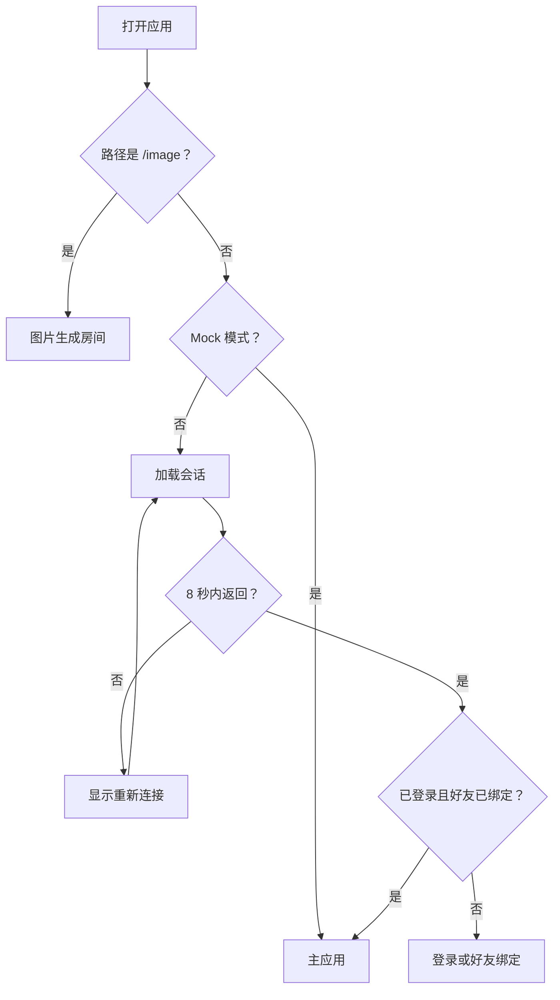

# 页面和导航

## 功能

应用入口根据地址和登录状态显示图片生成房间、登录、好友绑定或主应用。

## 关键入口

- `src/main.tsx`
- `src/services/imageResourceLoader.ts`：非阻塞预加载主应用关键图片并提前触发浏览器解码。
- `src/components/AppShell.tsx`
- `src/components/TabBar.tsx`
- `src/components/PawMenu.tsx`
- `src/components/MeTab.tsx`：渲染“我的”页面列表及其手绘图标。
- `public/me/`：存放“我的”页面列表图标运行时资源。

## 底部导航

底部栏从左到右显示：

1. `小窝`：宠物状态、照顾操作、共同记忆和双方贡献榜。
2. `小记`：打开日历与个人每日运势。
3. 狗脚印：不切换当前页面，打开底部快捷上拉栏。
4. `消息`：打开会话列表。
5. `我的`：打开个人资料与设置。

狗脚印上拉栏统一提供每日暗号、五子棋、足迹地图和塔罗占卜入口。每日暗号与游戏入口不再重复显示在小窝页面。

当前页面对应的底栏图标会轻微上移并放大，帮助用户快速确认选中状态。狗脚印上拉栏覆盖在整个底栏之上，关闭后才能继续切换底部页面。
狗脚印上拉栏打开期间，四个页面按钮暂时恢复默认大小和位置；关闭上拉栏后，当前页面的选中状态重新显示。

会话列表仍属于主标签页并显示底部导航；进入某个会话的聊天详情后，聊天页以全屏模式显示，底部导航保持挂载和绘制，但降低层级放到聊天页后方并禁用交互，避免安装到手机主页后的独立 PWA 在返回时重新栅格化图标。点击聊天页返回按钮回到会话列表后，底部导航立即恢复。

底栏图标位于 `public/navigation/`，以 128×128 透明 PNG 保存，在页面中按视口使用 `clamp()` 自适应显示，普通图标约为 34–42px、脚印圆约为 50–58px。图标来自设计稿切图，已去除外部浅色画布。浅蓝色导航底板使用 `public/navigation/tab-bar-background.png`，作为独立背景层铺在图标和文字后方。

## 修改风险

- 修改入口判断可能导致无法登录或错误进入 Mock。
- 修改 `AppShell` 容易影响多个功能，必须限定范围。
- 安装到手机主页后的导航请求最多等待网络 2.5 秒；超时后使用已缓存应用壳，避免部署期间长期停在启动页。
- Service Worker 安装缓存包含小多利头像、底部导航底板与图标、以及“我的”页固定图标；缓存版本升级后旧缓存会在激活阶段删除。
- 静态资源版本配置缺失时，入口必须回退到同源主 JS、CSS 和启动图，不得生成缺少提交目录的 COS 重定向。
- 首次会话请求最多等待 8 秒；超时不得删除登录令牌，必须显示重新连接入口。
- Service Worker 对 API 和 Socket.IO 始终走网络，不得用缓存的 `index.html` 冒充接口响应。

## 验收

- [ ] Mock 模式能打开主应用。
- [ ] `/image` 能独立打开。
- [ ] 真实 API 模式能显示登录和好友绑定状态。
- [ ] 会话接口超过 8 秒时显示重新连接，并保留已有登录状态。
- [ ] 已安装 PWA 在断网或部署切换时能从缓存应用壳启动。
- [ ] 已安装 PWA 在聊天、底部页面和“我的”页之间切换时，固定图标与小多利头像首帧可见。
- [ ] 切换底部页面后刷新仍保持合理状态。
- [ ] 五个底栏图标顺序为小窝、小记、狗脚印、消息、我的。
- [ ] 会话列表显示底部导航；进入聊天详情后底部导航隐藏，返回会话列表后恢复。
- [ ] 底栏在 320px、390px 和 520px 宽度下图标比例稳定；宽屏保持设计比例并居中，不左右拉伸。
- [ ] 点击狗脚印不改变当前页面，并能打开或关闭快捷上拉栏。
- [ ] 每日暗号、五子棋、足迹地图和塔罗占卜只在快捷上拉栏提供入口。
- [ ] “我的”页面五个列表项显示对应手绘图标，文字与交互保持不变。
