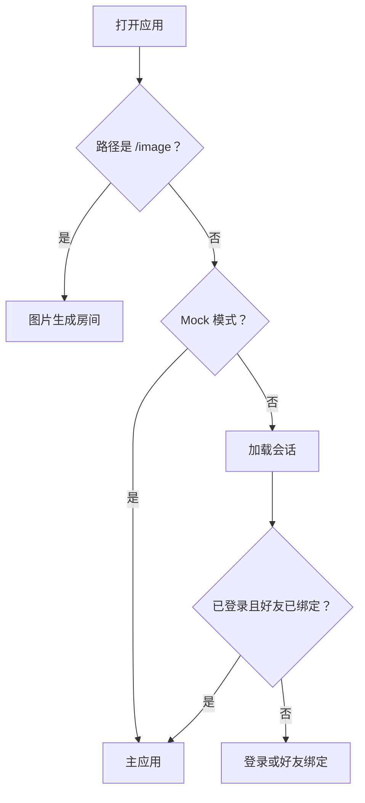

# 页面和导航

## 功能

应用入口根据地址和登录状态显示图片生成房间、登录、好友绑定或主应用。

## 关键入口

- `src/main.tsx`
- `src/components/AppShell.tsx`
- `src/components/TabBar.tsx`

## 修改风险

- 修改入口判断可能导致无法登录或错误进入 Mock。
- 修改 `AppShell` 容易影响多个功能，必须限定范围。

## 验收

- [ ] Mock 模式能打开主应用。
- [ ] `/image` 能独立打开。
- [ ] 真实 API 模式能显示登录和好友绑定状态。
- [ ] 切换底部页面后刷新仍保持合理状态。
