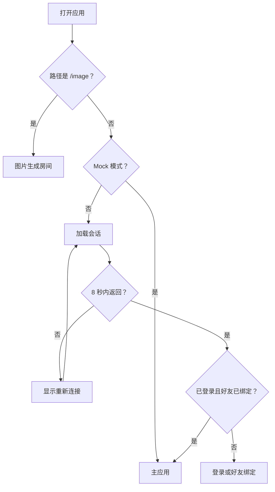

# 页面和导航

## 功能

应用入口根据地址和登录状态显示图片生成房间、登录、好友绑定或主应用。

## 关键入口

- `src/main.tsx`
- `src/components/AppShell.tsx`
- `src/components/TabBar.tsx`

## 修改风险

- 修改入口判断可能导致无法登录或错误进入 Mock。
- 修改 `AppShell` 容易影响多个功能，必须限定范围。
- 安装到手机主页后的导航请求最多等待网络 2.5 秒；超时后使用已缓存应用壳，避免部署期间长期停在启动页。
- 首次会话请求最多等待 8 秒；超时不得删除登录令牌，必须显示重新连接入口。
- Service Worker 对 API 和 Socket.IO 始终走网络，不得用缓存的 `index.html` 冒充接口响应。

## 验收

- [ ] Mock 模式能打开主应用。
- [ ] `/image` 能独立打开。
- [ ] 真实 API 模式能显示登录和好友绑定状态。
- [ ] 会话接口超过 8 秒时显示重新连接，并保留已有登录状态。
- [ ] 已安装 PWA 在断网或部署切换时能从缓存应用壳启动。
- [ ] 切换底部页面后刷新仍保持合理状态。
