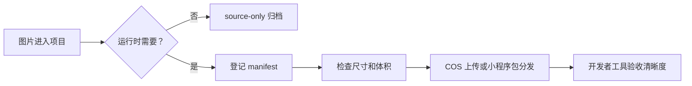

# 图片资源与加载性能

## 这项功能做什么

项目中的图片既要清晰，也要尽快显示。资源规则把图片分成运行时资源和原始素材，避免把设计阶段的大图错误加载到小程序。

## 用户能看到什么

- 塔罗牌入口先显示牌背和背景，实际翻牌前下载需要的牌面。
- 小窝、宠物和导航图片随小程序包本地分发，不依赖网络。
- 图片加载失败时应保留明确的占位或 fallback。

## 简单流程

## 当前资源状态

- 正式塔罗牌面位于 `public/tarot/cards/`，塔罗背景和牌背位于 `public/tarot/ui/`；这是仓库中唯一的运行时静态资源目录。
- 生产环境把 `public/tarot/cards/`、`public/tarot/ui/` 上传到 COS，每次发布使用完整 Git 提交 SHA 作为版本目录，小程序通过 `TARO_TAROT_ASSET_BASE_URL` 直接拉取。
- 小多利、动作图标、小窝背景、导航图标、消息空态插画、小记拍立得/按钮插画和邀请纸箱图层打包在 `miniapp/src/assets/`，随小程序构建产物分发，单张控制在 180 KB 安全线内。
- 原始概念图位于 `design-assets/tarot/concepts/` 和 `design-assets/nest/`，标记为 `source-only`，不属于生产静态资源；其中 `xiaoduoli-peek-source.png` 同时是小多利探头运行时图层（body/eyes）的直接出件源。
- 机器可读清单位于 `docs/assets/asset-manifest.json`。
- COS SecretId、SecretKey 只保存在 GitHub Production Environment，不进入小程序、服务器环境或仓库。
- COS 版本资源使用一年不可变缓存。
- 塔罗资源下载完成后进入本地缓存，只有全部资源下载成功时进度才允许达到 100%。

## 角色动画素材规则（出生即分层 / 原图直出）

需要把角色拆件做动画时，按以下优先级取材，**禁止修补式反抠**——inpaint 补洞、阈值抠 alpha 都会在底图留下永久补痕（旧流程 `make-xiaoduoli-eyes.mjs` 的教训）：

1. **出生即分层**（首选）：分组 SVG / 分层位图源，所有部件同一画布、同一位姿。
2. **原图直出 + 覆盖件**（小多利现行方案）：底图直接使用原图、一个像素不改；可动部件用**确定性裁切 + 羽化边 + 平滑区域采样填充**从同一原图生成覆盖层——静止时与原图逐像素一致、完全隐形，动画时靠覆盖件自身表达（瞳孔滑动、眼睑淡入等）。

- **出件**：`miniapp/tools/build-xiaoduoli-parts.mjs`（零依赖）从 `design-assets/nest/xiaoduoli-peek-source.png` 直出 `xiaoduoli-body.png`（原图）与眼部木偶三层 `xiaoduoli-eyes.png`（眼眶，瞳孔原位以采样虹膜色填充）/ `xiaoduoli-pupils.png`（瞳孔圆盘）/ `xiaoduoli-lids.png`（闭眼眼睑）（均 446×314 全画布、同坐标叠放，运行时显式 rpx 尺寸对位，无需手工标定百分比）。
- **几何自动生成**：瞳孔支点等几何由脚本按眼部标定计算，写入 `miniapp/src/features/main/xiaoduoli-box-parts.generated.scss`（勿手改）和 `miniapp/tools/xiaoduoli-parts.report.json`（供测试断言与文档登记）。
- **复用优先**：新增表情/动作优先用领域时间线 + CSS 变换组合现有图层实现；只有确需新部件时才改源并重跑脚本。改完源必须重跑脚本并同步 manifest 与文档。

## 常见问题

### 图片很清晰但打开很慢

先检查是否误用了原始大图、是否在首屏下载了全部功能图片，以及是否提供了正确尺寸。不要先把压缩质量调到很低。

塔罗下载长期停在低百分比时，先直接测单张牌面的首字节和完整下载时间。这属于静态资源传输链路异常，不应通过伪造进度解决。

### 图片导致页面跳动

检查图片是否有固定容器尺寸或 `aspectFit`/`aspectFill` 模式。

## 验收清单

- [ ] 微信开发者工具模拟器清晰且无布局跳动。
- [ ] 首屏没有无关大图请求。
- [ ] 塔罗翻牌不等待网络。
- [ ] 塔罗下载达到 100% 后，背景、牌背和牌面首次显示均已完成下载。
- [ ] 慢速网络有占位或 fallback。
- [ ] COS 域名已加入小程序 downloadFile 合法域名。
- [ ] COS 公共基址使用版本目录，更新图片时切换版本目录。
- [ ] 小程序本地图片单张不超过 180 KB。
- [ ] `npm run check:assets` 通过。
