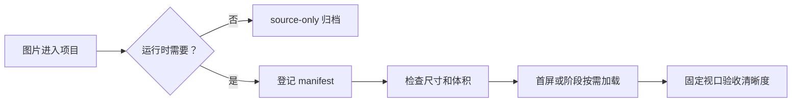

# 图片资源与加载性能

## 这项功能做什么

项目中的图片既要清晰，也要尽快显示。资源规则把图片分成运行时资源和原始素材，避免把设计阶段的大图错误加载到正式页面。

## 用户能看到什么

- 启动画面优先显示。
- 聊天和头像图片按实际显示场景加载。
- 塔罗牌入口先显示牌背和背景，实际翻牌前准备需要的牌面。
- 图片加载失败时应保留明确的占位或 fallback。

## 简单流程

## 当前资源状态

- 正式塔罗牌面位于 `public/tarot/cards/`。
- 塔罗背景和牌背位于 `public/tarot/ui/`。
- 原始概念图位于 `public/tarot/concepts/`，当前标记为 `source-only`。
- 机器可读清单位于 `docs/assets/asset-manifest.json`。

## 常见问题

### 图片很清晰但打开很慢

先检查是否误用了原始大图、是否首屏预加载了全部功能图片，以及是否提供了正确尺寸。不要先把压缩质量调到很低。

### 塔罗翻牌时闪烁

检查实际抽牌结果是否提前预取，并确认动画开始前图片已经完成加载。

### 图片导致页面跳动

检查图片是否有 `width`/`height` 或 `aspect-ratio`。

## 验收清单

- [ ] 手机视口清晰。
- [ ] 桌面视口清晰。
- [ ] 首屏没有无关大图请求。
- [ ] 塔罗翻牌不等待网络。
- [ ] 慢速网络有占位或 fallback。
- [ ] `npm run check:assets` 通过。
