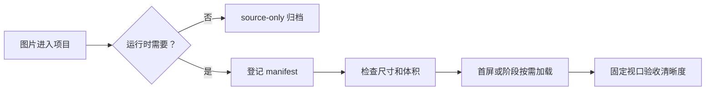

# 图片资源与加载性能

## 这项功能做什么

项目中的图片既要清晰，也要尽快显示。资源规则把图片分成运行时资源和原始素材，避免把设计阶段的大图错误加载到正式页面。

## 用户能看到什么

- 启动画面优先显示。
- 聊天和头像图片按实际显示场景加载。
- 塔罗牌入口先显示牌背和背景，实际翻牌前准备需要的牌面。
- 图片加载失败时应保留明确的占位或 fallback。

## 简单流程

## 当前资源状态

- 底部导航图标位于 `public/navigation/`，使用 128×128 透明 PNG；浅蓝底板使用 1219×261 透明 PNG，均按进入主应用后的常驻导航资源加载。
- 登录页会非阻塞预热并解码 `xiaoduoli.png`；已登录用户进入主应用时，入口会并行准备小多利、房间背景、底部导航底板和五个导航图标，完成前显示强制资源进度态，不在登录页下载塔罗或其他大型功能资源。
- 安装到手机主页后的独立 PWA 还会通过 Service Worker 应用壳缓存保存这些固定界面图片，避免启动或界面切换时再等待网络与首次栅格化。
- 正式塔罗牌面位于 `public/tarot/cards/`。
- 塔罗背景和牌背位于 `public/tarot/ui/`。
- 原始概念图位于 `design-assets/tarot/concepts/`，标记为 `source-only`，不属于生产静态资源。
- 机器可读清单位于 `docs/assets/asset-manifest.json`。
- 生产环境把构建产物 `assets/` 和运行时目录 `pet/`、`icons/`、`navigation/`、`me/`、`tarot/cards/`、`tarot/ui/` 上传到 COS。
- 每次发布使用完整 Git 提交 SHA 作为版本目录，Caddy 只返回重定向，文件字节由 COS 直接发送。
- `design-assets/` 位于 Vite 的 `public/` 目录之外，不进入 Web 构建或 COS 上传；`index.html`、`sw.js`、`manifest.webmanifest` 也不上传。
- COS SecretId、SecretKey 只保存在 GitHub Production Environment，不进入前端、服务器环境或仓库。
- COS 版本资源使用一年不可变缓存；Web 镜像仍保留同源文件作为紧急关闭重定向时的回退。
- “我的”页面列表图标位于 `public/me/`，使用 128×128 透明 PNG，随该页面按需加载。
- 塔罗资源下载完成后以固定 2 路并发调用浏览器图片解码；只有 24 项资源全部可直接绘制时，进度才允许达到 100%。
- 塔罗 CSS 背景和牌背通过运行时 CSS 变量引用资源清单 URL，避免下载 COS 资源后又从应用服务器重复请求同源图片。
- 小多利运行时资源统一为 `public/pet/xiaoduoli.png`，登录、加载、小窝、聊天头像和悬浮宠物均使用同一张透明 PNG，避免不同页面混用旧形象。小窝房间背景位于 `public/nest/room-background.webp`，进入主应用后与宠物图一起非阻塞预加载。

## 常见问题

### 图片很清晰但打开很慢

先检查是否误用了原始大图、是否首屏预加载了全部功能图片，以及是否提供了正确尺寸。不要先把压缩质量调到很低。

塔罗下载长期停在低百分比时，先直接测单张牌面的首字节和完整下载时间。当前生产服务器曾出现 `248 KB` 图片在 25 秒内只返回 `32 KB` 的情况，这属于静态资源传输链路异常，不应通过伪造进度解决。

### 塔罗翻牌时闪烁

检查实际抽牌结果是否提前预取，并确认动画开始前图片已经完成下载和解码。若图片呈现从上到下逐步出现，还要检查 CSS 是否绕过资源清单重新请求了同源 JPEG。

### 图片导致页面跳动

检查图片是否有 `width`/`height` 或 `aspect-ratio`。

## 验收清单

- [ ] 手机视口清晰。
- [ ] 桌面视口清晰。
- [ ] 底部导航图标在窄屏和宽屏视口下保持清晰且不发生布局跳动。
- [ ] 从聊天详情返回主页时，底部导航底板和五个图标在首帧显示，不出现延迟空白。
- [ ] 从手机主页入口启动后切换到“我的”页，五个固定列表图标在首帧显示。
- [ ] 底栏图标透明边缘自然，没有参考图背景残留。
- [ ] 首屏没有无关大图请求。
- [ ] 塔罗翻牌不等待网络。
- [ ] 塔罗下载达到 100% 后，背景、牌背和牌面首次显示均已完成解码。
- [ ] 慢速网络有占位或 fallback。
- [ ] COS 响应包含允许站点来源的 CORS 头。
- [ ] COS 公共基址使用版本目录，更新图片时切换版本目录。
- [ ] 线上主 JS、主 CSS 和启动图均重定向到当前部署提交的 COS 目录。
- [ ] `/api/`、`/socket.io/`、`index.html`、`sw.js` 不发生 COS 重定向。
- [ ] `public/me/` 图标保持透明背景且单张不超过通用运行时图片预算。
- [ ] 小多利头像无设定图文字、旁侧角色残片或背景边缘。
- [ ] 小多利 PNG 保持透明背景，JPG 不出现黑色透明区域。
- [ ] `npm run check:assets` 通过。
