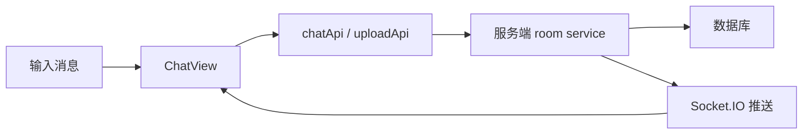

# 聊天与实时消息

## 功能

用户可以在房间中发送文字和图片，查看小多利或好友的消息，并通过 Socket.IO 接收实时更新。

## 关键入口

- `src/components/ChatView.tsx`
- `src/services/chatApi.ts`
- `src/services/realtimeClient.ts`
- `server/src/http/roomRoutes.ts`
- `server/src/services/roomService.ts`

## 数据

Mock 模式使用 `src/state/mockStore.ts`。真实模式由服务端仓储保存。

## 风险

- 重复消息通常与实时事件和请求结果同时写入有关。
- 图片上传涉及文件大小、OSS 和消息创建三个步骤。

## 验收

- [ ] 文字消息只出现一次。
- [ ] 图片有预览、发送状态和失败提示。
- [ ] 好友或宠物消息实时出现。
- [ ] 切换房间不会串消息。
