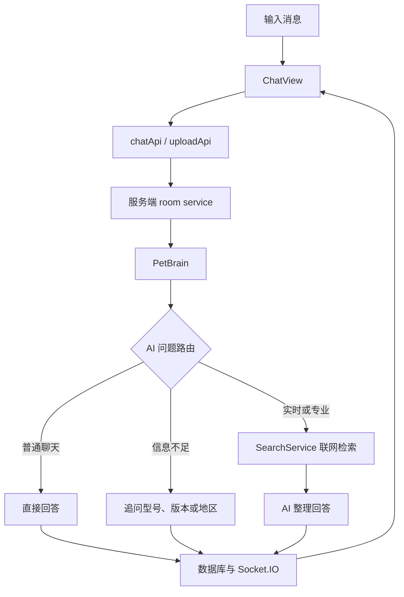

# 聊天与实时消息

## 功能

用户可以在房间中发送文字和图片，查看小多利或好友的消息，并通过 Socket.IO 接收实时更新。小多利会区分普通聊天、信息不足的问题和需要实时或专业资料的问题。



## 关键入口

- `src/components/ChatView.tsx`
- `src/services/chatApi.ts`
- `src/services/realtimeClient.ts`
- `server/src/http/roomRoutes.ts`
- `server/src/services/roomService.ts`
- `server/src/services/petBrain.ts`
- `server/src/services/aiRouting.ts`
- `server/src/services/aiService.ts`
- `server/src/services/searchService.ts`

## 数据

Mock 模式使用 `src/state/mockStore.ts`。真实模式由服务端仓储保存。

真实模式的回答规则：

- 普通陪伴聊天不联网。
- 模糊价格问题先询问品牌、型号或预算。
- 价格、当前版本、赛季攻略和专业规范等问题自动检索。
- 搜索查询会移除明显手机号和邮箱，不发送宠物长期记忆。
- 用户只看到整理后的自然回答，不显示 URL 和来源列表。
- 搜索不可用、无结果或资料不足时明确说明，不使用模型记忆猜测实时事实。

服务端搜索配置：

```text
SEARCH_API_KEY
SEARCH_BASE_URL
SEARCH_TIMEOUT_MS
SEARCH_MAX_QUERIES
SEARCH_MAX_RESULTS
SEARCH_MAX_SNIPPET_LENGTH
SEARCH_LOCALE
```

## 风险

- 重复消息通常与实时事件和请求结果同时写入有关。
- 图片上传涉及文件大小、OSS 和消息创建三个步骤。
- 外部搜索可能超时、限流或返回互相冲突的资料。
- 关键词路由需要避免把“我今天很累”误判为实时搜索。
- 商品价格和游戏阵容会随日期、地区、渠道和版本变化。

## 验收

- [ ] 文字消息只出现一次。
- [ ] 图片有预览、发送状态和失败提示。
- [ ] 好友或宠物消息实时出现。
- [ ] 切换房间不会串消息。
- [ ] “我今天有点累”直接陪伴，不调用搜索。
- [ ] “一个相机多少钱”先追问品牌、型号或预算。
- [ ] 明确型号的当前价格问题自动检索并给出区间和波动因素。
- [ ] 当前赛季攻略自动检索并整理核心、装备和替代方案。
- [ ] 搜索失败时明确说明暂时无法可靠确认，不编造数字或阵容。
- [ ] 最终回答不展示 URL、来源列表或内部检索字段。
