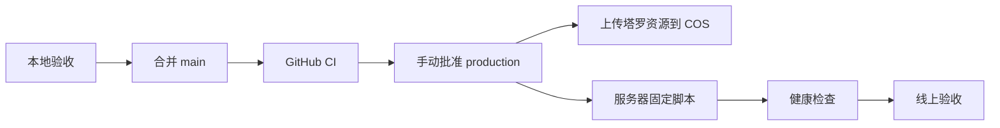

# 部署与服务器更新

## 当前架构

腾讯云 Lighthouse 运行 Docker Compose：

- `caddy`：HTTPS 入口，反代 `api.pet10kk.com` 到 API。
- `api`：Node API。
- `postgres`：业务数据。
- `redis`：缓存和临时状态。

生产 HTTPS 入口由 `deploy/Caddyfile` 固定为 `api.pet10kk.com`。仓库不再托管网页站点；前端只有微信小程序，塔罗图片由腾讯 COS 直接提供。

## 生图接口与浏览器测试页

- 对外接口（`server/src/http/imageRoutes.ts`）：`POST /api/images/generations` 同步生图（阻塞直到出图，仅图片模型）；`POST /api/images/tasks` 提交异步任务（提交即返回 202）；`GET /api/images/tasks/:id` 轮询任务状态与结果；`GET /api/images/models` 启用模型目录（公开只读）；`GET /api/images/quota` 剩余额度与门禁校验（鉴权但不消耗额度，图/视频分池展示 + 当天剩余尝试次数）；`POST /api/images/optimize` 提示词优化（独立宽松限额 6/分钟、30/天，调文本模型按图/视频两套规则改写，不占生成次数）。全部用 `Authorization: Bearer <生图邀请码>` 鉴权，任务/同步响应含上游 `usage` 汇总的金额与 Token。
- 模型目录（`server/src/services/imageModels.ts`）：图片模型 `openai/gpt-5.4-image-2`（现役主力）、`openai/gpt-5.5`、`google/gemini-3.1-flash-image-preview`、`google/gemini-3-pro-image-preview`；视频模型 `kwaivgi/kling-v3.0-pro`、`kwaivgi/kling-v3.0-std`（可灵）。由环境变量 `IMAGE_ENABLED_MODELS`（逗号分隔）控制启用集，默认只启用图片模型。图片走 `/chat/completions`（`image_config` 仅对 openai 系生图模型发送）；视频走中转独立的 `/videos` 三步异步接口（创建带 `resolution: '720p'|'1080p'` 与可选 `frame_images` 首帧图→轮询→下载），视频不在 `/models` 文本目录里、也不走 chat/completions 的 video modality（kit 探测结论），模型存在性用畸形体免费探测法验证（2026-09-22）。注意两个坑：任务直链 `unsigned_urls[0]` 指向上游（openrouter）需要上游侧鉴权，直接拉是空体，**取片必须走中转 `GET /videos/{id}/content` 代理**（本站 key 即可）；可灵对首帧图有尺寸下限，512px 实测被拒、1024px 通过（测试页提示首帧建议 ≥720px）。可灵 std 实测单条约 1 分钟 / $0.63（pro 档参考 $0.84，约 5 分钟），720p 出 1948×1064。
- 限额与门禁（2026-09-22 改版）：**每分钟 3 次提交（图/视频共享）；图片每天 100 张、视频每天 30 个，按张/个计**（出图数量 count 按张扣，一次提交消耗对应张数），图/视频各自独立日池（`IMAGE_IMAGE_DAILY_LIMIT`/`IMAGE_VIDEO_DAILY_LIMIT`）。**邀请码门禁：一天内错误 3 次该 IP 当天整体锁定**（连正确码也拒绝，次日自动重置，`IMAGE_INVITE_MAX_FAILURES_PER_DAY` 可调），401 响应带 `attemptsRemaining` 供前端展示，锁定后所有接口返回 403 `invite_locked`。校验全部通过才扣生成额度（校验失败不占额度）。`GET /api/images/quota` 返回分钟/图/视频各自剩余与 `attemptsRemaining`。
- 可灵参数（2026-09-22 实测）：`resolution: '720p'|'1080p'`（分辨率/清晰度档位由模型选择决定，std≈$0.63/5s、pro≈$0.84/5s）；`frameMode: 'first'|'first_last'` 参考模式（首帧 / 首尾帧——第 2 张参考图作 last_frame，真图实测支持 960×960 出片 $0.63，缺 2 张报 `invalid_frame_mode`）；视频比例与分辨率档位上游均不生效（21:9 参数与默认同样出 1920×1080；480p 与 720p 同为 960×960），比例由首帧图决定、分辨率由上游按首帧比例自动定档，页面不提供这两个选择；联网搜索是上游 /videos 不支持的字段。出图参数：图片任务支持 `aspectRatio` 十一档（自适应 auto=不发送 aspect_ratio 按模型默认出图，实测 1024×1024；1:1 / 16:9 / 9:16 / 4:3 / 3:4 / 3:2 / 2:3 / 4:5=896×1120 / 5:4=1120×896 / 21:9=1568×672，均实测透传出图）、`imageSize`（1K/2K，仅 openai 系模型生效，页面默认 1K）、`count`（1~4 张，一次提交并行出图，部分失败交付成功部分）。提示词优化由 `IMAGE_PROMPT_MODEL`（默认 `openai/gpt-5.4-mini`，单次约 $0.0007）驱动。
- 额度语义（2026-09-22 起）：**生出来才扣额度**——提交时先扣（分钟 1 次 + 日池按张/个），任务**成功**按实际出图数结算，失败/部分失败自动退回（全败连分钟额度一起退，同分钟可立即重试）。上游偶发「回文本不回图」会**自动重试一次**并在服务端日志记 `image_upstream_no_image`（脱敏：只记字段名与长度不记内容），两次仍无图才判 `upstream_invalid_response` 且额度已退。
- 浏览器工作台：`https://api.pet10kk.com/image-playground`（`server/src/http/imagePlaygroundRoutes.ts`，页面内联在 TS 里随 `server:build` 一起产出）。**先进独立邀请码门禁页（错 3 次锁一天），通过后进入工作台**；邀请码只保存在页面内存，无「记住邀请码」。表单字段按模型类型联动（图=比例/尺寸/数量+参考图，视频=分辨率/时长/声音+首帧图），「✨优化提示词」一键改写，任务卡片**成功后显示消耗金额（$）与 Token**（取自上游 usage，多图合计），页面顶部实时显示分池剩余额度。参考图最多 5 张（服务端同步校验），支持拖拽进页面与直接粘贴截图自动添加，缩略图单行排列、完整显示不裁切（contain）、可单个移除。生成结果每张图/每条视频下方带「⬇ 下载」按钮（图片存 .png、视频存 .mp4，文件名含任务 id 与序号；href 即上游原始 base64，下载为未经再压缩的原图，2K 实测 2048×2048/7.4MB）；点击结果图可放大预览（lightbox，点背景关闭）；结果只在内存保留 30 分钟，看完尽快下载。比例/尺寸参数仅 GPT-5.4 Image 等带 image 的 openai 模型生效（gpt-5.5 与 Gemini 系页面自动禁用并提示）。页面带 `noindex`。任务结果只存内存，保留 30 分钟、上限 30 个任务，重启即清。注意：页面 JS 内联在 TS 模板字符串里，正则等含反斜杠内容要双写转义（路由测试有内联脚本可解析断言防复发）。
- 本地验收页面：`npm run preview:playground --prefix server`（或 server/ 下 `npx tsx scripts/image-playground-preview.mts`，`server/scripts/image-playground-preview.mts`）只挂载生图路由，不依赖数据库；打开 `http://localhost:8791/image-playground`，邀请码默认 `localtest`（`PLAYGROUND_INVITE` 等环境变量可覆盖限额与模型）。上游 key 沿用 `AI_IMAGE_API_KEY` 或 ZCode 配置，无 key 时页面可看、生成会提示上游不可用——纯界面/额度/门禁验收无需真实出图，不消耗费用。
- 邀请码安全约定：保持足够长（16 位以上随机字母数字），更换时更新服务器 `/opt/pet10/.env.production` 的 `IMAGE_INVITE_CODE` 后 `docker compose --env-file .env.production -f docker-compose.prod.yml up -d --no-deps api` 重建容器（属于 `all` 类发布的运维操作），不写进代码、仓库或日志。

## 推荐发布流程

## 更新类型

- `assets`：只更新塔罗图片；上传 COS 版本目录，不触碰服务器。
- `api`：服务端路由和业务服务。
- `all`：Compose、环境变量或资源与服务共同变化。

## 腾讯 COS 塔罗资源

1. 创建允许公共读取的 COS 存储桶或公开目录。
2. GitHub Production Environment 配置 `COS_SECRET_ID`、`COS_SECRET_KEY`、`COS_BUCKET`、`COS_REGION` 和公开的 `STATIC_ASSET_BASE_URL`。
3. `assets` 或 `all` 发布将 `public/tarot/cards/`、`public/tarot/ui/` 上传到以完整提交 SHA 命名的目录；如果 `STATIC_ASSET_BASE_URL` 包含路径前缀（例如 `/pet10-web`），COS Object Key 会使用相同前缀。
4. `design-assets/` 不进入上传；小程序本体通过微信开发者工具上传，也不经过 COS。
5. CORS 允许小程序请求来源使用 `GET`、`HEAD`，允许请求头 `*`，暴露 `Content-Length`、`ETag`。
6. 上传对象设置 `Cache-Control: public, max-age=31536000, immutable` 和 `Content-Disposition: inline`。
7. 小程序构建必须提供 `TARO_ASSET_BASE_URL`，指向当前 COS 版本目录；COS 域名必须加入微信小程序后台的 downloadFile 合法域名。
8. 上传失败或版本资源校验不通过时，部署停止且不报告成功。

回滚塔罗资源时，重新用旧提交 SHA 构建小程序并指向旧版本目录即可；旧 COS 目录保持不可变，不需要重新上传。

## 安全规则

- 生产只部署已提交的 `main`。
- 不在服务器手工编辑业务代码。
- 不使用 `docker compose down -v`。
- 数据库迁移必须单独确认。
- API 启动会幂等补齐运行时表和索引，包括微信身份、好友邀请及关系小窝唯一约束；已有生产库首次补迁移前仍需备份并检查旧数据冲突。
- GitHub 的 `production` Environment 必须启用人工批准，并配置服务器固定 SSH 主机公钥。
- COS SecretId、SecretKey 只存在于 GitHub Environment，不能传到 Lighthouse、小程序构建产物或日志。

## 小程序手机预览

仓库提供 `.github/workflows/miniapp-preview.yml`，可从 GitHub Actions 手动触发指定分支、标签或提交，流程为：

1. 安装根目录和 `miniapp/` 依赖，并固定安装 `miniprogram-ci@2.1.31`。
2. 运行小程序测试并执行 `npm run build:weapp`。
3. 使用 `miniprogram-ci` 生成微信预览二维码。
4. 将二维码作为 Actions artifact 下载到手机后扫码体验。

需要在 GitHub Actions Secrets 配置 `WECHAT_APPID`、`WECHAT_PRIVATE_KEY`、`TARO_PREVIEW_API_BASE_URL` 和 `TARO_TAROT_ASSET_BASE_URL`（旧 secret 名，注入构建变量 `TARO_ASSET_BASE_URL`）。预览 API 必须指向测试环境，避免体验操作写入生产数据；预览构建要求静态资产地址显式配置。上传密钥只在 CI 临时目录中使用，不能提交到仓库。该流程只生成预览二维码，不合并分支、不发布生产环境。

详细配置见后续的 `docs/operations/lighthouse-deployment.md`。
