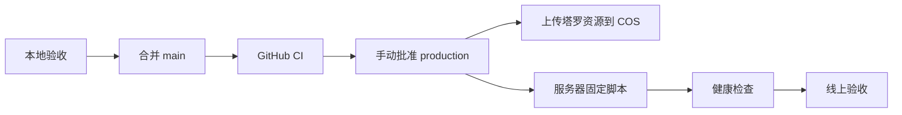

# 部署与服务器更新

## 当前架构

腾讯云 Lighthouse 运行 Docker Compose：

- `caddy`：HTTPS 入口，反代 `api.pet10kk.com` 到 API。
- `api`：Node API。
- `postgres`：业务数据。
- `redis`：缓存和临时状态。

生产 HTTPS 入口由 `deploy/Caddyfile` 固定为 `api.pet10kk.com`。仓库不再托管网页站点；前端只有微信小程序，塔罗图片由腾讯 COS 直接提供。

## 推荐发布流程

## 更新类型

- `assets`：只更新塔罗图片；上传 COS 版本目录，不触碰服务器。
- `api`：服务端路由和业务服务。
- `all`：Compose、环境变量或资源与服务共同变化。

## 腾讯 COS 塔罗资源

1. 创建允许公共读取的 COS 存储桶或公开目录。
2. GitHub Production Environment 配置 `COS_SECRET_ID`、`COS_SECRET_KEY`、`COS_BUCKET`、`COS_REGION` 和公开的 `STATIC_ASSET_BASE_URL`。
3. `assets` 或 `all` 发布将 `public/tarot/cards/`、`public/tarot/ui/` 上传到以完整提交 SHA 命名的目录；如果 `STATIC_ASSET_BASE_URL` 包含路径前缀（例如 `/pet10-web`），COS Object Key 会使用相同前缀。
4. `design-assets/` 不进入上传；小程序本体通过微信开发者工具上传，也不经过 COS。
5. CORS 允许小程序请求来源使用 `GET`、`HEAD`，允许请求头 `*`，暴露 `Content-Length`、`ETag`。
6. 上传对象设置 `Cache-Control: public, max-age=31536000, immutable` 和 `Content-Disposition: inline`。
7. 小程序构建必须提供 `TARO_TAROT_ASSET_BASE_URL`，指向当前 COS 版本目录；COS 域名必须加入微信小程序后台的 downloadFile 合法域名。
8. 上传失败或版本资源校验不通过时，部署停止且不报告成功。

回滚塔罗资源时，重新用旧提交 SHA 构建小程序并指向旧版本目录即可；旧 COS 目录保持不可变，不需要重新上传。

## 安全规则

- 生产只部署已提交的 `main`。
- 不在服务器手工编辑业务代码。
- 不使用 `docker compose down -v`。
- 数据库迁移必须单独确认。
- API 启动会幂等补齐运行时表和索引，包括微信身份、好友邀请及关系小窝唯一约束；已有生产库首次补迁移前仍需备份并检查旧数据冲突。
- GitHub 的 `production` Environment 必须启用人工批准，并配置服务器固定 SSH 主机公钥。
- COS SecretId、SecretKey 只存在于 GitHub Environment，不能传到 Lighthouse、小程序构建产物或日志。

## 小程序手机预览

仓库提供 `.github/workflows/miniapp-preview.yml`，可从 GitHub Actions 手动触发指定分支、标签或提交，流程为：

1. 安装根目录和 `miniapp/` 依赖，并固定安装 `miniprogram-ci@2.1.31`。
2. 运行小程序测试并执行 `npm run build:weapp`。
3. 使用 `miniprogram-ci` 生成微信预览二维码。
4. 将二维码作为 Actions artifact 下载到手机后扫码体验。

需要在 GitHub Actions Secrets 配置 `WECHAT_APPID`、`WECHAT_PRIVATE_KEY`、`TARO_PREVIEW_API_BASE_URL` 和 `TARO_TAROT_ASSET_BASE_URL`。预览 API 必须指向测试环境，避免体验操作写入生产数据；预览构建要求塔罗资源地址显式配置。上传密钥只在 CI 临时目录中使用，不能提交到仓库。该流程只生成预览二维码，不合并分支、不发布生产环境。

详细配置见后续的 `docs/operations/lighthouse-deployment.md`。
