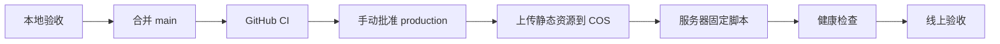

# 部署与服务器更新

## 当前架构

腾讯云 Lighthouse 运行 Docker Compose：

- `caddy`：HTTPS 和入口。
- `web`：Nginx 静态前端。
- `api`：Node API。
- `postgres`：业务数据。
- `redis`：缓存和临时状态。

生产 HTTPS 入口由 `deploy/Caddyfile` 固定为 `pet10kk.com` 和 `api.pet10kk.com`，不再使用临时 `sslip.io` 域名。

## 推荐发布流程

## 更新类型

- `web`：React、CSS、塔罗动画和前端图片；先上传 COS 版本目录，再更新 Web 和 Caddy。
- `api`：服务端路由和业务服务。
- `all`：Compose、环境变量或前后端共同变化。

## 腾讯 COS 静态资源

1. 创建允许公共读取的 COS 存储桶或公开目录。
2. GitHub Production Environment 配置 `COS_SECRET_ID`、`COS_SECRET_KEY`、`COS_BUCKET`、`COS_REGION` 和公开的 `STATIC_ASSET_BASE_URL`。
3. `web` 或 `all` 发布将 `assets/`、`pet/`、`nest/`、`icons/`、`navigation/`、`me/`、`tarot/cards/`、`tarot/ui/` 上传到以完整提交 SHA 命名的目录；如果 `STATIC_ASSET_BASE_URL` 包含路径前缀（例如 `/pet10-web`），COS Object Key 会使用相同前缀。
4. `design-assets/` 位于 Web 构建目录之外，不进入构建或上传；`index.html`、`sw.js`、`manifest.webmanifest` 也不上传。
5. CORS 允许生产站点来源使用 `GET`、`HEAD`，允许请求头 `*`，暴露 `Content-Length`、`ETag`。
6. 上传对象设置 `Cache-Control: public, max-age=31536000, immutable` 和 `Content-Disposition: inline`，确保 CSS 背景和页面图片由浏览器直接渲染而非被作为附件下载。
7. Caddy 仅在静态资源公共基址和提交版本都非空时，将允许的静态路径重定向到当前提交目录；配置缺失时回退到同源 Nginx 文件，避免主 JS、CSS 和启动图被重定向到不存在的 `//` 路径。API、Socket.IO 和应用壳控制文件始终同源。
8. 上传失败或启动图重定向不匹配时，部署停止且不报告成功。
9. `web`、`all` 发布和静态资源回滚在健康检查通过后，自动将已验证的 `STATIC_ASSET_BASE_URL` 与完整提交 SHA 写回服务器 `.env.production`；以后直接重建 Caddy 也会继续使用最近一次成功版本，不需要人工更新 SHA。`api` 发布不修改这两个配置。

回滚时部署脚本使用旧提交 SHA 切换 Caddy，并在验证成功后同步更新 `.env.production`；旧 COS 目录保持不可变，不需要重新上传。

## 安全规则

- 生产只部署已提交的 `main`。
- 不在服务器手工编辑业务代码。
- 不使用 `docker compose down -v`。
- 数据库迁移必须单独确认。
- API 启动会幂等补齐运行时表和索引，包括微信身份、好友邀请及关系小窝唯一约束；已有生产库首次补迁移前仍需备份并检查旧数据冲突。
- GitHub 的 `production` Environment 必须启用人工批准，并配置服务器固定 SSH 主机公钥。
- COS SecretId、SecretKey 只存在于 GitHub Environment，不能传到 Lighthouse、前端构建产物或日志。

详细配置见后续的 `docs/operations/lighthouse-deployment.md`。
