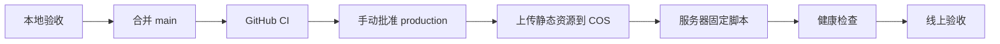

# 部署与服务器更新

## 当前架构

腾讯云 Lighthouse 运行 Docker Compose：

- `caddy`：HTTPS 和入口。
- `web`：Nginx 静态前端。
- `api`：Node API。
- `postgres`：业务数据。
- `redis`：缓存和临时状态。

## 推荐发布流程

## 更新类型

- `web`：React、CSS、塔罗动画和前端图片；先上传 COS 版本目录，再更新 Web 和 Caddy。
- `api`：服务端路由和业务服务。
- `all`：Compose、环境变量或前后端共同变化。

## 腾讯 COS 静态资源

1. 创建允许公共读取的 COS 存储桶或公开目录。
2. GitHub Production Environment 配置 `COS_SECRET_ID`、`COS_SECRET_KEY`、`COS_BUCKET`、`COS_REGION` 和公开的 `STATIC_ASSET_BASE_URL`。
3. `web` 或 `all` 发布将 `assets/`、`pet/`、`icons/`、`navigation/`、`me/`、`tarot/cards/`、`tarot/ui/` 上传到以完整提交 SHA 命名的目录。
4. `public/tarot/concepts/`、`index.html`、`sw.js`、`manifest.webmanifest` 不上传。
5. CORS 允许生产站点来源使用 `GET`、`HEAD`，允许请求头 `*`，暴露 `Content-Length`、`ETag`。
6. 上传对象设置 `Cache-Control: public, max-age=31536000, immutable`。
7. Caddy 将允许的静态路径重定向到当前提交目录；API、Socket.IO 和应用壳控制文件继续同源。
8. 上传失败或启动图重定向不匹配时，部署停止且不报告成功。

回滚时部署脚本使用旧提交 SHA 切换 Caddy，旧 COS 目录保持不可变，不需要重新上传。

## 安全规则

- 生产只部署已提交的 `main`。
- 不在服务器手工编辑业务代码。
- 不使用 `docker compose down -v`。
- 数据库迁移必须单独确认。
- GitHub 的 `production` Environment 必须启用人工批准，并配置服务器固定 SSH 主机公钥。
- COS SecretId、SecretKey 只存在于 GitHub Environment，不能传到 Lighthouse、前端构建产物或日志。

详细配置见后续的 `docs/operations/lighthouse-deployment.md`。
