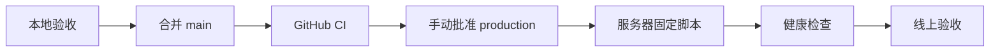

# 部署与服务器更新

## 当前架构

腾讯云 Lighthouse 运行 Docker Compose：

- `caddy`：HTTPS 和入口。
- `web`：Nginx 静态前端。
- `api`：Node API。
- `postgres`：业务数据。
- `redis`：缓存和临时状态。

## 推荐发布流程

## 更新类型

- `web`：React、CSS、塔罗动画和前端图片。
- `api`：服务端路由和业务服务。
- `all`：Compose、环境变量或前后端共同变化。

## 腾讯 COS 塔罗资源

1. 创建允许公共读取的 COS 存储桶或公开资源目录。
2. 只上传 `public/tarot/cards/` 与 `public/tarot/ui/`，保持对象键为 `tarot/cards/*` 和 `tarot/ui/*`。
3. 推荐上传到版本目录，例如 `pet10-v1/tarot/...`，并把 `TAROT_ASSET_BASE_URL` 设置为 `https://<bucket>.cos.<region>.myqcloud.com/pet10-v1`。
4. CORS 允许生产站点来源使用 `GET`、`HEAD`，允许请求头 `*`，暴露 `Content-Length`、`ETag`。
5. COS 对象设置 `Cache-Control: public, max-age=31536000, immutable`；更新图片时上传新版本目录并修改公共基址。
6. `.env.production` 只保存 `TAROT_ASSET_BASE_URL` 公共地址。COS SecretId、SecretKey 不进入前端构建或仓库。
7. 执行 `web` 部署后，清空手机站点缓存验证首次 24 项资源下载；正常网络目标为 10 秒以内。

回滚时把 `TAROT_ASSET_BASE_URL` 留空并重新部署 `web`，前端会恢复使用同源 `/tarot/...` 文件。

## 安全规则

- 生产只部署已提交的 `main`。
- 不在服务器手工编辑业务代码。
- 不使用 `docker compose down -v`。
- 数据库迁移必须单独确认。
- GitHub 的 `production` Environment 必须启用人工批准，并配置服务器固定 SSH 主机公钥。

详细配置见后续的 `docs/operations/lighthouse-deployment.md`。
