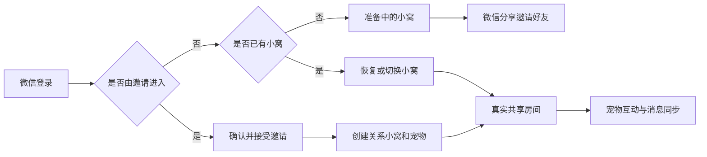

# 微信小程序体验版

## 目标

在不影响现有 React PWA 的前提下，使用 Taro 提供正式微信登录、好友邀请、多关系小窝、宠物互动和共享房间聊天。

## 当前流程



## 当前范围

### 小程序主界面补充

- 小窝支持读取共同记忆、删除共同记忆，并展示双方贡献榜。
- 消息页读取真实会话列表，支持切换当前共享房间。
- 小记支持月份切换、每日心情标记和完整运势详情展开。
- 我的页面支持 MBTI 选择并通过资料接口保存。
- 我的页面复用 PWA `avatarConfig` 合同，支持头像预览、编辑、恢复和保存。
- 爪印菜单中的足迹地图使用 `/api/social/rooms/:roomId/map` 读取和点亮足迹。
- 五子棋复用服务端同一状态机，通过 `/api/games/gobang` HTTP 轮询支持邀请、接受、落子、认输和结果同步。
- 记忆和地图面板使用底部抽屉，不阻断主页面导航。

### 当前未完成

- 塔罗仍需按视觉基线逐阶段迁移和验收；现有 PWA 动画依赖浏览器 DOM，不能直接复制到 Taro。
- 小程序端头像编辑器、MBTI 测试和完整运势详情仍待迁移。

- Taro + React + TypeScript 微信小程序骨架；
- 仅使用微信登录，服务端通过 `jscode2session` 创建或恢复 Pet10 身份；
- 新用户无需邀请也能进入准备中的小窝；
- 使用微信原生分享卡片邀请任意微信好友；
- 好友接受邀请后创建独立关系小窝和共享宠物；
- A+B 和 A+C 分别拥有不同小窝和宠物；
- 从 Pet10 API 读取共享房间、真实宠物和最近 50 条消息；
- 发送真实文本消息、请求小多利回复，并每 3 秒拉取消息实现基础双端同步；
- 喂食、玩耍、清洁、睡觉四种真实宠物动作；
- 小多利、四个动作图标和经验/状态卡片复用 PWA 的同源 PNG 资源与信息层级；
- 登录、加载、无小窝、无宠物、邀请失败、消息失败和请求失败提示；
- 微信开发者工具可构建的 WeApp 产物。

## 明确不在范围内

- PostgreSQL、Redis 和 COS；
- Socket.IO 实时推送；当前共享房间使用 HTTP 轮询；
- 图片消息上传、图片生成；
- 衣柜、照片墙和任务的实际功能；
- 微信支付、会员和公开发布；
- 现有 PWA 页面修改。

## 代码入口

- `miniapp/src/pages/index/index.tsx`
- `miniapp/src/domain/petRules.ts`
- `miniapp/src/services/apiClient.ts`
- `miniapp/src/services/authApi.ts`
- `miniapp/src/services/invitationApi.ts`
- `miniapp/src/services/launchContextApi.ts`
- `miniapp/src/services/petApi.ts`
- `miniapp/src/services/roomApi.ts`
- `miniapp/src/services/petMapper.ts`
- `miniapp/src/pages/invite/invite.tsx`
- `miniapp/src/pages/room/room.tsx`
- `miniapp/src/components/PetStatusCard.tsx`
- `miniapp/src/components/PetActionBar.tsx`
- `miniapp/config/index.ts`

## 配置与微信体验

默认构建使用正式 API `https://api.pet10kk.com`，避免普通构建覆盖开发者工具中的可登录版本。需要连接其他环境时可通过环境变量覆盖 API 基地址；不得把令牌、AppSecret 或其他密钥写进小程序：

```powershell
$env:TARO_API_BASE_URL = "https://你的-api-域名"
npm run build:weapp --prefix miniapp
```

API 域名必须使用 HTTPS，并添加到微信小程序后台的“开发管理 → 开发设置 → 服务器域名 → request 合法域名”。开发者工具可以仅用于本机调试而临时关闭合法域名校验；第二名成员在真机体验时不能依赖该开关。

体验成员使用各自微信身份登录，不再输入邮箱、邀请码或房间 ID。邀请人通过首页原生分享按钮发送邀请卡片；被邀请人打开卡片并接受后，服务端创建双方专属小窝和宠物。

## 资源与排版

小程序将以下 PWA 运行时资源复制到 `miniapp/src/assets/`，采用本地打包、非预加载方式，避免依赖 Web 的 `/pet/...` 路径或未配置的图片域名：

| 文件 | 原始尺寸 | 体积 | 小程序用途 |
| --- | --- | --- | --- |
| `xiaoduoli.png` | 436×700 | 85 KB | 宠物场景主图 |
| `action-feed.png` | 445×474 | 25 KB | 喂食动作 |
| `action-play.png` | 449×474 | 24 KB | 玩耍动作 |
| `action-clean.png` | 448×474 | 25 KB | 清洁动作 |
| `action-sleep.png` | 447×474 | 25 KB | 睡觉动作 |

图片均为 PNG，保留原尺寸与透明通道并采用 256 色优化；运行时使用固定容器尺寸和 `aspectFit`，避免布局跳动。每张小程序图片控制在 200 KB 以内，并为开发者工具扫描保留 180 KB 安全线；房间背景 WebP 压缩至约 150 KB。它们分别与 `public/pet/xiaoduoli.png`、`public/nest/action-feed.png`、`public/nest/action-play.png`、`public/nest/action-clean.png` 和 `public/nest/action-sleep.png` 保持相同源文件；PWA 图片仍在 `docs/assets/asset-manifest.json` 中登记，小程序副本随 `miniapp` 构建产物分发。

## 开发命令

在仓库根目录执行：

```powershell
npm test -- --run miniapp/src/domain/petRules.test.ts
npm test --prefix miniapp
npm run build:weapp --prefix miniapp
```

微信开发者工具导入目录：

```text
D:\Pet10\miniapp
```

构建输出目录：

```text
D:\Pet10\miniapp\dist
```

根目录的 `project.config.json` 通过 `miniprogramRoot` 指向 `dist`。微信开发者工具应导入项目根目录，不应直接导入构建输出目录。

## 白屏排查

如果导入后模拟器持续白屏：

1. 关闭已经直接导入 `D:\Pet10\miniapp\dist` 的旧项目；
2. 重新导入 `D:\Pet10\miniapp`；
3. 执行 `npm run build:weapp --prefix miniapp` 后点击“编译”；
4. 如果开发者工具仍然卡死，关闭硬件加速并清理工具缓存后重启；
5. 在“设置 → 安全设置”中开启服务端口，允许使用 CLI 自动化读取运行错误。

开发者工具日志出现 `webcontents-render-process-gone` 且原因为 `oom` 时，说明白屏来自工具渲染进程内存崩溃，而不是小程序页面构建失败。

## 风险与后续阶段

- 如果 API 地址为空、非 HTTPS 或未配置为合法域名，真机无法连接真实数据；
- 服务端目前只允许一个 `APP_ORIGIN`；小程序请求不依赖浏览器 CORS，但生产 API 仍需按现有部署规范设置可访问的 HTTPS 地址；
- 当前消息同步使用 3 秒 HTTP 轮询，页面隐藏后停止；后续可升级 Socket.IO；
- 分享前必须成功创建服务端邀请 token，不能把房间 ID 作为邀请参数；
- 正式发布前仍需验证两台真机的微信分享、邀请回跳和消息同步。

## 当前验收

- [x] 微信登录接口已接入；
- [x] 无邀请新用户进入准备中的小窝；
- [x] 微信好友邀请卡片和邀请确认页已接入；
- [x] A+B、A+C 独立小窝约束已接入；
- [x] 共享房间宠物读取与四种动作接口已接入；
- [x] 共享房间历史消息、发送消息和小多利回复已接入；
- [x] 页面可见期间每 3 秒同步最新消息；
- [x] 小多利和四个动作图标使用 PWA 同源资源；
- [x] 信息卡采用 PWA 的场景、等级、经验和四项状态层级；
- [x] Pet10 状态反馈与邀请入口仅在小窝页显示；
- [x] 个人页优先展示会话中的微信昵称和头像，生日可直接通过日期选择器设置；
- [x] 小记在未设置生日时不请求运势接口，改为提示先设置生日；
- [ ] 使用真实 HTTPS API 完成两人接受邀请并读取同一只宠物；
- [ ] 两台真机轮流操作后验证数据同步；
- [ ] 微信开发者工具视觉验收；
- [ ] 微信开发者工具真机预览；
