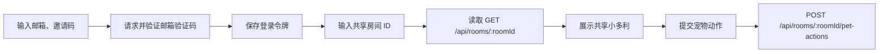

# 微信小程序体验版

## 目标

在不影响现有 React PWA 和 Node 后端的前提下，使用 Taro 创建一个独立的微信小程序，供两名体验成员通过邮箱验证码登录、读取同一共享房间的小多利并完成宠物互动。

## 当前流程



## 第二阶段范围

- Taro + React + TypeScript 微信小程序骨架；
- 邮箱验证码和邀请码登录，令牌仅保存在小程序本地存储；
- 从既有 Pet10 API 读取共享房间和真实宠物数据；
- 喂食、玩耍、清洁、睡觉四种真实宠物动作；
- 小多利、四个动作图标和经验/状态卡片复用 PWA 的同源 PNG 资源与信息层级；
- 登录、加载、未选房间、无宠物和请求失败提示；
- 首页、宠物详情占位页、共享房间占位页、测试设置页；
- 微信开发者工具可构建的 WeApp 产物。

## 明确不在范围内

- PostgreSQL、Redis 和 COS；
- WebSocket 实时聊天；
- AI 问答和图片生成；
- 小程序内加好友、创建共享房间、衣柜、照片墙和任务的实际功能；
- 微信支付、会员和公开发布；
- 现有 PWA 页面或后端行为修改。

## 代码入口

- `miniapp/src/pages/index/index.tsx`
- `miniapp/src/domain/petRules.ts`
- `miniapp/src/services/apiClient.ts`
- `miniapp/src/services/authApi.ts`
- `miniapp/src/services/petApi.ts`
- `miniapp/src/services/petMapper.ts`
- `miniapp/src/components/PetStatusCard.tsx`
- `miniapp/src/components/PetActionBar.tsx`
- `miniapp/config/index.ts`

## 配置与两人体验

构建时通过环境变量提供 API 基地址，不得把令牌、AppSecret 或其他密钥写进小程序：

```powershell
$env:TARO_API_BASE_URL = "https://你的-api-域名"
npm run build:weapp --prefix miniapp
```

API 域名必须使用 HTTPS，并添加到微信小程序后台的“开发管理 → 开发设置 → 服务器域名 → request 合法域名”。开发者工具可以仅用于本机调试而临时关闭合法域名校验；第二名成员在真机体验时不能依赖该开关。

两人都需要分别使用现有允许名单内的邮箱和邀请码登录。两人必须先在 Pet10 PWA 中建立同一个双人共享房间，然后在小程序中填写该房间 ID；小程序不会创建房间或把普通单人房间转换为共享房间。

## 资源与排版

小程序将以下 PWA 运行时资源复制到 `miniapp/src/assets/`，采用本地打包、非预加载方式，避免依赖 Web 的 `/pet/...` 路径或未配置的图片域名：

| 文件 | 原始尺寸 | 体积 | 小程序用途 |
| --- | --- | --- | --- |
| `xiaoduoli.png` | 436×700 | 500 KB | 宠物场景主图 |
| `action-feed.png` | 445×474 | 245 KB | 喂食动作 |
| `action-play.png` | 449×474 | 247 KB | 玩耍动作 |
| `action-clean.png` | 448×474 | 253 KB | 清洁动作 |
| `action-sleep.png` | 447×474 | 258 KB | 睡觉动作 |

图片均为 PNG；运行时使用固定容器尺寸和 `aspectFit`，避免布局跳动。它们分别与 `public/pet/xiaoduoli.png`、`public/nest/action-feed.png`、`public/nest/action-play.png`、`public/nest/action-clean.png` 和 `public/nest/action-sleep.png` 保持相同源文件；PWA 图片仍在 `docs/assets/asset-manifest.json` 中登记，小程序副本随 `miniapp` 构建产物分发。

## 开发命令

在仓库根目录执行：

```powershell
npm test -- --run miniapp/src/domain/petRules.test.ts
npm test --prefix miniapp
npm run build:weapp --prefix miniapp
```

微信开发者工具导入目录：

```text
D:\Pet10\miniapp
```

构建输出目录：

```text
D:\Pet10\miniapp\dist
```

根目录的 `project.config.json` 通过 `miniprogramRoot` 指向 `dist`。微信开发者工具应导入项目根目录，不应直接导入构建输出目录。

## 白屏排查

如果导入后模拟器持续白屏：

1. 关闭已经直接导入 `D:\Pet10\miniapp\dist` 的旧项目；
2. 重新导入 `D:\Pet10\miniapp`；
3. 执行 `npm run build:weapp --prefix miniapp` 后点击“编译”；
4. 如果开发者工具仍然卡死，关闭硬件加速并清理工具缓存后重启；
5. 在“设置 → 安全设置”中开启服务端口，允许使用 CLI 自动化读取运行错误。

开发者工具日志出现 `webcontents-render-process-gone` 且原因为 `oom` 时，说明白屏来自工具渲染进程内存崩溃，而不是小程序页面构建失败。

## 风险与后续阶段

- 如果 API 地址为空、非 HTTPS 或未配置为合法域名，真机无法连接真实数据；
- 服务端目前只允许一个 `APP_ORIGIN`；小程序请求不依赖浏览器 CORS，但生产 API 仍需按现有部署规范设置可访问的 HTTPS 地址；
- 共享房间页面目前仍是体验入口；实时宠物更新需后续接入 Socket.IO 或轮询；
- 正式体验版前需要由管理员添加第二名体验成员；
- 微信 OpenID 登录需要单独设计，不能在客户端伪造用户令牌。

## 第二阶段验收

- [x] 邮箱验证码登录接口已接入；
- [x] 共享房间宠物读取与四种动作接口已接入；
- [x] 小多利和四个动作图标使用 PWA 同源资源；
- [x] 信息卡采用 PWA 的场景、等级、经验和四项状态层级；
- [ ] 使用真实 HTTPS API 完成两人登录并读取同一只宠物；
- [ ] 两台真机轮流操作后验证数据同步；
- [ ] 微信开发者工具视觉验收；
- [ ] 微信开发者工具真机预览；
