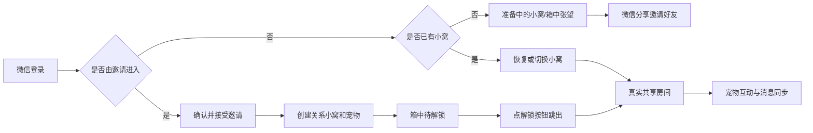

# 微信小程序

## 目标

使用 Taro 提供正式微信登录、好友邀请、多关系小窝、宠物互动和共享房间聊天。小程序是本项目唯一的前端。

## 当前流程



## 当前范围

### 个人资料与微信资料

- 微信登录一次点击静默完成，不收集头像昵称，也不再展示确认弹窗；新用户默认使用“微信用户”和默认头像。微信自 2022 年废弃 `wx.getUserProfile`，头像与昵称无法一键授权，只能由用户各做一次主动操作。
- 令牌失效时客户端会清除令牌、静默重登一次并重放原请求，不再停留在“资源准备失败”页；并发请求只触发一次重登，且只重放一次。
- 令牌有效但账号已被注销（如在其他设备注销后，本机仍持有旧令牌）时，启动准备会收到 404 `user_not_found`；客户端识别该错误后清除本地令牌并退回登录页，提示“账号已注销，请重新登录”，不再卡死在准备页。判定逻辑在 `miniapp/src/domain/sessionState.ts` 的 `isAccountMissingError`，接线在 `miniapp/src/pages/index/index.tsx` 的启动失败分支。
- 邀请页从分享卡打开后自动静默登录并展示邀请，登录或读取失败时保留重试入口。
- “我的”页面不再提供 MBTI 手动选择，性格类型只能通过 28 题测试计算并保存，支持重新测试。
- “我的”页面支持分别编辑姓名、性别和生日；性别选项为女、男、保密，默认保密。
- “我的”页面右侧资料值增大字号和点击区域，避免信息过小难以识别。
- 头像编辑器改为大预览、中文选项、较大色块和固定操作栏的底部面板。

### 小程序主界面补充

- UID 与好友系统：每个用户注册时分配全局递增的八位数字 UID（`users.uid`，数据库序列 `users_uid_seq` 从 00000001 起，存量用户按创建时间回填）。「我的」页名字下方展示 `UID: 12345678` 胶囊（`miniapp-me__uid-row`），点击弹 toast「你是第 N 位小多利用户~」（N 取去前导零的数字）。消息页标题下有两枚胶囊操作「＋ 添加好友」「🐾 小多利圈」；添加好友弹窗（`MiniappAddFriendModal`）输入 8 位数字 UID 精确搜索并直接发送好友申请（服务端 `/api/friendships` 优先按 UID 解析，兼容旧公开码/用户名/邮箱；通知 payload 带 `fromUid`），下方列推荐好友（已接受关系，带「已共养小多利/已加好友」状态）与「邀请微信好友」分享按钮。加好友只建立关系与聊天房间，不再自动创建小多利。
- 小多利圈（`MiniappCirclePage`，消息页内整页层）：聚合用户所有已接受关系的房间动态（用户 + 小多利，含升级庆祝等 pet 帖），按时间倒序；每条卡片带头像/昵称/「xx 的小窝 · 时间」、正文与点赞（♥ 计数，可切换），服务端接口 `/api/social/circle`（`listCircleFeed`）。无动态时空态引导「去添加好友」。
- 合养邀请流程：小窝空状态的底部按钮改为「邀请好友一起养小多利吧~」，点击弹「选择一起养的好友」弹窗（`MiniappCoRaisePickerModal`，数据 `/api/co-raise/candidates`，过滤已共养项）；列表为空时引导打开添加好友弹窗。点「邀请」调 `/api/co-raise/relationships/:id/invite`，对方在小窝（未共养时）的消息页顶部收到邀请提示入口（横幅条：小多利头像 + 「xx想和你一起养小多利」+ 引导句，数据来自通知类型 `co_raise_invitation`）。点提示弹确认框：「小多利全世界只有一只，只能与唯一的一位好友共养哦。确认选择和 Ta 一起养了吗？」，按钮「再想想 / 确认」；确认调 `/api/co-raise/relationships/:id/confirm` 服务端校验双方共养名额（任一方已有小多利则 400 `pet_quota_used`/`friend_pet_quota_used`，同房已有则 `already_co_raising`）后在该房间补建唯一小多利并写初见记忆，随后刷新上下文进入活跃小窝（boxPhase 跳箱解锁流程不变）。
- 箱中小多利待机动画间隔收紧（`xiaoduoliBehavior.ts`：`XIAODUOLI_IDLE_DELAY_MIN/MAX_MS` 由 1800–6000ms 改为 800–2600ms），表演更频繁；动作概率与时长不变。
- 小窝、消息、我的页标题下保留简介（句尾不带句号）；主内容区上边距收紧，底部导航位置不变；底部 tab 图标下的文字相对原位上移 4rpx（图标位置不变）。
- 无好友时，小窝邀请界面上方是小多利在纸箱里探头左顾右盼，中部信纸信件（九宫格切片渲染：四角固定不变形、四边单轴拉伸、中心净区补余量；整封信不分段，完整平铺在白纸净区内，不滚动），下方领养提示（小多利独一无二、只能养一只、请认真选择一起养的对象；提示与信纸、与邀请按钮的间距均已收窄）；底部为「邀请好友一起养小多利吧~」按钮（点击打开选择一起养的好友弹窗，不再直接微信分享）。切片文件名带版本号（当前 -v4），因同路径图片会被开发者工具缓存供旧图，换图必须升文件名。箱中待机为原图直出 + 眼部木偶拆解方案：身体层（`xiaoduoli-body.png`）是原图直出、一个像素不改；眼部三层全部从同一原图确定性裁切/采样生成——眼眶层（`xiaoduoli-eyes.png`，瞳孔原位以采样虹膜色填充）、瞳孔层（`xiaoduoli-pupils.png`，圆盘裁切）、眼窝底毛层（`xiaoduoli-underlay.png`，逐角度采样椭圆外纯毛区毛色作眼睑色填到 d=0.6、跨睫毛暗环平滑混回原图色（0.6..0.92）后 alpha 才渐隐（0.94..1），眨眼压扁后露出成闭眼眼睑；颜色先于透明度收敛使边界合成逐像素等于原图，圆形切边不可见）；静止时与原图逐像素一致，眨眼=眼组（眼眶+瞳孔）绕瞳孔平均高度支点整体压扁露出底毛成闭眼线，瞟眼=瞳孔在眼眶内滑动（±1.3%）；各图层 446×314 同坐标叠放，显式 rpx 尺寸对位，瞳孔支点由出件脚本自动生成；领域层按邀请种子生成随机时间线，做眨眼、双眨、左右瞟和小跳，同一房间回放一致，并支持 `prefers-reduced-motion` 降级为静态图。纸箱动画底下铺夜景街角背景（`xiaoduoli-street-v13.png`，贴寻主启事的砖墙与路灯；从 source 原图整幅直切 750:406 舞台比例，边缘烧焦晕染按最暗通道亮度映射为真 alpha；白 matte 内左右两边的炭色云纹靠彩度（chroma≥8）识别恢复——白底无彩度归零、有彩度云纹按彩度强度回填半透明，使左右与上下同为烧焦云撕形朦胧渐隐，画布四周再叠 12~14px 线性 alpha 渐隐兜底保证贴合屏幕边无硬线；740×401 PNG 入包，`aspectFill` 铺满舞台、左右贴屏幕两边，z-index 0 垫底，动画各层照常在其上方；箱体与小多利按 0.58 缩小：箱高 35.5%（底距 5%）、木偶 192×134rpx（整体较原图缩小并上移），落点与眼神动画随 rpx 等比缩放）。
- 好友接受邀请后，小窝仍是同一套箱中探头和信件，只把底部按钮换成「玩家已接受邀请解锁小多利~」；点按钮后播放从箱子跳出、彩带和星光，随后进入站立小多利与互动。已有小窝在本机记为已解锁，不会重播。
- 锁定/空状态信件场景（`shouldLockNestPageScroll` 为 true）由 `MiniappNestView` 渲染进 `.nest-lock-layer` 固定全屏层（`position: fixed; inset: 0; z-index: 19; overflow-y: auto`，padding 与 `.home-page` 一致、底部净空统一 238px 与其他 tab 对齐），底部邀请/解锁按钮与反馈文案经 `footer` prop 一并渲染在层内：页面文档流高度归零，真机不再出现「除底部栏外整页可拖动」的页面级滚动（信纸 + 街景 + 底部留白原本合计超过一屏），超矮机型由层内滚动兜底；loading 与解锁后的活跃态仍走原文档流，消息/日历/我的页不受影响。
- 小窝支持读取共同记忆、删除共同记忆，并展示双方贡献榜。小窝顶部不再展示「好友名 · Lv」房间芯片行；多房间的切换入口在消息页会话列表，避免测试好友名字堆在小窝上方。
- 消息页读取真实会话列表（走 `conversationListCache.ts` 内存单槽缓存：tab 切入先直出缓存列表不闪无好友空态页，后台静默刷新替换，请求失败保留缓存，登出清缓存防串号），支持切换当前共享房间。无好友会话时按空态卡片展示：标题与副文案、中间较大的抱信封小狗插画（约屏宽一半，文字紧跟插画下方）、说明和「去添加好友」按钮（打开添加好友弹窗）。有好友会话时只渲染会话列表本身（不再附加与会话重复的“共享房间”固定入口）；共享房间消息按 `senderId` 区分发送者：自己的消息右侧显示「我」，好友的消息左侧显示好友昵称（`getMessagePresentation`），小多利消息左侧显示「小多利」。
- 聊天页输入区不再提供「叫小多利说句话」快捷按钮（旧房间页同移除）；共享弹窗关闭叉叉换为无外圈版本（`modal-close-v2.png`，由 `miniapp/tools/make-modal-close.mjs` 出件，显示尺寸相应收窄保持视觉大小）。
- 小记、消息、我的三个 tab 的根节点（`.miniapp-journal` / `.miniapp-messages` / `.miniapp-me`）与游戏中心、锁定信件场景同模式，各自是 `position: fixed; inset: 0; z-index: 19; overflow-y: auto` 的固定全屏层：页面文档流高度归零，真机整页不可拖动，内容超一屏由层内滚动兜底（小记正常内容仍恰好一屏，padding 8px 28px 226px 复刻原几何）；消息/我的层底部净空统一为 238px（与小记 226px+12px 一致），不再紧贴底栏。层在底部导航（z 20）之下；loading 与解锁后的活跃态小窝仍走原文档流。
- 「关于小多利」弹窗长按版本号进入隐藏 GM 工具：可为当前账号批量添加 1/3/5 个测试好友（服务端生成 `gm_friend_*` 假用户并直接建立已接受关系和房间，不再自动创建宠物），也可一键删除全部测试好友；删除只作用于 GM 生成的假用户及其关系（真实好友不受影响，服务端按外键级联清理对应房间数据）。添加或删除成功后立即刷新首页上下文（`MiniappMeView` 的 `onDataChanged`）。
- 全小程序返回入口统一使用共享组件 `MiniappBackButton`（`miniapp/src/components/`）：无底色的深棕细左箭头（CSS 边框旋转绘制，4rpx 描边），仅保留 72rpx 透明命中区域与按压变淡反馈，`aria-label="返回"`。写日记顶栏、纪念日面板、今日运势页、游戏中心和五子棋页的返回都由它渲染，不再各自维护 `‹` 字符或文字样式。
- 小记为单人日记：整页固定一屏不滚动（容器 `height: calc(100vh - 220px)`、`overflow: hidden`），今日运势条固定可见，「查看」展开的历史日记在今日块固定区域内超出裁剪；页面背景与其它主界面同为 `#fff8ee`；标题左对齐，下方简介「记录和小多利的每一天」（各 tab 页简介句尾均不带句号），「日记 / 纪念日」居中分页；周历放在白卡片里；进入小记时今日日记先显示三行微光骨架占位（`prefers-reduced-motion` 时静止），本周日记接口返回后才把骨架换成空态文案或已记录内容，不再先闪「还没有日记」默认文案再刷新；周日记走内存单槽缓存（`miniapp/src/features/main/journalWeekCache.ts`，只存最后一次请求窗口），请求成功写入缓存，再次切入小记 tab（组件重挂载）时直接渲染缓存数据、不重播骨架动画，改为后台静默刷新替换；已登录冷启动与微信登录成功后后台预取本周日记，首次进小记多数也能直接命中，登出时清缓存防串号；跨周翻页与缓存外的周仍按首次加载播骨架，请求失败时保留缓存/已有数据不闪空态；今日日记卡右侧有「查看」，未上传照片时默认拍立得用坐姿小狗并放大到 280×292（上传照片白框可见尺寸与邮票可见邮票面一致：233 内衬 + 8/8/20 边衬 ≈ 249×230，切换不跳变且不再大于默认邮票），正文在卡内 `ScrollView` 滚动查看（字号不变，`word-break: break-all` 保证无空格长串也换行），上传照片后用白框拍立得展示（264 内衬 + 8/8/20 边衬，倾角与坐姿邮票一致，约 -6°）；写日记/拍照记录插图较大；各区块使用统一 32rpx 间距；写日记/拍照记录按钮收矮且距卡片底边不变，今日日记上半拍立得区固定 292rpx，运势条紧跟其下、自带 24rpx 底部外边距整体上移，与底栏间距接近消息页。写日记和纪念日都在当前页全屏打开，不跳转；写日记覆盖层固定一屏不滚动，自带顶栏（统一返回按钮 / 写日记 / 保存）、白卡片占满剩余高度（卡片内除正文外全部定高不可压缩；庭院插画整体下移 85rpx 裁掉部分底部空草地，小狗落在卡片下方约 330rpx 露出带里）和心情选择行；正文 textarea 是卡片内唯一弹性区（内容多时在框内滚动，最低 60rpx），相册缩略图行和地点输入出现时压缩正文区而非撑高卡片；心情直接点选表情图（难过/平静/开心/兴奋，120rpx 大图，选中高亮；表情为 200×200 透明贴纸，由 `miniapp/tools/make-mood-slices.mjs` 从四心情源图出件：边界洪泛转真透明 + 圆盘灰环几何擦除 + 按主体腮宽归一化统一四张狗头的尺寸与高度（装饰不参与基准），文件名带版本号当前 -v6（以眼心为公共锚点开统一裁窗，不缩放只对齐——源图四格同尺寸绘制，任何按轮廓宽度缩放的方案都会被姿势带偏）），日期行不再重复显示心情文字；天气按钮动态显示当前天气图标；未放照片时拍立得放大为 300×326（奔跑邮票 `aspectFit` 居中，「点这里放今天的照片」提示收在框内下方，不遮挡工具栏），放照片后白框可见尺寸与奔跑邮票可见邮票面一致（264 内衬 + 14/14/20 边衬 ≈ 292×284，倾角与默认奔跑邮票一致约 +6°，两张默认邮票倾角实测方向相反），切换尺寸不跳变，默认插图为奔跑小狗；照片最多 3 张，点主图弹「查看大图/更换照片」，点主图下方缩略图直接预览大图，缩略图 × 移除不影响预览。不提供点赞和分享。
- 日记数据使用个人维度 `/api/diaries` 接口（创建、区间列表、更新、删除、切换喜欢），照片压缩后以 base64 存储，单张不超过 30 万字符、每篇最多 3 张。
- 纪念日与日记编辑器仍保留独立页面路由作壳层（`pages/journal-anniversary`、`pages/journal-editor`），主路径在小记当前页全屏打开对应面板；纪念日沿用房间维度接口，无好友时回退个人 `pet_dm` 房间。纪念日面板顶部有暖色渐变过渡；面板覆盖层与写日记一致为定高 `overflow: hidden` 一屏层不可滑动（表单照片区 220rpx、间距收紧凑保证小屏一屏放下）；进入面板先显示两块微光骨架卡，接口返回后才渲染列表或空态，不再先闪默认空状态。纪念日列表卡片为「暖底圆角方形图标座 + 左侧信息 + 右侧倒计时聚焦块」，带顶部高光与多层投影（图标为 256×256 手绘贴纸风透明底 PNG，由 `miniapp/tools/make-anniversary-icons.mjs` 从 SVG 出件：深棕粗描边 + 奶白/柔粉填充 + 暖橙点缀与小星星装饰，与应用内心情/动作图标同语言，单张 4–8KB）：信息列依次为名称（卡片标题档）、日期行（`2024年8月28日 · 每年/单次`）、说明（单行省略）与「已走过 N 天」等辅句；右侧聚焦块展示大号倒计时数字加「天后/天前」单位（40rpx 档），点击卡片进入编辑；当天纪念日卡片换暖色渐变底，聚焦块显示「今天」，辅句显示「第 N 周年 🎉」（单次为「就是今天 🎉」）；未到首次日期的纪念日辅句显示「期待中 ✨」。列表按下次日期由近到远排序（过期单次垫底），底部为虚线描边卡片式「+ 添加纪念日」按钮；空状态为白卡居中气球插画加「还没有纪念日」与引导文案；列表卡片有轻量上浮入场动效并支持 `prefers-reduced-motion` 降级。可选上传一张照片作纪念日背景（表单照片区 300rpx 高，复用 `imageCompression` 统一压缩链路：quality 80、宽度档 [1080, 900, 720]、dataURL 上限 300_000 字符，服务端 `anniversaryPhotoSchema` 同步校验，`photo: null` 清除）；上传照片后列表改用 DaysMatter 式照片背景大卡（560rpx 高，照片 `aspectFill` 铺底 + 上下渐隐遮罩，居中展示「名称 · 还有/已经」引导句、132rpx 大号倒计时数字与「N年N月M日 星期X」日期行，白字带投影），无照片仍用图标座卡片。表单整体收进白卡：日期、名称、说明为暖底字段块，五个图标选项为等宽大图标格（84rpx 透明底贴纸直接点选，无边框不可滑动，选中仅换暖底加深色描边，与写日记心情选择同款交互），「每年重复/不重复」为分段控件（选中格白底浮起，原生按钮边框已重置），底部操作行为「取消 / 删除（编辑时） / 保存」，保存为暖色渐变胶囊按钮。
- 我的页面支持 MBTI 选择并通过资料接口保存。
- 我的页面复用 `avatarConfig` 合同，支持头像预览、编辑、恢复和保存。
- 小程序主页面壳层、底部安全区和底部导航使用统一的 `#fff8ee` 背景，避免切换到底部页面时出现白色露底。
- 爪印菜单提供“每日暗号”“游戏”“塔罗占卜”三个带图标入口，不设关闭按钮（点遮罩或再点爪印关闭）；图标统一使用圆角方形底座（镜面高光 + 内圈白描边 + 暖色渐变与多层投影的烤漆质感），按一行最多四格的网格从左到右排布，不足一行靠左；下拉栏弹出时整栏从底部强弹簧上滑、标题自上方落入、入口逐个加大行程上浮错帧出现，关闭时反向收起，并支持 `prefers-reduced-motion` 降级。小程序端不再提供足迹地图功能和入口。
- “游戏”入口打开整页游戏中心（不再是居中弹窗）：页首为“一起玩小游戏”标题、简介与小多利趴在窝垫上的插画（`journal/puppy-cushion-v2.png`），下方卡片列出五子棋（“开始游戏”暖金胶囊按钮）并保留“更多游戏敬请期待😈”；打开时内容从上往下逐列入场（标题落入、卡片错帧弹簧上浮）；进入五子棋后关闭棋盘返回游戏中心。五子棋复用服务端同一状态机，通过 `/api/games/gobang` HTTP 轮询支持邀请、接受、落子、认输和结果同步。
- 五子棋面板（`miniapp/src/features/main/MiniappGobangPanel.tsx`）选择页在页首展示小多利插画与浮棋装饰的英雄卡，下方两张玩法卡（单人练习/好友对战）带圆形图标底座、镜面高光与错帧入场；对弈页顶部为“我 VS 对手/小多利”头像对阵栏（自己与好友用 `avatarUrl`，无头像回退首字圆形占位，小多利固定用 `xiaoduoli.png` 形象），头像角标显示执子颜色，轮到谁落子谁的头像点亮金圈；棋盘带木纹渐变、四周闭合网格线（首列补左线、首行补上线）与星位标记，整块在剩余空间居中，落子有弹入动画，好友对局最新一手棋子带红点标记；面板内文案统一使用“小多利”（不再出现“小多利机器人”）。
- 记忆面板使用居中弹窗，不阻断主页面导航。

### 当前未完成

- 塔罗牌面从腾讯 COS 直连下载，动画按小程序能力逐阶段迁移；
- 小程序端头像编辑器、MBTI 测试和完整运势详情仍待迁移。

- Taro + React + TypeScript 微信小程序骨架；
- 仅使用微信登录，服务端通过 `jscode2session` 创建或恢复 Pet10 身份；服务端只保留 `/api/auth/wechat` 一个登录接口（邮箱验证码登录已移除），该接口按 IP 限流，默认每分钟 10 次，可用 `WECHAT_LOGIN_RATE_LIMIT_PER_MINUTE` 调整，超限返回 429；
- 新用户无需邀请也能进入准备中的小窝；
- 使用微信原生分享卡片邀请任意微信好友；
- 好友接受邀请后创建独立关系小窝和共享宠物；
- A+B 和 A+C 分别拥有不同小窝和宠物；
- 从 Pet10 API 读取共享房间、真实宠物和最近 50 条消息；
- 发送真实文本消息、请求小多利回复，并通过单请求在途的 3 秒轮询实现基础双端同步；前一次请求未结束时不会重叠发起下一次，切换房间后的旧响应会丢弃。
- 喂食、玩耍、清洁、睡觉四种真实宠物动作；
- 小多利、四个动作图标和经验/状态卡片使用仓库静态资源中的同源 PNG 与信息层级；
- 登录、加载、无小窝、无宠物、邀请失败、消息失败和请求失败提示；
- 微信开发者工具可构建的 WeApp 产物。

## 明确不在范围内

- PostgreSQL、Redis 和 COS；
- Socket.IO 实时推送；当前共享房间使用 HTTP 轮询；
- 图片消息上传、图片生成；
- 照片墙和衣柜的实际功能（设计稿见 `docs/superpowers/specs/2026-08-29-wardrobe-photo-wall-tasks-design.md`）；
- 微信支付、会员和公开发布。

## 任务与道具系统（已实现第一期）

- 任务是**系统预设**的（`server/src/domain/nestTaskCatalog.ts`），用户只完成不创建：**每日任务**（连续签到 1 天 / 给小多利喂食 1 次 / 陪小多利玩耍 1 次 / 给小多利洗澡 1 次，每天刷新）+ **成就任务**（连续签到 3/7 天、累计喂食 10/50 次、累计洗澡 10 次、累计玩耍 20 次、和好友完成默契换装 1 次，链式解锁——前置成就领取后下一级才解锁）。奖励**只有道具**（狗粮/皮球/香皂），不发经验。
- 小窝右上「任务」图标打开全屏面板（复用纪念日覆盖层模式）：顶部道具库存条 + 「签到」按钮，下方「每日任务」「成就」两组任务卡。任务卡展示标题、奖励、进度（成就带进度条）；状态流转为「进行中 N/M → 可领取（金色按钮）→ 已领取」；未解锁成就显示灰置「未解锁」。
- 进度由服务端自动派生：照顾动作在 `POST /pet-actions` 内先扣道具、成功后写每日进度（`nest_task_progress` 表，每日任务按日期周期、次日自动重置）；签到走 `POST /api/rooms/:roomId/checkin`（每天一次，重复返回 409 `checkin_already_done`，同时向 `pet_events` 累计成就计数）；成就任务的进度 = `pet_events` 按 action 的累计计数（喂食/玩耍/清洁/睡觉/签到/默契换装）。领取走 `POST /tasks/:key/claim`（未完成 `nest_task_not_complete`、已领 409 `nest_task_already_claimed`、前置未领 `nest_task_locked`）。
- 照顾动作消耗道具（喂食耗狗粮、玩耍耗皮球、清洁耗香皂；**睡觉永远免费**防死锁）；库存不足返回 409 `insufficient_item`，首页消息提示去任务。照顾面板按钮显示道具库存角标，0 库存灰置。首次读取任务/库存自动发新手礼包（狗粮×3 皮球×2 香皂×2，只发一次）。
- 服务端表：`nest_task_progress`（房间×任务 key 的进度/领取状态，periodKey 区分每日周期与成就永久）、`room_inventory`（库存，条件更新防并发刷）、`room_pouches`（新手包标记）；v1 的用户自建任务表 `nest_tasks` 已在迁移中 `DROP TABLE IF EXISTS` 移除。领域规则在 `nestTaskCatalog.ts`（任务模板）与 `itemCatalog.ts`（道具/动作映射/新手包）。
- 小程序纯函数在 `miniapp/src/domain/nestTaskModel.ts`（按钮状态、分组、库存可用性、奖励文案），API 在 `nestTaskApi.ts`（list/claim/checkin/inventory），面板组件 `MiniappNestTaskPanel`。道具图标由 `miniapp/tools/make-item-icons.mjs` 出件（手绘贴纸风，与纪念日/心情图标同语言）。

## 代码入口

- `miniapp/src/pages/index/index.tsx`
- `miniapp/src/features/main/MiniappGamesPage.tsx`
- `miniapp/src/features/main/MiniappJournalView.tsx`
- `miniapp/src/features/main/JournalAnniversaryPanel.tsx`
- `miniapp/src/features/main/JournalEditorForm.tsx`
- `miniapp/src/domain/petRules.ts`
- `miniapp/src/services/apiClient.ts`
- `miniapp/src/services/authApi.ts`
- `miniapp/src/services/invitationApi.ts`
- `miniapp/src/services/launchContextApi.ts`
- `miniapp/src/services/petApi.ts`
- `miniapp/src/services/roomApi.ts`
- `miniapp/src/services/petMapper.ts`
- `miniapp/src/pages/invite/invite.tsx`
- `miniapp/src/features/main/MiniappNestView.tsx`
- `miniapp/src/features/main/XiaoduoliBoxScene.tsx`
- `miniapp/src/domain/xiaoduoliUnlock.ts`
- `miniapp/src/services/xiaoduoliUnlockStorage.ts`
- `miniapp/src/pages/room/room.tsx`
- `miniapp/src/components/PetStatusCard.tsx`
- `miniapp/src/components/PetActionBar.tsx`
- `miniapp/config/index.ts`

## 配置与微信体验

默认构建使用正式 API `https://api.pet10kk.com`，避免普通构建覆盖开发者工具中的可登录版本。需要连接其他环境时可通过环境变量覆盖 API 基地址；不得把令牌、AppSecret 或其他密钥写进小程序：

```powershell
$env:TARO_API_BASE_URL = "https://你的-api-域名"
npm run build:weapp --prefix miniapp
```

API 域名必须使用 HTTPS，并添加到微信小程序后台的“开发管理 → 开发设置 → 服务器域名 → request 合法域名”。开发者工具可以仅用于本机调试而临时关闭合法域名校验；第二名成员在真机体验时不能依赖该开关。

塔罗牌面、背景和牌背从腾讯 COS 直连下载，构建时必须提供 `TARO_TAROT_ASSET_BASE_URL`，指向当前 COS 版本目录（例如 `https://<bucket>.cos.<region>.myqcloud.com/pet10-web/<完整提交SHA>`）；缺少该变量时构建直接失败。COS 域名必须添加到微信小程序后台的“服务器域名 → downloadFile 合法域名”：

```powershell
$env:TARO_TAROT_ASSET_BASE_URL = "https://<bucket>.cos.<region>.myqcloud.com/pet10-web/<完整提交SHA>"
npm run build:weapp --prefix miniapp
```

体验成员使用各自微信身份登录，不再输入邮箱、邀请码或房间 ID。邀请人通过首页原生分享按钮发送邀请卡片；被邀请人打开卡片并接受后，服务端创建双方专属小窝和宠物。

## 资源与排版

小程序将以下仓库静态资源复制到 `miniapp/src/assets/`，采用本地打包、非预加载方式，避免依赖未配置的图片域名：

| 文件 | 原始尺寸 | 体积 | 小程序用途 |
| --- | --- | --- | --- |
| `xiaoduoli.png` | 436×700 | 79 KB | 宠物场景主图；解锁跳出后的站立小多利 |
| `action-feed.png` | 445×474 | 23 KB | 喂食动作 |
| `action-play.png` | 449×474 | 22 KB | 玩耍动作 |
| `action-clean.png` | 448×474 | 24 KB | 清洁动作 |
| `action-sleep.png` | 447×474 | 22 KB | 睡觉动作 |
| `room-background.jpg` | 1152×1152 | 106 KB | 小窝宠物场景背景 |
| `navigation/game.png` | 256×256 | 12 KB | 爪印菜单游戏入口图标 |
| `navigation/tarot.png` | 256×256 | 16 KB | 爪印菜单塔罗占卜入口图标 |
| `navigation/gobang.png` | 256×256 | 18 KB | 游戏中心五子棋入口图标 |
| `navigation/codeword.png` | 256×256 | 10 KB | 爪印菜单每日暗号图标（挂锁笔记本） |
| `me/mbti.png` | 128×128 | 4 KB | 我的页性格类型入口图标 |
| `nest/letter-paper-tl-v4.png` | 65×212 | 6 KB | 无好友小窝信纸九宫格左上角 |
| `nest/letter-paper-tc-v4.png` | 439×212 | 14 KB | 信纸九宫格顶带（含信封翻盖与图钉，切线过其下方纸面净区，固定不拉伸） |
| `nest/letter-paper-tr-v4.png` | 216×212 | 12 KB | 信纸九宫格右上角（含木夹与翻盖） |
| `nest/letter-paper-ml-v4.png` | 65×86 | 3 KB | 信纸九宫格左边条（纯竖向边带，随中行纵向拉伸） |
| `nest/letter-paper-mc-v4.png` | 439×86 | 3 KB | 信纸九宫格中心净区（纯色纸面，随卡片高度纵向拉伸） |
| `nest/letter-paper-mr-v4.png` | 216×86 | 4 KB | 信纸九宫格右边条（纯竖向边带，随中行纵向拉伸） |
| `nest/letter-paper-bl-v4.png` | 65×255 | 7 KB | 信纸九宫格左下角 |
| `nest/letter-paper-bc-v4.png` | 439×255 | 14 KB | 信纸九宫格底带（切线过爪印上方纸面净区，固定不拉伸） |
| `nest/letter-paper-br-v4.png` | 216×255 | 17 KB | 信纸九宫格右下角（含爪印、爱心与小信封装饰） |
| `nest/xiaoduoli-box.png` | 520×440 | 11 KB | 邀请/待解锁纸箱 |
| `nest/xiaoduoli-street-v13.png` | 740×401 | 169 KB | 待解锁纸箱夜景街角背景（原图直切，四边烧焦晕染+炭色云纹转真透明朦胧渐隐，左右贴边） |
| `nest/xiaoduoli-body.png` | 446×314 | 34 KB | 箱中探头身体层（原图直出，未作任何修补） |
| `nest/xiaoduoli-eyes.png` | 446×314 | 10 KB | 眼眶底层（瞳孔原位以采样虹膜色填充，供瞳孔滑动） |
| `nest/xiaoduoli-pupils.png` | 446×314 | 4 KB | 瞳孔圆盘层（瞟眼时在眼眶内滑动） |
| `nest/xiaoduoli-underlay.png` | 446×314 | 9 KB | 眼窝底毛层（纯毛环采样+边界融色，眨眼压扁露出成闭眼眼睑，无圆形切边） |
| `messages-empty-v2.png` | 520×411 | 28 KB | 消息页无好友空态：抱信封小狗 |
| `journal/polaroid-run-v2.png` | 420×406 | 36 KB | 写日记页默认奔跑小狗拍立得，点击可换自己的照片 |
| `journal/polaroid-sit-v2.png` | 420×373 | 33 KB | 小记今日日记卡默认坐姿小狗拍立得 |
| `journal/action-write-v2.png` | 320×270 | 14 KB | 小记「写日记」按钮插画 |
| `journal/action-photo-v2.png` | 359×219 | 22 KB | 小记「拍照记录」按钮插画 |
| `journal/editor-yard.jpg` | 750×750 | 29 KB | 写日记页底部庭院背景 |
| `moods/mood-1-v6.png` | 200×200 | 15 KB | 写日记心情选择：难过（乌云含泪，透明抠图） |
| `moods/mood-2-v6.png` | 200×200 | 17 KB | 写日记心情选择：平静（侧边汗滴，透明抠图） |
| `moods/mood-3-v6.png` | 200×200 | 19 KB | 写日记心情选择：开心（吐舌笑加短线，透明抠图） |
| `moods/mood-4-v6.png` | 200×200 | 17 KB | 写日记心情选择：兴奋（眯眼腮红加爱心星星，透明抠图） |

本地包内资源禁止使用 WebP（微信 image 组件不解析本地 WebP，iOS 真机会整块不显示；WebP 仅用于塔罗 COS 网络资源并配合 `webp` 属性）。入库前用 `scripts/optimize-miniapp-assets.mjs` 统一压缩：带透明通道的图片转 256 色全色板 + 误差扩散抖动 PNG（禁止再压 64/128 小色板，2026-08 验收发现小色板把整体压灰；全量真彩 PNG 约 5.4MB 超包，256 全色板是包体约束下最接近原图色彩的方案），不透明背景转 JPEG（mozjpeg，4:4:4 色度保留），两张大背景按显示密度降采样（street 840px、room 1152px）。可选 TinyPNG 追加压缩：设置 `TINIFY_API_KEY` 环境变量后执行 `node scripts/optimize-miniapp-assets.mjs --write`，脚本在本地优化产物上再过一遍 TinyPNG，只覆盖收益 ≥2% 的文件，输出保持 PNG/JPEG（key 存环境变量，禁止进仓库）。运行时用户照片压缩走 `miniapp/src/services/imageCompression.ts`：单次压缩、quality 80、按宽度档位 `[1080, 900, 720]`（头像 `[640, 480, 360]`）降分辨率重试，禁止降质量和重复压缩（详见 `.agents/rules/miniapp-image.md`）。运行时使用固定容器尺寸和 `aspectFit` 或 `aspectFill`，避免布局跳动。每张小程序图片控制在 180 KB 安全线内；主包构建产物必须低于微信 2MB 上限（当前约 1.9MB，若继续膨胀需考虑非 tab 页分包或大图迁 COS）。小程序副本随 `miniapp` 构建产物分发；塔罗资源不打包，从 COS 版本目录下载。

## 开发命令

在仓库根目录执行：

```powershell
npm test --prefix miniapp -- src/domain/petRules.test.ts
npm test --prefix miniapp
npm run build:weapp --prefix miniapp
```

微信开发者工具可直接导入仓库根目录：

```text
D:\Pet10
```

构建输出目录：

```text
D:\Pet10\miniapp\dist
```

仓库根目录的 `project.config.json` 通过 `miniprogramRoot` 指向 `miniapp/dist`；`miniapp/project.config.json` 仍支持单独导入小程序目录。不要直接导入构建输出目录。

预览时如果微信开发者工具已经打开，继续使用该窗口清缓存并编译，不要再开新窗口。只有尚未打开时才启动一次。

## 白屏排查

如果导入后模拟器持续白屏：

1. 关闭已经直接导入 `D:\Pet10\miniapp\dist` 的旧项目；
2. 重新导入 `D:\Pet10\miniapp`；
3. 执行 `npm run build:weapp --prefix miniapp` 后点击“编译”；
4. 如果开发者工具仍然卡死，关闭硬件加速并清理工具缓存后重启；
5. 在“设置 → 安全设置”中开启服务端口，允许使用 CLI 自动化读取运行错误。

开发者工具日志出现 `webcontents-render-process-gone` 且原因为 `oom` 时，说明白屏来自工具渲染进程内存崩溃，而不是小程序页面构建失败。

## 风险与后续阶段

- 如果 API 地址为空、非 HTTPS 或未配置为合法域名，真机无法连接真实数据；
- 服务端目前只允许一个 `APP_ORIGIN`；小程序请求不依赖浏览器 CORS，但生产 API 仍需按现有部署规范设置可访问的 HTTPS 地址；
- 当前消息同步使用 3 秒 HTTP 轮询，页面隐藏后停止；轮询请求 single-flight 且过期响应不写入页面，后续可升级 Socket.IO；
- 分享前必须成功创建服务端邀请 token，不能把房间 ID 作为邀请参数；
- 正式发布前仍需验证两台真机的微信分享、邀请回跳和消息同步。

## 当前验收

- [x] 微信登录接口已接入；
- [x] 无邀请新用户进入准备中的小窝；
- [x] 微信好友邀请卡片和邀请确认页已接入；
- [x] A+B、A+C 独立小窝约束已接入；
- [x] 共享房间宠物读取与四种动作接口已接入；
- [x] 共享房间历史消息、发送消息和小多利回复已接入；
- [x] 页面可见期间每 3 秒同步最新消息；
- [x] 小多利和四个动作图标使用仓库同源资源；
- [x] 信息卡采用场景、等级、经验和四项状态层级；
- [x] Pet10 状态反馈与邀请入口仅在小窝页显示；
- [x] 小窝、消息、小记和我的页面的页面壳层与底部安全区保持统一背景色；
- [x] 个人页优先展示会话中的微信昵称和头像，生日可直接通过日期选择器设置；
- [x] 微信登录一次点击静默完成，令牌失效自动重登并重放请求；
- [x] MBTI 只能通过 28 题测试计算，个人页不再提供手动类型选择；
- [x] 个人页支持姓名、性别编辑，性别默认保密；
- [x] 个人页右侧资料值和头像编辑器选项具备可读的字号、间距和点击区域；
- [x] 小记在未设置生日时不请求运势接口，改为提示先设置生日；
- [ ] 接受邀请后小窝显示箱中探头左顾右盼和「玩家已接受邀请解锁小多利~」，点按钮后跳出并带彩带星光；
- [ ] 使用真实 HTTPS API 完成两人接受邀请并读取同一只宠物；
- [ ] 两台真机轮流操作后验证数据同步；
- [ ] 微信开发者工具视觉验收；
- [ ] 微信开发者工具真机预览；
