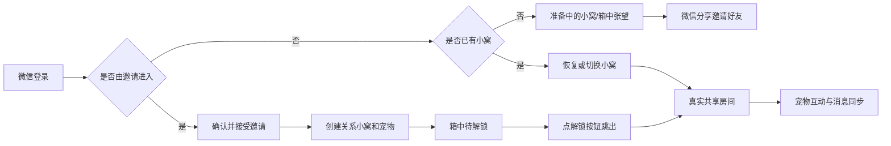

# 微信小程序

## 目标

使用 Taro 提供正式微信登录、好友邀请、多关系小窝、宠物互动和共享房间聊天。小程序是本项目唯一的前端。

## 当前流程



## 当前范围

### 个人资料与微信资料

- 微信登录一次点击静默完成，不收集头像昵称，也不再展示确认弹窗；新用户默认使用“微信用户”和默认头像。微信自 2022 年废弃 `wx.getUserProfile`，头像与昵称无法一键授权，只能由用户各做一次主动操作。
- 令牌失效时客户端会清除令牌、静默重登一次并重放原请求，不再停留在“资源准备失败”页；并发请求只触发一次重登，且只重放一次。
- 令牌有效但账号已被注销（如在其他设备注销后，本机仍持有旧令牌）时，启动准备会收到 404 `user_not_found`；客户端识别该错误后清除本地令牌并退回登录页，提示“账号已注销，请重新登录”，不再卡死在准备页。判定逻辑在 `miniapp/src/domain/sessionState.ts` 的 `isAccountMissingError`，接线在 `miniapp/src/pages/index/index.tsx` 的启动失败分支。
- 邀请页从分享卡打开后自动静默登录并展示邀请，登录或读取失败时保留重试入口。
- “我的”页面不再提供 MBTI 手动选择，性格类型只能通过 28 题测试计算并保存，支持重新测试。
- “我的”页面支持分别编辑姓名、性别和生日；性别选项为女、男、保密，默认保密。
- “我的”页面右侧资料值增大字号和点击区域，避免信息过小难以识别。
- 头像编辑器改为大预览、中文选项、较大色块和固定操作栏的底部面板。

### 小程序主界面补充

- UID 与好友系统：每个用户注册时分配全局递增的八位数字 UID（`users.uid`，数据库序列 `users_uid_seq` 从 00000001 起，存量用户按创建时间回填）。「我的」页名字下方展示 `UID: 12345678` 胶囊（`miniapp-me__uid-row`），点击弹 toast「你是第 N 位小多利用户~」（N 取去前导零的数字）。消息页标题下有两枚胶囊操作「＋ 添加好友」「🐾 小多利圈」；添加好友弹窗（`MiniappAddFriendModal`）输入 8 位数字 UID 搜索（`GET /api/friendships/lookup`，服务端优先按 UID 解析，兼容旧公开码/用户名/邮箱）先展示对方信息卡——头像/昵称/UID 胶囊与关系状态（自己/已是好友/申请已发送/对方也申请了你），不发申请；用户手动点「加好友」才调 `POST /api/friendships`（通知 payload 带 `fromUid`）。下方「推荐好友」改为最新注册且与自己尚无好友关系/申请的用户（`GET /api/friendships/suggestions`，最多 4 条，行内可直接发申请，弹窗内发过即置灰「已申请」），不再展示我的好友；底部保留「邀请微信好友」分享按钮。加好友只建立关系与聊天房间，不再自动创建小多利。弹窗动效（弹入回弹、信息卡与推荐行错帧入场、按钮按压反馈）均带 `prefers-reduced-motion` 降级。
- 添加好友弹窗（`MiniappAddFriendModal`）与确认合养弹窗（`MiniappCoRaiseConfirmModal`）、小多利圈（`MiniappCirclePage`）都渲染在页面根层级（`index.tsx` overlay 状态机：`addFriend`/`circle`/`coRaisePicker`/`confirm`，z-index 40 盖过 tab 栏 z20——它们若渲染在消息页 z19 固定层内部会被 tab 栏压住，弹窗层级已验证）；圈层打开时隐藏 tab 栏，无动态时空态整体在页面中下部居中。
- 小多利圈（`MiniappCirclePage`）：聚合用户所有已接受关系的房间动态（用户 + 小多利，含升级庆祝等 pet 帖），按时间倒序；每条卡片带头像/昵称（圆形头像框统一用头部裁切版 `xiaoduoli-avatar-v2.png`：全身竖图 aspectFill 居中裁切会落在胸口、脑袋偏下）/「xx 的小窝 · 时间」、正文与点赞（♥ 计数，可切换），服务端接口 `/api/social/circle`（`listCircleFeed`）。无动态时空态引导「去添加好友」。
- 合养邀请流程：小窝空状态的底部按钮改为「邀请好友一起养小多利吧~」，点击弹「选择一起养的好友」弹窗（`MiniappCoRaisePickerModal`，数据 `/api/co-raise/candidates`，过滤已共养项）；列表为空时引导打开添加好友弹窗。点「邀请」调 `/api/co-raise/relationships/:id/invite`，对方在小窝（未共养时）的消息页顶部收到邀请提示入口（横幅条：小多利头像 + 「xx想和你一起养小多利」+ 引导句，数据来自通知类型 `co_raise_invitation`）。点提示弹确认框：「小多利全世界只有一只，只能与唯一的一位好友共养哦。确认选择和 Ta 一起养了吗？」，按钮「再想想 / 确认」；确认调 `/api/co-raise/relationships/:id/confirm` 服务端校验双方共养名额（任一方已有小多利则 400 `pet_quota_used`/`friend_pet_quota_used`，同房已有则 `already_co_raising`）后在该房间补建唯一小多利并写初见记忆，随后刷新上下文进入活跃小窝（boxPhase 跳箱解锁流程不变）。
- 箱中小多利待机动画间隔收紧（`xiaoduoliBehavior.ts`：`XIAODUOLI_IDLE_DELAY_MIN/MAX_MS` 由 1800–6000ms 改为 800–2600ms），表演更频繁；动作概率与时长不变。
- 四个 tab 页（小窝/小记/消息/我的）标题下的简介已整体移除，页面内容上移起排；各 tab 底部净空统一 238px（小窝文档流为 234px + 末张卡 8rpx 下边距，固定层直接 238px）；底部 tab 图标下的文字相对原位上移 4rpx（图标位置不变）。
- 无好友时，小窝邀请界面上方是小多利在纸箱里探头左顾右盼，中部信纸信件（九宫格切片渲染：四角固定不变形、四边单轴拉伸、中心净区补余量；整封信不分段，完整平铺在白纸净区内，不滚动），下方领养提示（小多利独一无二、只能养一只、请认真选择一起养的对象；提示与信纸、与邀请按钮的间距均已收窄）；底部为「邀请好友一起养小多利吧~」按钮（点击打开选择一起养的好友弹窗，不再直接微信分享）。切片文件名带版本号（当前 -v4），因同路径图片会被开发者工具缓存供旧图，换图必须升文件名。箱中待机为原图直出 + 眼部木偶拆解方案：身体层（`xiaoduoli-body.png`）是原图直出、一个像素不改；眼部三层全部从同一原图确定性裁切/采样生成——眼眶层（`xiaoduoli-eyes.png`，瞳孔原位以采样虹膜色填充）、瞳孔层（`xiaoduoli-pupils.png`，圆盘裁切）、眼窝底毛层（`xiaoduoli-underlay.png`，逐角度采样椭圆外纯毛区毛色作眼睑色填到 d=0.6、跨睫毛暗环平滑混回原图色（0.6..0.92）后 alpha 才渐隐（0.94..1），眨眼压扁后露出成闭眼眼睑；颜色先于透明度收敛使边界合成逐像素等于原图，圆形切边不可见）；静止时与原图逐像素一致，眨眼=眼组（眼眶+瞳孔）绕瞳孔平均高度支点整体压扁露出底毛成闭眼线，瞟眼=瞳孔在眼眶内滑动（±1.3%）；各图层 446×314 同坐标叠放，显式 rpx 尺寸对位，瞳孔支点由出件脚本自动生成；领域层按邀请种子生成随机时间线，做眨眼、双眨、左右瞟和小跳，同一房间回放一致，并支持 `prefers-reduced-motion` 降级为静态图。纸箱动画底下铺夜景街角背景（`xiaoduoli-street-v13.png`，贴寻主启事的砖墙与路灯；从 source 原图整幅直切 750:406 舞台比例，边缘烧焦晕染按最暗通道亮度映射为真 alpha；白 matte 内左右两边的炭色云纹靠彩度（chroma≥8）识别恢复——白底无彩度归零、有彩度云纹按彩度强度回填半透明，使左右与上下同为烧焦云撕形朦胧渐隐，画布四周再叠 12~14px 线性 alpha 渐隐兜底保证贴合屏幕边无硬线；740×401 PNG 入包，`aspectFill` 铺满舞台、左右贴屏幕两边，z-index 0 垫底，动画各层照常在其上方；箱体与小多利按 0.58 缩小：箱高 35.5%（底距 5%）、木偶 192×134rpx（整体较原图缩小并上移），落点与眼神动画随 rpx 等比缩放）。
- 好友接受邀请后，小窝仍是同一套箱中探头和信件，只把底部按钮换成「玩家已接受邀请解锁小多利~」；点按钮后播放从箱子跳出、彩带和星光，随后进入站立小多利与互动。已有小窝在本机记为已解锁，不会重播。
- 锁定/空状态信件场景（`shouldLockNestPageScroll` 为 true）由 `MiniappNestView` 渲染进 `.nest-lock-layer` 固定全屏层（`position: fixed; inset: 0; z-index: 19; overflow-y: auto`，padding 与 `.home-page` 一致、底部净空统一 238px 与其他 tab 对齐），底部邀请/解锁按钮与反馈文案经 `footer` prop 一并渲染在层内：页面文档流高度归零，真机不再出现「除底部栏外整页可拖动」的页面级滚动（信纸 + 街景 + 底部留白原本合计超过一屏），超矮机型由层内滚动兜底；loading 与解锁后的活跃态仍走原文档流，消息/日历/我的页不受影响。
- 小窝支持读取共同记忆、删除共同记忆，并展示双方贡献榜。小窝顶部不再展示「好友名 · Lv」房间芯片行；多房间的切换入口在消息页会话列表，避免测试好友名字堆在小窝上方。
- 活跃态小窝整页一屏不滚动（排版紧凑化，底部「今日默契换装」横卡已移除，默契状态收进衣柜面板内）：场景卡上半是 500px 高室内场景——背景 `room-background-v11.jpg`（AI 以 v10 源图为参考重生成：窗户比 v10 放大一点点、「Happy Day」牌与书架略缩小、地毯居中靠前让小多利坐在垫子正中；居中裁带；2048 归档源图中裁 750×570，42KB mozjpeg q70）`widthFix` 通栏铺满，显示高恰为 500rpx 与场景等高、无空带无两侧留白；小多利立绘 149×240 绝对定位居中坐在地毯中央（bottom 38px，脚底落在垫子中央；尺寸阶梯 212/148 双倍渲染误判→74/106/120/140 依次偏小→149 合适）；flow 模式盒宽由内联 style 给出，必须显式写 rpx（Taro pxtransform 不转换内联样式，写 px 会按设备像素渲染≈2 倍，立绘撑出盒底被场景裁脚，2026-09 连环「尺寸不对/偏下」真根因）；立绘图盒必须显式宽高（`MiniappOutfitPortrait` 的 `flowHeight` + aspectFill），禁用 widthFix——微信会在兄弟节点 setData 时重测量 widthFix 图，开关名片、切回小窝立绘都会闪一下（2026-09-01 反馈根因，与信件背景闪动同机制）；头顶说话气泡已按 2026-09-01 反馈整体移除（连同 `xiaoduoliSpeech.ts` 轮播与定时器一并删除，牌子不再受气泡净空约束）；左下小多利名牌（纯展示不点击，2026-09-01 二轮反馈移除名片弹窗后仅保留名牌）：手绘卡通空白小卡 `pet-card-entry-v3.png` 走 COS 按需下载不占包体（无角色，蜜桃粉/鹅黄/鼠尾草绿配色，solid 去底 360×248 PNG8+TinyPNG 39KB——显示 120rpx 的 3x 出件+lanczos 缩放后轻锐化治小尺寸发糊，v2 460px 超采样版已从 COS 移除），微倾斜 120×82rpx 显示（2026-09-01 多轮反馈逐步缩小：176→144→120）、宠物名 Text 居中叠放；未就绪时同款 CSS 卡面兜底、图就位 onLoad 门控淡入防闪跳；右侧快捷入口（衣柜/照片墙/任务）在「记忆」按钮（top/right 24px）下方起排并拉开间距（top 108px、right 24px、图标 92×96、间距 16px，2026-09-01 按验收反馈从 top 84/right 8 左移下移，不再贴近「记忆」按钮）。场景卡下半是紧凑状态区（成长经验 + 饱食/心情/精力/健康 2×2，原「开心地陪着你们」状态行已删；进度条加粗 16rpx，凹槽底 + 填充顶部高光/底部投影、四项状态各自同色系渐变，宽度变化 0.4s 过渡）；场景上半部任何状态都飘 b 站式弹幕（`xiaoduoliDanmaku.ts` 纯函数触发规则，情绪只决定频率与语气：心情引擎 happy 档或 mood≥75 → 7s 一条；content 档或 mood≥45 → 12s 一条；饿/累/病/困告急 → 10s 抱怨文案；bored/sulky/angry → 14s 小脾气；照顾栏点喂食/玩耍等动作刷新状态后连发 10 条弹幕流（350ms 错峰起漂，animation-fill-mode backwards 保证延迟期藏在右缘外）；同屏上限 10 条，暖棕字奶白光晕 transform 匀速从右向左漂过，漂出由定时器移除；周期弹幕的 plan.active 死判断已修（历史提交把弹幕改成任何状态都飘时删了域层 active 字段、组件判断漏改，周期弹幕自 492afe4 起从未触发，只有动作连发在飘），`prefers-reduced-motion` 由 CSS 降级隐藏）。下方照顾栏、贡献榜收紧内边距，主流机型合计恰好一屏，矮机型由页面滚动兜底。
- 照顾栏喂食/玩耍/清洁按钮的道具角标曾把按钮整个盖住：`.pet-action-button image` 会同时命中角标小图（微信 image 默认 300×225 铺开），改为子选择器 `.pet-action-button > image` 只命中主贴片图，角标回到 22rpx 小胶囊。2026-09-01 按验收反馈：四按钮贴片 120×128→108×115，标题行道具芯片的数量字号 20px→26px（与标题同级）。
- 小窝站姿 idle 三细节（2026-09-02）：①**呼吸**——站姿容器以底边为轴 scaleY 1→0.988（3.2s 循环，与箱中呼吸同量级、比睡姿呼吸轻），衣柜叠穿层在容器内随动不分离；②**眨眼**——复用箱中验证过的「眼窝底毛+眼组压扁」分层方案：出件工具 `miniapp/tools/cut-xiaoduoli-sit-eye-layers.mjs` 从站姿立绘切眼组条带（双眼 bbox 暗色连通域实测，240×98 共享条带）与眼窝底毛层（逐列垂直渐变毛色椭圆——站姿脸部明暗跨度大，箱中逐角度环采样会产生放射状扇纹，故改列采样），两层 PNG8 走 COS（4.8KB/4.0KB），按 149×240 图盒换算定位（缩放 149/436、left 33.5/top 49.9/82.0×33.5）；底毛常驻盖住原眼（静止时逐像素同底图），眼组按 2.2~6.2s 随机间隔整组绕双眼中心线压扁 200ms（A/B 双动画类交替换挡重播，不重挂 image 防重新加载闪烁；不变量 GROW≤PAD-FEATHER 保证底毛椭圆完全藏在眼组不透明核心内）；③**趴下**——新增 `lie` 行为幕（`NEST_PET_LIE_MS`=9000，调度间隔 36~78s 与闲逛并行独立，先到先得被占静默跳过），趴姿闭眼单帧 `xiaoduoli-lying-v1.png`（AI 以站姿为参考生成 + `cut-xiaoduoli-lying-pose.mjs` 白底泛洪切件 583×260 PNG8 80KB 走 COS，显示 291.5×130=站姿 54% 高）交叉淡入 300ms，以底边为轴轻呼吸（scaleY 0.985）到点回站姿；素材未就绪时趴下/眨眼静默跳过保持站姿；三项均带 `prefers-reduced-motion` 降级（呼吸静止、眨眼动画禁用、趴姿呼吸静止）。

- 小窝睡觉动作有「四脚朝天」行为幕：照顾栏点睡觉后，站姿立绘与肚皮朝天的睡姿图（COS 按需下载 `public/wardrobe/xiaoduoli-sleep-v1.png`，480×274 PNG8，`suitAssets.ensureFile` 下载缓存，未就绪保持站姿）交叉淡入 300ms，睡姿以底边为轴做肚皮呼吸（scaleY 1→0.97），头顶 Zzz 三连错峰上飘且周期弹幕暂停；20s（`domain/nestPetAct.ts` 的 `NEST_PET_SLEEP_MS`）后自动醒来，期间喂食/玩耍/清洁立即唤醒，重复点睡觉刷新时长。行为判定是纯函数 `reduceNestPetAct`（动作 → 行为幕状态），`MiniappNestView` 持状态+定时器，`PetStatusCard` 只负责渲染，全部动效带 `prefers-reduced-motion` 降级（淡入无过渡、呼吸/Zzz 静止）。
- 小窝自动「闲逛」与玩耍「叼娃娃」行为幕：站立态每 24~54s（`nextWanderDelayMs` 随机）自动出发闲逛一趟——AI 生成的两帧侧身步态（腾空尾高 `xiaoduoli-walk-a-v1` / 触地尾低 `xiaoduoli-walk-b-v1`，统一画布 468×300 脚底基线对齐，显示 87×57）以 0.42s step-end 交替成小跑循环，叠 0.42s 颠步+1.2° 轻摇，travel 一镜到底走中心→右缘→翻面（scaleX -1）→走回中心（7s = `NEST_PET_WANDER_MS`）；照顾栏点玩耍立即（睡觉中也会跳起来）出发「叼娃娃」分镜（9s = `NEST_PET_FETCH_MS`）：走向左缘→走出画面淡出→换向叼着红领巾绒毛娃娃（`xiaoduoli-doll-v1.png` 92×128，显示 34×46，挂 travel 层跟随翻面）走回中心→娃娃抛落弹地压扁回弹→开心蹦两下，娃娃停留后淡出；喂食/清洁不打断行进分镜，玩耍可打断闲逛改去叼娃；素材三张齐了才播分镜（未就绪静默保持站姿），`wardrobeAssetLoader` 下载+索引写回已串行化（并发 ensureFile 不再互相覆盖索引条目），全部动效带 `prefers-reduced-motion` 降级（分镜不播、娃娃不出现）。
- 消息页读取真实会话列表（走 `conversationListCache.ts` 内存单槽缓存：tab 切入先直出缓存列表不闪无好友空态页，后台静默刷新替换，请求失败保留缓存，登出清缓存防串号），支持切换当前共享房间。无好友会话时按空态卡片展示：标题与副文案、中间较大的抱信封小狗插画（约屏宽一半，文字紧跟插画下方）、说明和「去添加好友」按钮（打开添加好友弹窗）。有好友会话时只渲染会话列表本身（不再附加与会话重复的“共享房间”固定入口）；会话行为固定高度：最新消息预览单行省略（`.miniapp-messages__conversation-copy` 必须带 `display:block`，微信 `Text` 默认内联会使 ellipsis 失效、长文案把行撑高）；共享房间消息按 `senderId` 区分发送者：自己的消息右侧显示「我」，好友的消息左侧显示好友昵称（`getMessagePresentation`），小多利消息左侧显示「小多利」。
- 聊天页输入区不再提供「叫小多利说句话」快捷按钮（旧房间页同移除）；共享弹窗关闭叉叉换为无外圈版本（`modal-close-v2.png`，由 `miniapp/tools/make-modal-close.mjs` 出件，显示尺寸相应收窄保持视觉大小）。
- 小记、消息、我的三个 tab 的根节点（`.miniapp-journal` / `.miniapp-messages` / `.miniapp-me`）与游戏中心、锁定信件场景同模式，各自是 `position: fixed; inset: 0; z-index: 19; overflow-y: auto` 的固定全屏层：页面文档流高度归零，真机整页不可拖动，内容超一屏由层内滚动兜底（小记正常内容仍恰好一屏，padding 4px 28px 226px，顶部上移后的起点）；消息/我的层底部净空统一为 238px（与小记 226px+12px 一致），不再紧贴底栏。层在底部导航（z 20）之下；loading 与解锁后的活跃态小窝仍走原文档流。
- 「关于小多利」弹窗长按版本号进入隐藏 GM 工具：可为当前账号批量添加 1/3/5 个测试好友（服务端生成 `gm_friend_*` 假用户并直接建立已接受关系和房间，不再自动创建宠物），也可一键删除全部测试好友；删除只作用于 GM 生成的假用户及其关系（真实好友不受影响，服务端按外键级联清理对应房间数据）。添加或删除成功后立即刷新首页上下文（`MiniappMeView` 的 `onDataChanged`）。2026-09-01 新增「小窝调试」组：①「道具各 +9」调 `POST /api/gm/nest/items` 给当前账号全部房间的库存发牛奶/皮球/香皂/骨头各 9 件（可重复点，自动覆盖道具目录全量）；②衣柜全解锁开关调 `POST /api/gm/wardrobe/unlock-all`（body `{ enabled }`）：`pet_wardrobe.gm_unlock_all` 列（迁移幂等加列）置 true 后解锁派生无视全部条件（`wardrobeCatalog.isSuitAvailable`，解锁视图/穿戴/默契提交同一口径），「恢复条件解锁」置 false 还原；操作作用于当前账号的全部房间，重新打开衣柜面板即见最新解锁态。2026-09-02 新增「解锁动画调试」组：「模拟解锁小多利」按钮（`MiniappMeView` 的 `onSimulateUnlock`）切到小窝 tab 并将首页 `simulateUnlock` 置 true、`boxPhase` 置 jumping——`getNestSceneMode` 在模拟态无视真实解锁/空状态强制返回 `locked`（信纸+箱中待解锁场景），立即播放 1.2s 从盒子跳出+彩带星光动画；`MiniappNestView` 模拟态收幕时不写 `pet10_xiaoduoli_unlock` 真实解锁存储，动画结束自动复位回真实场景，可反复触发（不入库、纯前端表现验收）。
- 全小程序返回入口统一使用共享组件 `MiniappBackButton`（`miniapp/src/components/`）：无底色的深棕细左箭头（CSS 边框旋转绘制，4rpx 描边），仅保留 72rpx 透明命中区域与按压变淡反馈，`aria-label="返回"`。写日记顶栏、纪念日面板、今日运势页、游戏中心和五子棋页的返回都由它渲染，不再各自维护 `‹` 字符或文字样式。
- 小记为单人日记：整页固定一屏不滚动（容器 `height: calc(100vh - 220px)`、`overflow: hidden`），今日运势条只在「日记」tab 显示（纪念日 tab 不出现，不占用公共区域），「查看」展开的历史日记在今日块固定区域内超出裁剪；页面背景与其它主界面同为 `#fff8ee`；标题左对齐（标题下简介已移除），「日记 / 纪念日」居中分页；周历放在白卡片里；进入小记时今日日记先显示三行微光骨架占位（`prefers-reduced-motion` 时静止），本周日记接口返回后才把骨架换成空态文案或已记录内容，不再先闪「还没有日记」默认文案再刷新；周日记走内存单槽缓存（`miniapp/src/features/main/journalWeekCache.ts`，只存最后一次请求窗口），请求成功写入缓存，再次切入小记 tab（组件重挂载）时直接渲染缓存数据、不重播骨架动画，改为后台静默刷新替换；已登录冷启动与微信登录成功后后台预取本周日记，首次进小记多数也能直接命中，登出时清缓存防串号；跨周翻页与缓存外的周仍按首次加载播骨架，请求失败时保留缓存/已有数据不闪空态；今日日记卡右侧有「查看」，未上传照片时默认拍立得用坐姿小狗并放大到 280×292（上传照片白框 232 内衬 + 10/10/22 边衬，前置外径 252×217、-6° 倾斜后屏上投影 273×242 与坐姿邮票可见投影等大，切换不跳变），正文在卡内 `ScrollView` 滚动查看（字号不变，`word-break: break-all` 保证无空格长串也换行），上传照片后用白框拍立得展示（照片填满白框不留空白；倾角与坐姿邮票一致，约 -6°，点开大图可看完整照片）；写日记/拍照记录插图较大；各区块使用统一 32rpx 间距；写日记/拍照记录按钮收矮且距卡片底边不变，今日日记上半拍立得区固定 292rpx，运势条紧跟其下、自带 24rpx 底部外边距整体上移，与底栏间距接近消息页。写日记仍在当前页全屏打开不跳转；「日记 / 纪念日」为页内分页 tab，点击原地刷新中间内容区（顶部标题/分页与底部运势条、底部导航保持不动）；写日记覆盖层固定一屏不滚动，自带顶栏（统一返回按钮 / 写日记 / 保存）、白卡片占满剩余高度（卡片内除正文外全部定高不可压缩；庭院插画整体下移 85rpx 裁掉部分底部空草地，小狗落在卡片下方约 330rpx 露出带里）和心情选择行；正文 textarea 是卡片内唯一弹性区（内容多时在框内滚动，最低 60rpx），相册缩略图行和地点输入出现时压缩正文区而非撑高卡片；心情直接点选表情图（难过/平静/开心/兴奋，120rpx 大图，选中高亮；表情为 200×200 透明贴纸，由 `miniapp/tools/make-mood-slices.mjs` 从四心情源图出件：边界洪泛转真透明 + 圆盘灰环几何擦除 + v7 起改每卡按暖色主体（狗头）高度归一化：头高统一映射到画布 84%、头顶贴 8%、水平眼心对齐 50%（装饰不参与基准，按同一 scale 变换超出画布自然裁掉；旧统一窗口方案在 mood-4 低头扑姿下头顶触边裁耳、主体显小）），日期行不再重复显示心情文字；天气按钮动态显示当前天气图标；未放照片时拍立得放大为 300×326（奔跑邮票 `aspectFit` 居中，「点这里放今天的照片」提示收在框内下方，不遮挡工具栏），放照片后白框 239 内衬 + 14/14/20 边衬，前置外径 267×258、+6° 倾斜后屏上投影 293×284 与奔跑邮票可见投影等大（两张默认邮票倾角实测方向相反），默认插图为奔跑小狗；照片最多 3 张，主图与缩略图填满裁切展示不留空白，点主图弹「查看大图/更换照片」，点主图下方缩略图直接预览大图（全屏可看完整照片），缩略图 × 移除不影响预览。不提供点赞和分享。
- 日记数据使用个人维度 `/api/diaries` 接口（创建、区间列表、更新、删除、切换喜欢），照片压缩后以 base64 存储，单张不超过 30 万字符、每篇最多 3 张。
- 纪念日与日记编辑器仍保留独立页面路由作壳层（`pages/journal-anniversary`、`pages/journal-editor`）；纪念日主路径为小记页内分页 tab 嵌入（`JournalAnniversaryPanel` 的 `variant="inline"`：无返回栏，「把重要的日子记下来」说明行固定在上，列表在中间内容区内滚动，每次切入重新拉取），编辑器主路径仍为当前页全屏覆盖层。纪念日沿用房间维度接口，无好友时回退个人 `pet_dm` 房间。独立路由壳层的全屏面板保留暖色渐变与定高 `overflow: hidden` 不可滑动布局；页内分页嵌入为透明背景，今日运势条不出现；纪念日设置表单不滚动——表单卡片弹性占满内容区、无标题行（tab 语境已明确），照片预览区在 88–420rpx 自适应伸缩吸收机型高差、字段与间距收紧凑，保证一屏全部内容可见；进入面板先显示两块微光骨架卡，接口返回后才渲染列表或空态，不再先闪默认空状态。纪念日列表卡片为「暖底圆角方形图标座 + 左侧信息 + 右侧倒计时聚焦块」，带顶部高光与多层投影（图标为 256×256 手绘贴纸风透明底 PNG，由 `miniapp/tools/make-anniversary-icons.mjs` 从 SVG 出件：深棕粗描边 + 奶白/柔粉填充 + 暖橙点缀与小星星装饰，与应用内心情/动作图标同语言，单张 4–8KB）：信息列依次为名称（卡片标题档）、日期行（`2024年8月28日 · 每年/单次`）、说明（单行省略）与「已走过 N 天」等辅句；右侧聚焦块展示大号倒计时数字加「天后/天前」单位（40rpx 档），点击卡片进入编辑；当天纪念日卡片换暖色渐变底，聚焦块显示「今天」，辅句显示「第 N 周年 🎉」（单次为「就是今天 🎉」）；未到首次日期的纪念日辅句显示「期待中 ✨」。列表按下次日期由近到远排序（过期单次垫底），底部为虚线描边卡片式「+ 添加纪念日」按钮；空状态为白卡居中气球插画加「还没有纪念日」与引导文案；列表卡片有轻量上浮入场动效并支持 `prefers-reduced-motion` 降级。可选上传一张照片（表单照片预览 `aspectFit` 完整预览不裁切、页内嵌入时高度 88–420rpx 随屏伸缩，复用 `imageCompression` 统一压缩链路：quality 80、宽度档 [1080, 900, 720，仍超限依次回退 540、420]、dataURL 上限 300_000 字符，服务端 `anniversaryPhotoSchema` 同步校验，`photo: null` 清除）；上传照片后列表改用照片完整展示大卡：照片区宽度铺满卡片、高度按 `Image onLoad` 实测原图宽高比等比换算（`anniversaryPhotoBoxHeight`，夹在 360–640rpx，比例未知时先回退 420rpx，极端长宽比在暖底内完整缩放，任何情况不裁切照片），倒计时信息移到照片下方实底信息条，居中展示「名称 · 还有/已经」引导句、96rpx 倒计时数字与「N年N月M日 星期X」日期行（当天纪念日换暖色信息条），无照片仍用图标座卡片。表单整体收进白卡：日期、名称、说明为暖底字段块，五个图标选项为等宽大图标格（80rpx 透明底贴纸直接点选，无边框不可滑动，选中仅换暖底加深色描边，与写日记心情选择同款交互），「每年重复/不重复」为分段控件（选中格白底浮起，原生按钮边框已重置），底部操作行为「取消 / 删除（编辑时） / 保存」，保存为暖色渐变胶囊按钮。
- 我的页面支持 MBTI 选择并通过资料接口保存。
- 我的页面复用 `avatarConfig` 合同，支持头像预览、编辑、恢复和保存。
- 小程序主页面壳层、底部安全区和底部导航使用统一的 `#fff8ee` 背景，避免切换到底部页面时出现白色露底。
- 爪印菜单提供“每日暗号”“游戏”“塔罗占卜”三个带图标入口，不设关闭按钮（点遮罩或再点爪印关闭）；图标统一使用圆角方形底座（镜面高光 + 内圈白描边 + 暖色渐变与多层投影的烤漆质感），按一行最多四格的网格从左到右排布，不足一行靠左；下拉栏弹出时整栏从底部强弹簧上滑、标题自上方落入、入口逐个加大行程上浮错帧出现，关闭时反向收起，并支持 `prefers-reduced-motion` 降级。小程序端不再提供足迹地图功能和入口。
- “游戏”入口打开整页游戏中心（不再是居中弹窗）：页首为“一起玩小游戏”标题、简介与小多利趴在窝垫上的插画（`journal/puppy-cushion-v2.png`），下方卡片列出五子棋（“开始游戏”暖金胶囊按钮）并保留“更多游戏敬请期待😈”；打开时内容从上往下逐列入场（标题落入、卡片错帧弹簧上浮）；进入五子棋后关闭棋盘返回游戏中心。五子棋复用服务端同一状态机，通过 `/api/games/gobang` HTTP 轮询支持邀请、接受、落子、认输和结果同步；棋盘网格线由两层背景渐变画在每格中心（`background-origin: content-box` 15 等分），棋子与星位落在交叉点上（格子只承担点击热区）。
- 五子棋面板（`miniapp/src/features/main/MiniappGobangPanel.tsx`）选择页在页首展示小多利插画与浮棋装饰的英雄卡，下方两张玩法卡（单人练习/好友对战）带圆形图标底座、镜面高光与错帧入场；对弈页顶部为“我 VS 对手/小多利”头像对阵栏（自己与好友用 `avatarUrl`，无头像回退首字圆形占位，小多利固定用 `xiaoduoli.png` 形象），头像角标显示执子颜色，轮到谁落子谁的头像点亮金圈；棋盘带木纹渐变、四周闭合网格线（首列补左线、首行补上线）与星位标记，整块在剩余空间居中，落子有弹入动画，好友对局最新一手棋子带红点标记；面板内文案统一使用“小多利”（不再出现“小多利机器人”）。
- 记忆面板使用居中弹窗，不阻断主页面导航。

### 当前未完成

- 塔罗牌面从腾讯 COS 直连下载，动画按小程序能力逐阶段迁移；
- 小程序端头像编辑器、MBTI 测试和完整运势详情仍待迁移。

- Taro + React + TypeScript 微信小程序骨架；
- 仅使用微信登录，服务端通过 `jscode2session` 创建或恢复 Pet10 身份；服务端只保留 `/api/auth/wechat` 一个登录接口（邮箱验证码登录已移除），该接口按 IP 限流，默认每分钟 10 次，可用 `WECHAT_LOGIN_RATE_LIMIT_PER_MINUTE` 调整，超限返回 429；
- 新用户无需邀请也能进入准备中的小窝；
- 使用微信原生分享卡片邀请任意微信好友；
- 好友接受邀请后创建独立关系小窝和共享宠物；
- A+B 和 A+C 分别拥有不同小窝和宠物；
- 从 Pet10 API 读取共享房间、真实宠物和最近 50 条消息；
- 发送真实文本消息、请求小多利回复，并通过单请求在途的 3 秒轮询实现基础双端同步；前一次请求未结束时不会重叠发起下一次，切换房间后的旧响应会丢弃。
- 喂食、玩耍、清洁、睡觉四种真实宠物动作；
- 小多利、四个动作图标和经验/状态卡片使用仓库静态资源中的同源 PNG 与信息层级；
- 登录、加载、无小窝、无宠物、邀请失败、消息失败和请求失败提示；
- 微信开发者工具可构建的 WeApp 产物。

## 明确不在范围内

- PostgreSQL、Redis 和 COS；
- Socket.IO 实时推送；当前共享房间使用 HTTP 轮询；
- 图片消息上传、图片生成；
- 照片墙的「纪念日当天引导拍照」卡（设计稿见 `docs/superpowers/specs/2026-08-29-wardrobe-photo-wall-tasks-design.md`，其余照片墙/衣柜/默契换装能力已实现，见下节）；
- 微信支付、会员和公开发布。

## 任务与道具系统（已实现第一期）

- 任务是**系统预设**的（`server/src/domain/nestTaskCatalog.ts`），用户只完成不创建：**每日任务**（连续签到 1 天 / 给小多利喂食 1 次 / 陪小多利玩耍 1 次 / 给小多利洗澡 1 次 / 和小多利下一盘五子棋 / 和好友下一盘五子棋 / 测一次塔罗 / 设置姓名和头像 / 写一次日记 / 设置一次纪念日，每天刷新）+ **成就任务**（连续签到 3/7 天、累计喂食 10/50 次、累计洗澡 10 次、累计玩耍 20 次、和好友完成默契换装 1 次，链式解锁——前置成就领取后下一级才解锁）。奖励**只有道具**（牛奶/皮球/香皂/骨头，原「狗粮」2026-09-01 起统一展示为「牛奶」），不发经验。**骨头奖励 2026-09-02 起加入**：和/小多利下五子棋、和好友下五子棋、测一次塔罗三个每日任务各奖骨头×1（此前骨头只有见面礼 1 根的来源）；照顾栏道具芯片与任务面板道具口袋固定顺序为**骨头 → 牛奶 → 皮球 → 香皂**（`nestTaskModel.ts` 的 `INVENTORY_ITEM_ORDER` + `orderedItems`，不再随服务端字母序）。
- 小窝右上「任务」图标打开全屏面板（复用纪念日覆盖层模式）：顶部木框看板（木纹拼贴 `decor/wood-board-v1.png`，内嵌虚线缝线奶油内衬）内放「每日签到」呼吸按钮与四格道具口袋，下方「每日任务」「成就」两组任务卡按 70ms 错峰落入。任务卡展示标题、奖励、进度（成就带进度条，载入时自左生长+流光扫过）；可领取按钮金光呼吸+高光扫过，领取成功时按钮处迸发彩带；状态流转为「进行中 N/M → 可领取（金色按钮）→ 已领取」；未解锁成就显示灰置「未解锁」。三面板装饰贴图由 `miniapp/tools/make-panel-decor.mjs` 出件（种子固定可复现），全部新增动效带 `prefers-reduced-motion` 降级。
- 进度由服务端自动派生：照顾动作在 `POST /pet-actions` 内先扣道具、成功后写每日进度（`nest_task_progress` 表，每日任务按日期周期、次日自动重置）；签到走 `POST /api/rooms/:roomId/checkin`（每天一次，重复返回 409 `checkin_already_done`，同时向 `pet_events` 累计成就计数）；成就任务的进度 = `pet_events` 按 action 的累计计数（喂食/玩耍/清洁/睡觉/签到/默契换装）。**行为上报类每日任务**（2026-09-02 新增：五子棋×2/塔罗/日记/纪念日/资料）：客户端在行为发生处调 `nestTaskApi.reportActivity(roomId, metric)` → `POST /api/rooms/:roomId/activities`（`nestTaskRoutes.ts`，metric 枚举 `gobang_pet/gobang_friend/tarot/profile/diary/anniversary`），服务端 `nestTaskService.recordActivity` 校验房间成员后写当日进度并累计 `pet_events`；上报点——五子棋单练习完局（输赢平都算）报 `gobang_pet`、好友对局完局报 `gobang_friend`（每局只报一次，落子即胜立刻报+轮询兜底）、塔罗解读完成报 `tarot`（`MiniappTarotFlow.finishReading`）、新建日记报 `diary`（编辑不算，`JournalEditorForm`，独立编辑页从本地存储补 roomId）、新建纪念日报 `anniversary`（编辑不算，`JournalAnniversaryPanel`）、昵称或头像保存成功各报 `profile`（`MiniappMeView`）；这类任务**不做历史事件补记**（`REPORTED_DAILY_METRICS`，照顾类仍保留「历史行为当天补记」），上报失败静默不影响主流程。领取走 `POST /tasks/:key/claim`（未完成 `nest_task_not_complete`、已领 409 `nest_task_already_claimed`、前置未领 `nest_task_locked`）。
- 照顾动作消耗道具（玩耍耗皮球、清洁耗香皂；**睡觉永远免费**防死锁）；库存不足返回 409 `insufficient_item`，首页消息提示去任务。首次读取任务/库存自动发新手礼包（牛奶×3 皮球×2 香皂×2 骨头×1，只发一次）。**喂食自 2026-09-01 起可选道具**：点喂食按钮先弹轻量气泡（锚在喂食按钮正上方，透明全屏遮罩点按关闭、不盖 TabBar；打开瞬间重拉一次库存保证计数最新），在牛奶与骨头间二选一，另一种 0 库存时置灰可见；两样都为 0 才算按钮锁定（toast「牛奶和骨头都不够啦」）。选中项经 `POST /pet-actions` 的可选 `itemId` 字段消耗（不传时服务端回落牛奶；数值与普通喂食完全一致：饱食+30/心情+5/亲密+2/经验+5，`petRules` 不分道具），小多利的喂食感谢台词按实际消耗的道具分牛奶/骨头两桶（`petBrain.onPetEvent`，`PetActionOutcome.consumedItemId` 由路由层把 `consumeForAction` 返回值透传进来）。道具展示名统一为「**牛奶**」（原「狗粮」）：itemId `dog_food` 与图标文件名 `item-dog_food-v6.png` 不变，存量库存与奖励记录不受影响（图标本就是奶瓶，改名后图文更一致）。喂食可选集在 `itemCatalog.ts` 的 `FEED_ITEM_IDS`（服务端）与 `nestTaskModel.ts`（前端）同口径；气泡交互契约测试 `miniapp/src/config/petFeedBubble.test.ts`。
- 服务端表：`nest_task_progress`（房间×任务 key 的进度/领取状态，periodKey 区分每日周期与成就永久）、`room_inventory`（库存，条件更新防并发刷）、`room_pouches`（新手包标记）；v1 的用户自建任务表 `nest_tasks` 已在迁移中 `DROP TABLE IF EXISTS` 移除。领域规则在 `nestTaskCatalog.ts`（任务模板）与 `itemCatalog.ts`（道具/动作映射/新手包）。
- 小程序纯函数在 `miniapp/src/domain/nestTaskModel.ts`（按钮状态、分组、库存可用性、奖励文案），API 在 `nestTaskApi.ts`（list/claim/checkin/inventory），面板组件 `MiniappNestTaskPanel`。道具图标（手绘水彩贴纸风，与纪念日/心情图标同语言）由 `miniapp/tools/make-item-icons-v5.mjs` 出件（v6 出件、源图按道具映射 `design-assets/nest/item-*-v5/v6-source.jpg`）：AI 白底源图（gpt-5.4-image-2）→ 边界洪水填充去底+封闭近白保护 → 72px PNG8 + TinyPNG；2026-09-01 重绘为细节加富版并新增骨头，同日按反馈二次修正——皮球去掉球面星星/爱心贴片与旁侧点缀、骨头去掉蝴蝶结与旁侧点缀（v6），狗粮/香皂保持细节加富版仅随升号防缓存。

## 照片墙与衣柜（已实现第二、三期）

照片墙是房间维度的共同回忆陈列（拍立得软木墙），衣柜给小多利换装，并用「每日默契换装」把两者串成互动。设计稿为 `docs/superpowers/specs/2026-08-29-wardrobe-photo-wall-tasks-design.md`（v2），素材方案按实际可用素材调整：设计稿预期的「8 只小狗参考图」仓库中不存在，改用 2026-08 旧版换装系统的恢复素材（`design-assets/wardrobe/`，source-only）经 `miniapp/tools/make-wardrobe-suits.mjs` 出件，并按产品要求改为「网格挂衣服、点选后穿到小多利身上」：

- **叠穿件（帽子/围巾/小包）**：服装紧裁图随包内置，按 `wardrobeModel.ts` 的 `OUTFIT_LAYER_STYLE` 定位元数据（百分比，与脚本标定同步维护）以图层叠加穿到**原装小多利立绘**上——网格图标与叠加图层共用同一张文件。围巾已改由用户提供的 2048² 高清参考图（`design-assets/wardrobe/reference-sheet-v1.png`，8 只穿服饰小狗，source-only）颜色连通分割精准切出：粉白格纹+雏菊完整保留，舌头按位置遮挡、体毛/暖背景/深描边为生长边界，其余服饰待同法迁移。
- **主体服装（连帽衫/背带裤/小裙子/雨衣/睡衣）**：源素材中衣服与狗身是画在一起的，拆件叠加会出现贴纸感（已实验验证），因此预览与场景展示整套穿装立绘（320px PNG8）；网格仍展示服装特写图标（128 色 PNG8，与立绘分文件）。

### 照片墙

- 小窝右上「照片墙」图标打开全屏面板：真软木纹墙面（无缝拼贴 `decor/cork-board-v1.png`，顶部暖光池+底部暗角用 CSS 渐变叠加），上沿挂治愈风马卡龙彩灯串（奶油/鹅黄/浅粉/珊瑚/薄荷）：整串一张成图（`decor/photo-wall-lights-v4.png` 640×82，电线+灯座+发光灯泡一体，AI 生成去底），灯效为一层覆盖整串的暖色柔光呼吸（CSS 渐变叠层只调透明度；`prefers-reduced-motion` 静止常亮），两列拍立得白框网格——微差倾角、实拍质感三色图钉与三款和纸胶带贴图交替装饰（红/黄/蓝 × 金点/粉条纹/灰绿，阴影烘焙进素材不加 CSS 投影，`miniapp/tools/make-photo-wall-decor.mjs` 去底出件）、按 80ms 错峰落入，手动照 `aspectFill` 填满白框不留白；空墙显示手绘贴纸风插画（`decor/photo-wall-empty-v1.png`，两张叠放拍立得+爪印+图钉）；自动卡没有真实照片，按 origin 渲染模板卡（🏆 升级 / 🔑 暗号 / 👕 默契 / 📅 纪念日徽章），默契卡可带当日套装立绘。点卡片开自绘大图覆盖层（dataURL 不支持 `previewImage`，面板弹入），可改说明（≤40 字）与删除（双方都可删任何一张）。
- 上传：`chooseMedia(compressed)` → `imageCompression`（宽度档 `[1080,900,720]`，dataURL ≤300_000 字符，与日记照片同链路）→ 说明可选 → 贴墙。上限 36 张：手动照超限自动淘汰最旧一张；默契卡不被自动淘汰，只能手动删；满仓时自动卡放弃写入。
- 自动入墙钩子（服务端 `photoWallService`，HTTP 层不感知）：2026-09-01 起唯一的自动卡是默契卡——双方各自提交当日套装、结算一致时由 `wardrobeService` 写入「心有灵犀，今天穿的一样！」（带套装立绘 ref_key）；升级纪念卡与暗号连胜卡触发已移除（历史已入墙的 🏆/🔑 卡仍按 origin 正常渲染）；`socialService.answerCodeword` 不再挂照片墙回调。
- API：`GET/POST /api/rooms/:roomId/photos`、`PATCH/DELETE /photos/:photoId`（成员校验在 service，photo_not_found→404）。表 `photo_wall`（origin CHECK 约束、ref_key 存默契卡套装 key、taken_day）。

### 衣柜与默契换装

- 小窝右上「衣柜」图标打开面板：顶部「华丽舞台」试衣间场景——AI 重生成的衣帽间内景（金边双层圆台舞台+吊灯聚光，`wardrobe-interior-v3.jpg` 1152×768，COS 按需下载，未上线时回退 v2 内景），小多利立绘（点选即时试穿）恒按原装 436/700 宽高比换算宽度、脚踩在圆台台面（显示 870×580rpx，脚位约 y=420rpx；2026-09-01 反馈立绘 366→330 缩小一档，戴上帽子不再出场景顶；2026-09-02 反馈移除立绘下方套装名牌），叠加呼吸柔光与两颗闪烁星星；内景缓慢漂移（14s 往复）。场景下方为全宽「今日默契换装」细条卡（连胜火焰+当前/最高连胜 chip）。
- **按类别穿戴（每类一件）+ 标签页衣架**：目录分「🐾 服饰（主体服装，选一件）」（原装/连帽衫/背带裤/小裙子/雨衣/睡衣）与「🎀 配饰（可叠穿）」（帽子/围巾/小包，点选佩戴、再点摘下）；挂杆下是「服饰/配饰」**标签页 + Swiper 联动**（点标签切换、滑动带动选中，2026-09-02 反馈仿日历/纪念日分页逻辑但衣柜自己的样式）——类别归组、每页最多 6 件（2×3，`wardrobeModel.wardrobePages`，同类超出切块翻页），两行卡片完整显示（锁定条件文案压单行省略，点卡片 toast 给全文），不再一页长网格竖滚；2026-09-03 反馈：标签页上移紧贴挂杆（margin-top 44→8rpx）、「选一件穿上/配饰」提示文案移除、Swiper 分页高度恒定 516rpx（服饰两行/配饰一行切换时翻页点点与底部按钮不再上下跳）、目录图标统一缩为 132rpx 展示盒（高图不再顶满、矮宽图不再横铺）。预览按 pieces 多层合成：**底图恒为原装立绘，主体服装以「穿着视角服装切件」叠加（`BODY_LAYER_STYLE`），配饰用 `OUTFIT_LAYER_STYLE` 恒定定位**——所有穿戴画在同一张原装画布上，配饰定位不随主体换算（2026-09-01 反馈「换主体是整图替换、配饰没对准」的修正；旧 `BODY_OVERLAY_STYLE` 逐主体换算表与 `calibrate-body-overlays.mjs` 已删除）。2026-09-03 用户校准：围巾 top 56→50%（三角巾顶边提到下颌下方围住脖颈）、连帽衫切件层 top -5%（领口从胸中提到下巴下方，层盒整体上移，底部为层图透明区无露馅）——以 sharp 按真实层规则合成候选对比图自检后定档。同日第二轮校准：雨衣/小裙子切件层 top -5%（领口贴下巴）、帽子 50→56% 宽且 top 3.14→0.5%（更大更高不压耳根）、背带裤层升 v14（alpha 按底图爪部轮廓裁掉爪间下垂裤脚）、小包整件重生成 v4（AI 斜挎构图：米色背带从左肩斜跨、蓝色包身垂右腹，白底泛洪去件，替换无背带旧 v3，着位 left 24/top 48/width 46）——全部以 sharp 合成候选对比图自检定档。主体服装叠层由 **chroma key 管线**出件（2026-09-02 定稿，替代逐轮手动标定）：`miniapp/tools/gen-chroma-garments.mjs` 以**原装立绘**为参考图生成「同一姿势构图、狗身改纯黑剪影、穿上该服装」的图（帽兜翻颈后/睡衣无睡帽，2:3 画幅）→ `miniapp/tools/cut-chroma-garments.mjs` 黑键控抠狗（近黑软透明）+ 与原装犬身 bbox 仿射对齐（等比缩放、底边与水平居中对齐）+ 边界泛洪去白底 + 连通成分去噪 + 3 轮最小值侵蚀清黑边灰环 + 上颌带（y<395）清舌头/口腔/描边残留 → 输出 **436×700 全画布叠层**（定位恒为 left:0/top:0/width:100%，衣服位置由生成图天然决定，永不人工标定）；贴合度由 `miniapp/tools/verify-body-fit.mjs` 按真实图盒自动断言（衣领/下摆/宽度比/中轴/脸部净空）。立绘走显式宽高 flow 模式（容器宽度=`suitDisplayWidth('default', 高度)`，图盒=容器盒，叠加百分比与图对齐），小窝场景立绘（`PetStatusCard`）同口径展示双方穿戴。2026-09-03 反馈：flow 叠层一律 aspectFit+显式宽高（`OUTFIT_LAYER_STYLE`/`BODY_LAYER_STYLE` 增加 height，按素材宽高比与 436/700 图盒同源换算）——widthFix 图在行为幕切换（兄弟 setData）时被微信重测量，小窝点睡觉瞬间衣服拉伸一下后闪没；且换装时 layerLoaded 按 src 累积不再整体清空（同 src 层 onLoad 不会重触发，整体清空后点配饰身上主体衣服卡在透明态消失）。`GET /wardrobe` 返回 `outfit`（body/hat/scarf/bag）；`PUT /wardrobe` 接 `{ outfit }`（兼容旧 `{ itemKey }`=只换主体），`pet_wardrobe.equipped` 列以 JSON 存整套（TEXT 列免迁移，旧单 key 数据自动解析兼容）；未解锁件整套拒绝 409 `wardrobe_locked`。默契换装仍按**主体服装**提交与比对。
- 未解锁套装**显示真实样子置灰**（灰度+降透明）并叠加手绘金锁徽章（`wardrobe/lock-badge-v1.png` 128 PNG8），保留条件文案与途径徽章（任务/等级/暗号/默契/睡觉）；目录卡片错峰落入、选中摇摆后金光呼吸、图标下柔光展台圆座；底部「保存装扮」（PUT outfit）与「就选它，提交默契」（POST match，提交主体套装）双按钮。
- 目录 9 项（`server/src/domain/wardrobeCatalog.ts`）：原装/围巾/连帽衫默认解锁（保证首日默契有得选），背带裤=完成 5 次任务（`pet_events` 的 `task_claim` 计数，领奖时在 app 装配层写入）、小裙子=暗号连胜 3 天、雨衣=小多利 Lv.5、睡衣=累计睡觉 20 次、小包=默契最高连胜 3 天、帽子=完成 15 次任务。解锁全部由服务端 GET 时派生计算，客户端不重复判定，未解锁 PUT/match 返回 409 `wardrobe_locked`；GM 全解锁开关（`pet_wardrobe.gm_unlock_all`）为 true 时 `isSuitAvailable` 无视条件直接放行（解锁视图/穿戴/默契同一口径，测试用）。
- 默契换装：小窝页面最底部「今日默契换装」横卡（左侧当日装扮预览+连胜角标，右侧去换装）。双方各自提交当日套装（每人每天一次，提交后当天锁定，重复提交 409 `outfit_match_already_picked`）；任一方 GET 时双方齐则结算（`outfit_match_streak.last_match_day` 做先到先结算门闩）：一致 → 连胜+1、默契卡入墙、奖励香皂×1、双方累计 `outfit_match` 事件（喂成就任务）；不一致 → 连胜清零、最高连胜保留。`GET /wardrobe` 返回 `matchToday`（我的选择/对方已选/今日是否默契/连胜）。
- 表：`pet_wardrobe`（房间当前套装）、`outfit_match_daily`（房间×日×人唯一）、`outfit_match_streak`（连胜/最高连胜/最后结算日）。
- 套装素材分发：主包内置原装立绘 + 三件叠穿件（帽/巾/包网格与叠加共用文件，包体红线约束）；主体服装的特写图标、整套立绘（照片墙套装卡仍用）与**穿着视角切件层**发布在 `public/wardrobe/`（随 `upload:static` 上 COS），小程序按 `{TARO_ASSET_BASE_URL}/wardrobe/...`（静态资产版本根下的 wardrobe 子路径，与塔罗各自拼路径互不引用）按需下载，落 `USER_DATA_PATH` 本地缓存（索引存 storage，`wardrobeAssetLoader.ts` 注入式核心 + `wardrobeSuitAssets.ts` 运行时绑定，叠穿件单文件、主体服装 icon+display+layer 三文件口径）。素材未就绪/下载失败时网格卡与预览显示「云端准备中」并回退原装立绘，不阻塞其余功能。
- 服务端纯规则：`outfitMatchRules.ts`（双方齐才结算、连胜/最高连胜）、`photoWallRules.ts`（36 张上限、只淘汰手动照、caption 归一）、`codewordStreak.ts`（连胜回扫，供衣柜连胜结算与解锁条件使用）。小程序纯函数：`photoWallModel.ts`（来源徽章、模板卡判定、两列拆分、日期文案）、`wardrobeModel.ts`（叠穿分类与定位元数据、随包套装表、途径徽章、默契状态文案）。

## 代码入口

- `miniapp/src/pages/index/index.tsx`
- `miniapp/src/features/main/MiniappGamesPage.tsx`
- `miniapp/src/features/main/MiniappJournalView.tsx`
- `miniapp/src/features/main/JournalAnniversaryPanel.tsx`
- `miniapp/src/features/main/JournalEditorForm.tsx`
- `miniapp/src/domain/petRules.ts`
- `miniapp/src/services/apiClient.ts`
- `miniapp/src/services/authApi.ts`
- `miniapp/src/services/invitationApi.ts`
- `miniapp/src/services/launchContextApi.ts`
- `miniapp/src/services/petApi.ts`
- `miniapp/src/services/roomApi.ts`
- `miniapp/src/services/petMapper.ts`
- `miniapp/src/pages/invite/invite.tsx`
- `miniapp/src/features/main/MiniappNestView.tsx`
- `miniapp/src/features/main/XiaoduoliBoxScene.tsx`
- `miniapp/src/domain/xiaoduoliUnlock.ts`
- `miniapp/src/services/xiaoduoliUnlockStorage.ts`
- `miniapp/src/pages/room/room.tsx`
- `miniapp/src/components/PetStatusCard.tsx`
- `miniapp/src/components/PetActionBar.tsx`
- `miniapp/src/features/main/MiniappNestTaskPanel.tsx`
- `miniapp/src/features/main/MiniappPhotoWallPanel.tsx`
- `miniapp/src/features/main/MiniappWardrobePanel.tsx`
- `miniapp/src/services/photoWallApi.ts`
- `miniapp/src/services/wardrobeApi.ts`
- `miniapp/src/services/wardrobeAssetLoader.ts`
- `miniapp/config/index.ts`

## 配置与微信体验

默认构建使用正式 API `https://api.pet10kk.com`，避免普通构建覆盖开发者工具中的可登录版本。需要连接其他环境时可通过环境变量覆盖 API 基地址；不得把令牌、AppSecret 或其他密钥写进小程序：

```powershell
$env:TARO_API_BASE_URL = "https://你的-api-域名"
npm run build:weapp --prefix miniapp
```

API 域名必须使用 HTTPS，并添加到微信小程序后台的“开发管理 → 开发设置 → 服务器域名 → request 合法域名”。开发者工具可以仅用于本机调试而临时关闭合法域名校验；第二名成员在真机体验时不能依赖该开关。

塔罗牌面、背景和牌背从腾讯 COS 直连下载，构建时必须提供统一静态资产基址 `TARO_ASSET_BASE_URL`，指向当前 COS 版本目录（例如 `https://<bucket>.cos.<region>.myqcloud.com/pet10-web/<完整提交SHA>`）；塔罗资源固定拼其 `/tarot/...` 子路径、衣柜套装拼 `/wardrobe/...` 子路径，两个功能互不引用；缺少该变量时构建直接失败。COS 域名必须添加到微信小程序后台的“服务器域名 → downloadFile 合法域名”：

```powershell
$env:TARO_ASSET_BASE_URL = "https://<bucket>.cos.<region>.myqcloud.com/pet10-web/<完整提交SHA>"
npm run build:weapp --prefix miniapp
```

本地快速验收未上 COS 的资源：`npx http-server public -p 8787` 起本机静态服务模拟 COS，再以 `TARO_ASSET_BASE_URL=<占位正式目录> TARO_ASSET_DEV_BASE_URL=http://127.0.0.1:8787` 构建——开发者工具模拟器自动访问本机地址（`resolveAssetBaseUrl` 按 `platform === 'devtools'` 切换，`assetBaseUrl.ts`），真机预览与正式包仍走正式域名；正式构建不设 `TARO_ASSET_DEV_BASE_URL`，产物里不含本地地址。

体验成员使用各自微信身份登录，不再输入邮箱、邀请码或房间 ID。邀请人通过首页原生分享按钮发送邀请卡片；被邀请人打开卡片并接受后，服务端创建双方专属小窝和宠物。

## 资源与排版

小程序将以下仓库静态资源复制到 `miniapp/src/assets/`，采用本地打包、非预加载方式，避免依赖未配置的图片域名：

| 文件 | 原始尺寸 | 体积 | 小程序用途 |
| --- | --- | --- | --- |
| `xiaoduoli.png` | 436×700 | 79 KB | 宠物场景主图；解锁跳出后的站立小多利 |
| `xiaoduoli-avatar-v2.png` | 240×240 | 30 KB | 圆形头像框用头部裁切版（会话列表/聊天页/小多利圈/合养邀请条） |
| `wardrobe/xiaoduoli-sleep-v1.png`（COS） | 480×274 | 66 KB | 小窝睡觉动作「四脚朝天」睡姿（AI 以站姿立绘为参考图生成+白底切件 PNG8，`suitAssets.ensureFile` 按需下载不占包体，未就绪保持站姿） |
| `wardrobe/xiaoduoli-walk-a-v1.png`（COS） | 468×300 | 64 KB | 闲逛/叼娃步态帧 A：腾空迈步、尾巴高扬（AI 参考生成+两帧统一画布底对齐，显示 87×57） |
| `wardrobe/xiaoduoli-walk-b-v1.png`（COS） | 468×300 | 58 KB | 闲逛/叼娃步态帧 B：四腿收拢、尾巴压低（与帧 A 交替成小跑+摇尾） |
| `wardrobe/xiaoduoli-doll-v1.png`（COS） | 92×128 | 9 KB | 叼娃娃道具：红领巾绒毛小狗玩偶（叼回落地弹跳后淡出） |
| `action-feed.png` | 445×474 | 23 KB | 喂食动作 |
| `action-play.png` | 449×474 | 22 KB | 玩耍动作 |
| `action-clean.png` | 448×474 | 24 KB | 清洁动作 |
| `action-sleep.png` | 447×474 | 22 KB | 睡觉动作 |
| `room-background-v11.jpg` | 750×570 | 42 KB | 小窝宠物场景背景（AI 以 v10 源图为参考重生成：窗比 v10 大一点点、牌/柜略小、地毯居中靠前；居中裁带 mozjpeg q70；显示高 500rpx 与场景等高无空带；v2 丢牌子、v3 裁横带、v4 通栏地毯、v5 3:2、v6 牌子被挡、v7/v8 牌位偏高元素偏小、v9 牌窗比例不符、v10 垫子偏左均弃用） |
| `navigation/game.png` | 256×256 | 12 KB | 爪印菜单游戏入口图标 |
| `navigation/tarot.png` | 256×256 | 16 KB | 爪印菜单塔罗占卜入口图标 |
| `navigation/gobang.png` | 256×256 | 18 KB | 游戏中心五子棋入口图标 |
| `navigation/codeword.png` | 256×256 | 10 KB | 爪印菜单每日暗号图标（挂锁笔记本） |
| `me/mbti.png` | 128×128 | 4 KB | 我的页性格类型入口图标 |
| `nest/letter-paper-tl-v4.png` | 65×212 | 6 KB | 无好友小窝信纸九宫格左上角 |
| `nest/letter-paper-tc-v4.png` | 439×212 | 14 KB | 信纸九宫格顶带（含信封翻盖与图钉，切线过其下方纸面净区，固定不拉伸） |
| `nest/letter-paper-tr-v4.png` | 216×212 | 12 KB | 信纸九宫格右上角（含木夹与翻盖） |
| `nest/letter-paper-ml-v4.png` | 65×86 | 3 KB | 信纸九宫格左边条（纯竖向边带，随中行纵向拉伸） |
| `nest/letter-paper-mc-v4.png` | 439×86 | 3 KB | 信纸九宫格中心净区（纯色纸面，随卡片高度纵向拉伸） |
| `nest/letter-paper-mr-v4.png` | 216×86 | 4 KB | 信纸九宫格右边条（纯竖向边带，随中行纵向拉伸） |
| `nest/letter-paper-bl-v4.png` | 65×255 | 7 KB | 信纸九宫格左下角 |
| `nest/letter-paper-bc-v4.png` | 439×255 | 14 KB | 信纸九宫格底带（切线过爪印上方纸面净区，固定不拉伸） |
| `nest/letter-paper-br-v4.png` | 216×255 | 17 KB | 信纸九宫格右下角（含爪印、爱心与小信封装饰） |
| `nest/xiaoduoli-box.png` | 520×440 | 11 KB | 邀请/待解锁纸箱 |
| `nest/xiaoduoli-street-v13.png` | 740×401 | 169 KB | 待解锁纸箱夜景街角背景（原图直切，四边烧焦晕染+炭色云纹转真透明朦胧渐隐，左右贴边） |
| `nest/xiaoduoli-body.png` | 446×314 | 34 KB | 箱中探头身体层（原图直出，未作任何修补） |
| `nest/xiaoduoli-eyes.png` | 446×314 | 10 KB | 眼眶底层（瞳孔原位以采样虹膜色填充，供瞳孔滑动） |
| `nest/xiaoduoli-pupils.png` | 446×314 | 4 KB | 瞳孔圆盘层（瞟眼时在眼眶内滑动） |
| `nest/xiaoduoli-underlay.png` | 446×314 | 9 KB | 眼窝底毛层（纯毛环采样+边界融色，眨眼压扁露出成闭眼眼睑，无圆形切边） |
| `messages-empty-v2.png` | 520×411 | 28 KB | 消息页无好友空态：抱信封小狗 |
| `journal/polaroid-run-v2.png` | 420×406 | 36 KB | 写日记页默认奔跑小狗拍立得，点击可换自己的照片 |
| `journal/polaroid-sit-v2.png` | 420×373 | 33 KB | 小记今日日记卡默认坐姿小狗拍立得 |
| `journal/action-write-v2.png` | 320×270 | 14 KB | 小记「写日记」按钮插画 |
| `journal/action-photo-v2.png` | 359×219 | 22 KB | 小记「拍照记录」按钮插画 |
| `journal/editor-yard.jpg` | 750×750 | 29 KB | 写日记页底部庭院背景 |
| `moods/mood-1-v6.png` | 200×200 | 15 KB | 写日记心情选择：难过（乌云含泪，透明抠图） |
| `moods/mood-2-v6.png` | 200×200 | 17 KB | 写日记心情选择：平静（侧边汗滴，透明抠图） |
| `moods/mood-3-v6.png` | 200×200 | 19 KB | 写日记心情选择：开心（吐舌笑加短线，透明抠图） |
| `moods/mood-4-v6.png` | 200×200 | 17 KB | 写日记心情选择：兴奋（眯眼腮红加爱心星星，透明抠图） |
| `wardrobe/outfit-hat-v3.png` | 200×140 | 19 KB | 衣柜帽子叠穿件（AI 生成独立图去底，网格图标+头部叠加共用，随包） |
| `wardrobe/outfit-scarf-v2.png` | 176×138 | 18 KB | 衣柜围巾**完整版**（含蝴蝶结，网格图标用，随包） |
| `wardrobe/hoodie-icon-v2.png` 等 5 张 | ≤176 | 13-20 KB/张 | 连帽衫/背带裤/小裙子/雨衣/睡衣**完整服饰网格图标**（AI 生成去底，COS 按需） |
| `wardrobe/outfit-scarf-cut-v2.png` | 232×135 | 13 KB | 衣柜围巾**前襟叠加层**（折线切去蝴蝶结/环带，叠图不糊脸，随包） |
| `wardrobe/outfit-bag-v3.png` | 170×161 | 16 KB | 衣柜小包叠穿件（AI 生成独立图去底+裁背带，网格图标+腹侧叠加共用，随包） |
| `wardrobe/{suit}-layer-v8.png` 等 5 张 | 436×700 全画布 | 46-91 KB/张 | 连帽衫/背带裤/小裙子/雨衣/睡衣**穿着视角全画布叠层**（chroma key 管线：AI 以原装立绘为参考生成「同姿势、狗身纯黑剪影、穿上服装」图，抠黑+与犬身 bbox 仿射对齐+泛洪去白底+侵蚀清灰环，`miniapp/tools/gen-chroma-garments.mjs`+`cut-chroma-garments.mjs` 出件，定位恒 {0,0,100%} 不再人工标定，换主体不挡头，COS 按需；源图 `design-assets/wardrobe/gen-{suit}-chroma-v1.png` source-only） |
| `decor/cork-board-v1.png` | 168×168 | 8 KB | 三面板装饰：软木板无缝拼贴（照片墙墙面，SCSS 内联 base64 平铺） |
| `decor/wood-board-v1.png` | 192×128 | 8 KB | 三面板装饰：木纹无缝拼贴（任务看板木框/衣柜挂杆，SCSS 内联 base64） |
| `decor/photo-wall-empty-v1.png` | 340×280 | 9 KB | 照片墙空态插画（两张叠放拍立得+爪印+图钉，手绘贴纸风与道具图标同语言） |
| `decor/photo-wall-lights-v4.png` | 640×82 | 27 KB | 照片墙彩灯串整串成图（电线+灯座+发光马卡龙灯泡一体，AI 生成去底；端上叠一层暖光呼吸） |
| `decor/photo-wall-pin-{red,yellow,blue}-v2.png` | 63×68 | 2.9-3.0 KB/张 | 照片墙三色图钉（AI 生成正面视角圆头：钉在墙上的样子不露针，阴影烘焙；v1 侧面吊针像立着的已弃用） |
| `decor/photo-wall-tape-{dots,stripes,green}-v1.png` | 200×34-38 | 5.1-5.5 KB/张 | 照片墙三款和纸胶带（金点/粉条纹/灰绿，撕口毛边，AI 生成去底） |

三面板装饰贴图由 `miniapp/tools/make-panel-decor.mjs` 程序化生成（SVG 种子随机 → sharp 出件 PNG8，源码即源图、无 design-assets 源文件）；小窝入口快捷图标 `nest/wardrobe-v2.png`、`nest/photo-wall-v2.png`、`nest/tasks-v2.png` 已按 92×96px 显示尺寸重采样到 276px（3x 密度，2026-09，v1 530×550 移除）。

衣柜面板的内景背景为 AI 生成的水彩衣帽间华丽舞台（`public/wardrobe/wardrobe-interior-v3.jpg`，1152×768 112KB，金色圆台+吊灯聚光；源图 `design-assets/wardrobe/gen-wardrobe-interior-v3-2048.jpg`），走 COS 按需下载（`suitAssets.ensureFile`，v3 未上线自动回退 v2 内景），不占包体；未加载时回退面板渐变底。生成规则见 `.agents/rules/ai-image-generation.md`。锁定徽章由 `miniapp/tools/make-wardrobe-lock.mjs` 出件（手绘贴纸风金锁，2.7KB 随包）。

本地包内资源禁止使用 WebP（微信 image 组件不解析本地 WebP，iOS 真机会整块不显示；WebP 仅用于塔罗 COS 网络资源并配合 `webp` 属性）。入库前用 `scripts/optimize-miniapp-assets.mjs` 统一压缩：带透明通道的图片转 256 色全色板 + 误差扩散抖动 PNG（禁止再压 64/128 小色板，2026-08 验收发现小色板把整体压灰；全量真彩 PNG 约 5.4MB 超包，256 全色板是包体约束下最接近原图色彩的方案），不透明背景转 JPEG（mozjpeg，4:4:4 色度保留），两张大背景按显示密度降采样（street 840px、room 1152px）。可选 TinyPNG 追加压缩：`node scripts/optimize-miniapp-assets.mjs --write`，脚本自动读取仓库根 `.env`（gitignored）中的 `TINIFY_API_KEY`（主 key + `TINIFY_API_KEY_2..5` 备用，401/429 自动切下一个 key），只覆盖收益 ≥2% 的文件，输出保持 PNG/JPEG（key 只存本机 `.env`，禁止进仓库）。运行时用户照片压缩走 `miniapp/src/services/imageCompression.ts`：单次压缩、quality 80、按宽度档位 `[1080, 900, 720]`（头像 `[640, 480, 360]`，日记/纪念日照片 720 仍超限时依次回退 540、420）降分辨率重试，禁止降质量和重复压缩（详见 `.agents/rules/miniapp-image.md`）。运行时使用固定容器尺寸和 `aspectFit` 或 `aspectFill`，避免布局跳动。每张小程序图片控制在 180 KB 安全线内；主包构建产物必须低于微信 2MB 上限（2026-09 三面板视觉升级后实测 1.966MB / 2,061,616 字节，余量约 35KB，继续膨胀前先把大图迁 COS 或做分包）。小程序副本随 `miniapp` 构建产物分发；塔罗资源不打包，从 COS 版本目录下载；衣柜套装除随包围巾外也从 COS 按需下载（`{TARO_ASSET_BASE_URL}/wardrobe/`，静态资产版本根下的 wardrobe 子路径）。

## 开发命令

在仓库根目录执行：

```powershell
npm test --prefix miniapp -- src/domain/petRules.test.ts
npm test --prefix miniapp
npm run build:weapp --prefix miniapp
```

微信开发者工具可直接导入仓库根目录：

```text
D:\Pet10
```

构建输出目录：

```text
D:\Pet10\miniapp\dist
```

仓库根目录的 `project.config.json` 通过 `miniprogramRoot` 指向 `miniapp/dist`；`miniapp/project.config.json` 仍支持单独导入小程序目录。不要直接导入构建输出目录。

预览时如果微信开发者工具已经打开，继续使用该窗口清缓存并编译，不要再开新窗口。只有尚未打开时才启动一次。

## 白屏排查

如果导入后模拟器持续白屏：

1. 关闭已经直接导入 `D:\Pet10\miniapp\dist` 的旧项目；
2. 重新导入 `D:\Pet10\miniapp`；
3. 执行 `npm run build:weapp --prefix miniapp` 后点击“编译”；
4. 如果开发者工具仍然卡死，关闭硬件加速并清理工具缓存后重启；
5. 在“设置 → 安全设置”中开启服务端口，允许使用 CLI 自动化读取运行错误。

开发者工具日志出现 `webcontents-render-process-gone` 且原因为 `oom` 时，说明白屏来自工具渲染进程内存崩溃，而不是小程序页面构建失败。

## 风险与后续阶段

- 如果 API 地址为空、非 HTTPS 或未配置为合法域名，真机无法连接真实数据；
- 服务端目前只允许一个 `APP_ORIGIN`；小程序请求不依赖浏览器 CORS，但生产 API 仍需按现有部署规范设置可访问的 HTTPS 地址；
- 当前消息同步使用 3 秒 HTTP 轮询，页面隐藏后停止；轮询请求 single-flight 且过期响应不写入页面，后续可升级 Socket.IO；
- 分享前必须成功创建服务端邀请 token，不能把房间 ID 作为邀请参数；
- 正式发布前仍需验证两台真机的微信分享、邀请回跳和消息同步。

## 当前验收

- [x] 微信登录接口已接入；
- [x] 无邀请新用户进入准备中的小窝；
- [x] 微信好友邀请卡片和邀请确认页已接入；
- [x] A+B、A+C 独立小窝约束已接入；
- [x] 共享房间宠物读取与四种动作接口已接入；
- [x] 共享房间历史消息、发送消息和小多利回复已接入；
- [x] 页面可见期间每 3 秒同步最新消息；
- [x] 小多利和四个动作图标使用仓库同源资源；
- [x] 信息卡采用场景、等级、经验和四项状态层级；
- [x] Pet10 状态反馈与邀请入口仅在小窝页显示；
- [x] 小窝、消息、小记和我的页面的页面壳层与底部安全区保持统一背景色；
- [x] 个人页优先展示会话中的微信昵称和头像，生日可直接通过日期选择器设置；
- [x] 微信登录一次点击静默完成，令牌失效自动重登并重放请求；
- [x] MBTI 只能通过 28 题测试计算，个人页不再提供手动类型选择；
- [x] 个人页支持姓名、性别编辑，性别默认保密；
- [x] 个人页右侧资料值和头像编辑器选项具备可读的字号、间距和点击区域；
- [x] 小记在未设置生日时不请求运势接口，改为提示先设置生日；
- [ ] 接受邀请后小窝显示箱中探头左顾右盼和「玩家已接受邀请解锁小多利~」，点按钮后跳出并带彩带星光；
- [ ] 使用真实 HTTPS API 完成两人接受邀请并读取同一只宠物；
- [ ] 两台真机轮流操作后验证数据同步；
- [ ] 微信开发者工具视觉验收；
- [ ] 微信开发者工具真机预览；
