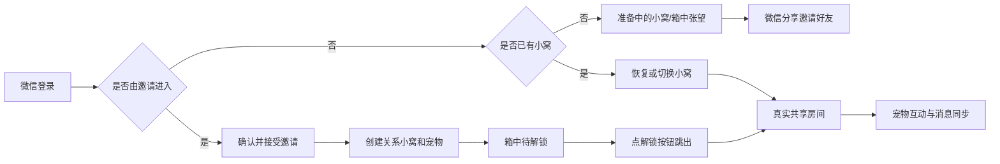

# 微信小程序

## 目标

使用 Taro 提供正式微信登录、好友邀请、多关系小窝、宠物互动和共享房间聊天。小程序是本项目唯一的前端。

## 当前流程



## 当前范围

### 个人资料与微信资料

- 微信登录一次点击静默完成，不收集头像昵称，也不再展示确认弹窗；新用户默认使用“微信用户”和默认头像。微信自 2022 年废弃 `wx.getUserProfile`，头像与昵称无法一键授权，只能由用户各做一次主动操作。
- 令牌失效时客户端会清除令牌、静默重登一次并重放原请求，不再停留在“资源准备失败”页；并发请求只触发一次重登，且只重放一次。
- 邀请页从分享卡打开后自动静默登录并展示邀请，登录或读取失败时保留重试入口。
- “我的”页面不再提供 MBTI 手动选择，性格类型只能通过 28 题测试计算并保存，支持重新测试。
- “我的”页面支持分别编辑姓名、性别和生日；性别选项为女、男、保密，默认保密。
- “我的”页面右侧资料值增大字号和点击区域，避免信息过小难以识别。
- 头像编辑器改为大预览、中文选项、较大色块和固定操作栏的底部面板。

### 小程序主界面补充

- 小窝、消息、我的页标题下保留简介；主内容区上边距收紧，底部导航位置不变。
- 无好友时，小窝邀请界面上方是小多利在纸箱里探头左顾右盼，中部信纸信件（图片 `widthFix`/`aspectFit` 不拉伸，正文可滚动），下方功能预告；底部为邀请分享按钮。
- 好友接受邀请后，小窝仍是同一套箱中探头和信件，只把底部按钮换成「玩家已接受邀请解锁小多利~」；点按钮后播放从箱子跳出、彩带和星光，随后进入站立小多利与互动。已有小窝在本机记为已解锁，不会重播。
- 小窝支持读取共同记忆、删除共同记忆，并展示双方贡献榜。
- 消息页读取真实会话列表，支持切换当前共享房间。无好友会话时按空态卡片展示：标题与副文案、中间较大的抱信封小狗插画（约屏宽一半，文字紧跟插画下方）、说明和「去邀请好友」分享按钮。
- 小记为单人日记：页面背景与其它主界面同为 `#fff8ee`；标题左对齐，下方简介「记录和小多利的每一天。」，「日记 / 纪念日」居中分页；周历放在白卡片里；今日日记卡右侧有「查看」；写日记/拍照记录插图较大；各区块使用统一 32rpx 间距；写日记/拍照记录按钮收矮且距卡片底边不变，今日日记上半拍立得区略增高，运势条紧跟其下、与底栏间距接近消息页。写日记和纪念日都在当前页全屏打开，不跳转；写日记覆盖层自带顶栏（返回 / 写日记 / 保存）、白卡片（日期、心情、正文、拍立得、天气/心情/相册/地点工具栏）和底部庭院插画，默认拍立得用奔跑小狗。不提供点赞和分享。
- 日记数据使用个人维度 `/api/diaries` 接口（创建、区间列表、更新、删除、切换喜欢），照片压缩后以 base64 存储，单张不超过 30 万字符、每篇最多 3 张。
- 纪念日与日记编辑器仍保留独立页面路由作壳层（`pages/journal-anniversary`、`pages/journal-editor`），主路径在小记当前页全屏打开对应面板；纪念日沿用房间维度接口，无好友时回退个人 `pet_dm` 房间。
- 我的页面支持 MBTI 选择并通过资料接口保存。
- 我的页面复用 `avatarConfig` 合同，支持头像预览、编辑、恢复和保存。
- 小程序主页面壳层、底部安全区和底部导航使用统一的 `#fff8ee` 背景，避免切换到底部页面时出现白色露底。
- 爪印菜单提供“游戏”和“塔罗占卜”两个带图标入口；小程序端不再提供足迹地图功能和入口。
- “游戏”入口打开居中弹窗，弹窗内当前提供五子棋入口，底部固定展示“敬请期待😈”；五子棋复用服务端同一状态机，通过 `/api/games/gobang` HTTP 轮询支持邀请、接受、落子、认输和结果同步。
- 记忆面板使用居中弹窗，不阻断主页面导航。

### 当前未完成

- 塔罗牌面从腾讯 COS 直连下载，动画按小程序能力逐阶段迁移；
- 小程序端头像编辑器、MBTI 测试和完整运势详情仍待迁移。

- Taro + React + TypeScript 微信小程序骨架；
- 仅使用微信登录，服务端通过 `jscode2session` 创建或恢复 Pet10 身份；服务端只保留 `/api/auth/wechat` 一个登录接口（邮箱验证码登录已移除），该接口按 IP 限流，默认每分钟 10 次，可用 `WECHAT_LOGIN_RATE_LIMIT_PER_MINUTE` 调整，超限返回 429；
- 新用户无需邀请也能进入准备中的小窝；
- 使用微信原生分享卡片邀请任意微信好友；
- 好友接受邀请后创建独立关系小窝和共享宠物；
- A+B 和 A+C 分别拥有不同小窝和宠物；
- 从 Pet10 API 读取共享房间、真实宠物和最近 50 条消息；
- 发送真实文本消息、请求小多利回复，并通过单请求在途的 3 秒轮询实现基础双端同步；前一次请求未结束时不会重叠发起下一次，切换房间后的旧响应会丢弃。
- 喂食、玩耍、清洁、睡觉四种真实宠物动作；
- 小多利、四个动作图标和经验/状态卡片使用仓库静态资源中的同源 PNG 与信息层级；
- 登录、加载、无小窝、无宠物、邀请失败、消息失败和请求失败提示；
- 微信开发者工具可构建的 WeApp 产物。

## 明确不在范围内

- PostgreSQL、Redis 和 COS；
- Socket.IO 实时推送；当前共享房间使用 HTTP 轮询；
- 图片消息上传、图片生成；
- 衣柜、照片墙和任务的实际功能；
- 微信支付、会员和公开发布。

## 代码入口

- `miniapp/src/pages/index/index.tsx`
- `miniapp/src/features/main/MiniappJournalView.tsx`
- `miniapp/src/features/main/JournalAnniversaryPanel.tsx`
- `miniapp/src/features/main/JournalEditorForm.tsx`
- `miniapp/src/domain/petRules.ts`
- `miniapp/src/services/apiClient.ts`
- `miniapp/src/services/authApi.ts`
- `miniapp/src/services/invitationApi.ts`
- `miniapp/src/services/launchContextApi.ts`
- `miniapp/src/services/petApi.ts`
- `miniapp/src/services/roomApi.ts`
- `miniapp/src/services/petMapper.ts`
- `miniapp/src/pages/invite/invite.tsx`
- `miniapp/src/features/main/MiniappNestView.tsx`
- `miniapp/src/features/main/XiaoduoliBoxScene.tsx`
- `miniapp/src/domain/xiaoduoliUnlock.ts`
- `miniapp/src/services/xiaoduoliUnlockStorage.ts`
- `miniapp/src/pages/room/room.tsx`
- `miniapp/src/components/PetStatusCard.tsx`
- `miniapp/src/components/PetActionBar.tsx`
- `miniapp/config/index.ts`

## 配置与微信体验

默认构建使用正式 API `https://api.pet10kk.com`，避免普通构建覆盖开发者工具中的可登录版本。需要连接其他环境时可通过环境变量覆盖 API 基地址；不得把令牌、AppSecret 或其他密钥写进小程序：

```powershell
$env:TARO_API_BASE_URL = "https://你的-api-域名"
npm run build:weapp --prefix miniapp
```

API 域名必须使用 HTTPS，并添加到微信小程序后台的“开发管理 → 开发设置 → 服务器域名 → request 合法域名”。开发者工具可以仅用于本机调试而临时关闭合法域名校验；第二名成员在真机体验时不能依赖该开关。

塔罗牌面、背景和牌背从腾讯 COS 直连下载，构建时必须提供 `TARO_TAROT_ASSET_BASE_URL`，指向当前 COS 版本目录（例如 `https://<bucket>.cos.<region>.myqcloud.com/pet10-web/<完整提交SHA>`）；缺少该变量时构建直接失败。COS 域名必须添加到微信小程序后台的“服务器域名 → downloadFile 合法域名”：

```powershell
$env:TARO_TAROT_ASSET_BASE_URL = "https://<bucket>.cos.<region>.myqcloud.com/pet10-web/<完整提交SHA>"
npm run build:weapp --prefix miniapp
```

体验成员使用各自微信身份登录，不再输入邮箱、邀请码或房间 ID。邀请人通过首页原生分享按钮发送邀请卡片；被邀请人打开卡片并接受后，服务端创建双方专属小窝和宠物。

## 资源与排版

小程序将以下仓库静态资源复制到 `miniapp/src/assets/`，采用本地打包、非预加载方式，避免依赖未配置的图片域名：

| 文件 | 原始尺寸 | 体积 | 小程序用途 |
| --- | --- | --- | --- |
| `xiaoduoli.png` | 436×700 | 85 KB | 宠物场景主图 |
| `action-feed.png` | 445×474 | 25 KB | 喂食动作 |
| `action-play.png` | 449×474 | 24 KB | 玩耍动作 |
| `action-clean.png` | 448×474 | 25 KB | 清洁动作 |
| `action-sleep.png` | 447×474 | 25 KB | 睡觉动作 |
| `room-background.webp` | 1280×1280 | 158 KB | 小窝宠物场景背景 |
| `navigation/game.png` | 256×256 | 97 KB | 爪印菜单游戏入口图标 |
| `navigation/tarot.png` | 256×256 | 99 KB | 爪印菜单塔罗占卜入口图标 |
| `navigation/gobang.png` | 256×256 | 94 KB | 游戏弹窗五子棋入口图标 |
| `navigation/codeword.png` | 256×256 | 93 KB | 爪印菜单每日暗号图标 |
| `me/mbti.png` | 128×128 | 30 KB | 我的页性格类型入口图标 |
| `nest/letter-paper.png` | 720×420 | 51 KB | 无好友小窝信件信纸背景 |
| `nest/xiaoduoli-box.png` | 520×440 | 156 KB | 邀请/待解锁纸箱 |
| `nest/xiaoduoli-peek.png` | 446×314 | 147 KB | 箱中探头左顾右盼，解锁时从箱子跳出 |
| `messages-empty.png` | 520×411 | 89 KB | 消息页无好友空态：抱信封小狗 |
| `journal/polaroid-run.png` | 420×406 | 103 KB | 小记与写日记默认奔跑小狗拍立得，点击可换自己的照片 |
| `journal/polaroid-sit.png` | 420×373 | 90 KB | 小记备用坐姿小狗拍立得 |
| `journal/action-write.png` | 320×270 | 45 KB | 小记「写日记」按钮插画 |
| `journal/action-photo.png` | 359×219 | 65 KB | 小记「拍照记录」按钮插画 |
| `journal/editor-yard.jpg` | 750×750 | 45 KB | 写日记页底部庭院背景 |

PNG 保留原尺寸与透明通道并采用 256 色优化；房间背景保留 1280×1280 构图并重新编码为 WebP。运行时使用固定容器尺寸和 `aspectFit` 或 `aspectFill`，避免布局跳动。每张小程序图片控制在 180 KB 安全线内。小程序副本随 `miniapp` 构建产物分发；塔罗资源不打包，从 COS 版本目录下载。

## 开发命令

在仓库根目录执行：

```powershell
npm test --prefix miniapp -- src/domain/petRules.test.ts
npm test --prefix miniapp
npm run build:weapp --prefix miniapp
```

微信开发者工具可直接导入仓库根目录：

```text
D:\Pet10
```

构建输出目录：

```text
D:\Pet10\miniapp\dist
```

仓库根目录的 `project.config.json` 通过 `miniprogramRoot` 指向 `miniapp/dist`；`miniapp/project.config.json` 仍支持单独导入小程序目录。不要直接导入构建输出目录。

预览时如果微信开发者工具已经打开，继续使用该窗口清缓存并编译，不要再开新窗口。只有尚未打开时才启动一次。

## 白屏排查

如果导入后模拟器持续白屏：

1. 关闭已经直接导入 `D:\Pet10\miniapp\dist` 的旧项目；
2. 重新导入 `D:\Pet10\miniapp`；
3. 执行 `npm run build:weapp --prefix miniapp` 后点击“编译”；
4. 如果开发者工具仍然卡死，关闭硬件加速并清理工具缓存后重启；
5. 在“设置 → 安全设置”中开启服务端口，允许使用 CLI 自动化读取运行错误。

开发者工具日志出现 `webcontents-render-process-gone` 且原因为 `oom` 时，说明白屏来自工具渲染进程内存崩溃，而不是小程序页面构建失败。

## 风险与后续阶段

- 如果 API 地址为空、非 HTTPS 或未配置为合法域名，真机无法连接真实数据；
- 服务端目前只允许一个 `APP_ORIGIN`；小程序请求不依赖浏览器 CORS，但生产 API 仍需按现有部署规范设置可访问的 HTTPS 地址；
- 当前消息同步使用 3 秒 HTTP 轮询，页面隐藏后停止；轮询请求 single-flight 且过期响应不写入页面，后续可升级 Socket.IO；
- 分享前必须成功创建服务端邀请 token，不能把房间 ID 作为邀请参数；
- 正式发布前仍需验证两台真机的微信分享、邀请回跳和消息同步。

## 当前验收

- [x] 微信登录接口已接入；
- [x] 无邀请新用户进入准备中的小窝；
- [x] 微信好友邀请卡片和邀请确认页已接入；
- [x] A+B、A+C 独立小窝约束已接入；
- [x] 共享房间宠物读取与四种动作接口已接入；
- [x] 共享房间历史消息、发送消息和小多利回复已接入；
- [x] 页面可见期间每 3 秒同步最新消息；
- [x] 小多利和四个动作图标使用仓库同源资源；
- [x] 信息卡采用场景、等级、经验和四项状态层级；
- [x] Pet10 状态反馈与邀请入口仅在小窝页显示；
- [x] 小窝、消息、小记和我的页面的页面壳层与底部安全区保持统一背景色；
- [x] 个人页优先展示会话中的微信昵称和头像，生日可直接通过日期选择器设置；
- [x] 微信登录一次点击静默完成，令牌失效自动重登并重放请求；
- [x] MBTI 只能通过 28 题测试计算，个人页不再提供手动类型选择；
- [x] 个人页支持姓名、性别编辑，性别默认保密；
- [x] 个人页右侧资料值和头像编辑器选项具备可读的字号、间距和点击区域；
- [x] 小记在未设置生日时不请求运势接口，改为提示先设置生日；
- [ ] 接受邀请后小窝显示箱中探头左顾右盼和「玩家已接受邀请解锁小多利~」，点按钮后跳出并带彩带星光；
- [ ] 使用真实 HTTPS API 完成两人接受邀请并读取同一只宠物；
- [ ] 两台真机轮流操作后验证数据同步；
- [ ] 微信开发者工具视觉验收；
- [ ] 微信开发者工具真机预览；
