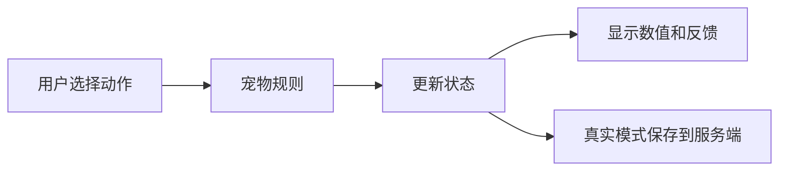

# 宠物系统

## 功能

两位用户共同照顾小多利。喂食、玩耍、清洁和休息会改变饥饿、心情、能量、健康、亲密度和成长状态。

## 关键入口

- `src/domain/petRules.ts`
- `src/components/PetActionBar.tsx`
- `src/components/PetStatusCard.tsx`
- `server/src/domain/petRules.ts`
- `server/src/services/petService.ts`

## 风险

前后端目前都有宠物规则，修改时必须同时检查两端，防止 Mock 和真实模式结果不同。

## 验收

- [ ] 每个动作只执行一次。
- [ ] 数值不超过合理上下限。
- [ ] Mock 和真实 API 的结果含义一致。
- [ ] 状态变化后界面立即更新。
