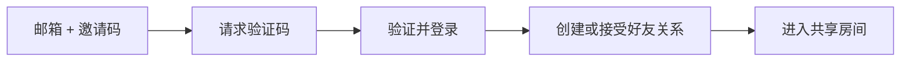

# 登录、好友和会话

## 功能

真实 API 模式下，用户通过邮箱验证码和邀请码登录，然后发送或接受好友邀请。绑定成功后进入共享房间。

## 流程

## 关键入口

- `src/components/LoginScreen.tsx`
- `src/components/FriendSetupScreen.tsx`
- `src/services/authApi.ts`
- `src/services/sessionApi.ts`
- `src/services/friendshipApi.ts`
- `server/src/services/authService.ts`
- `server/src/services/sessionService.ts`
- `server/src/services/friendshipService.ts`

## 验收

- [ ] 未登录时显示登录页。
- [ ] 验证码错误有明确提示。
- [ ] 好友关系未完成时不进入主房间。
- [ ] 退出登录后本地 token 被清理。
