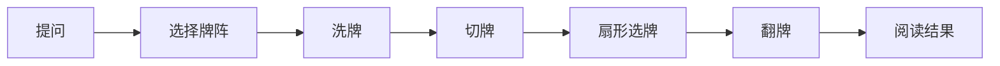

# 塔罗

## 功能

用户选择问题类别和牌阵，依次完成洗牌、切牌、扇形选牌和翻牌，最后查看阅读结果并可分享或查看历史。

## 关键入口

- `src/games/tarot/TarotGame.tsx`
- `src/games/tarot/tarotFlow.ts`
- `src/games/tarot/useTarotFlow.ts`
- `src/games/tarot/tarotAssets.ts`
- `src/games/tarot/tarotRitual.css`

## 数据

- 牌库和牌阵：`src/games/tarot/tarotDeck.ts`
- 阅读逻辑：`src/games/tarot/tarotReading.ts`
- 本地历史：`src/games/tarot/tarotHistory.ts`

## 动画规则

阶段只能按状态机迁移。动画期间必须锁定重复操作，reduced-motion 必须直接完成逻辑结果。详细标准见 `docs/visual-baselines/tarot/README.md`。

## 验收

- [ ] 每个阶段按顺序进入。
- [ ] 快速连续点击不会跳过阶段。
- [ ] 图片不闪烁，窄屏不横向滚动。
- [ ] reduced-motion 不会卡住。
- [ ] 分享、历史和重新开始正常。
