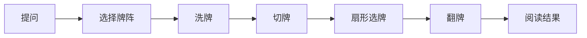

# 塔罗

## 功能

用户选择问题类别和牌阵，依次完成洗牌、切牌、扇形选牌和翻牌，最后查看阅读结果并可分享或查看历史。

## 关键入口

- `src/games/tarot/TarotGame.tsx`
- `src/games/tarot/tarotFlow.ts`
- `src/games/tarot/useTarotFlow.ts`
- `src/games/tarot/tarotAssets.ts`
- `src/games/tarot/tarotRitual.css`
- `miniapp/src/features/tarot/MiniappTarotFlow.tsx`
- `miniapp/src/features/tarot/tarotFlow.ts`

## 小程序接入

- 小程序从主页爪印菜单进入塔罗密室，不再显示占位提示。
- 小程序已实现完整 `question → spread → shuffle → cut → fan → reveal → reading` 七阶段流程。
- 问题阶段支持推荐问题、空问题拦截和首尾空白清理；牌阵阶段支持单牌、三牌、关系三牌和决定五牌阵。
- 洗牌阶段连续长按约 2 秒完成，松手暂停后可继续；切牌至少完成一次才能进入选牌，动画期间锁定重复操作。
- 扇形选牌按用户选择顺序赋牌位，飞牌动画结束后才提交选中结果；规定牌数全部选完后才能翻牌。
- 所有牌翻开后生成结构化解读并写入微信本地历史，最多保留 20 条；阅读结果可发送到当前聊天室，没有有效房间时禁用分享。
- 小程序状态机、牌库、解读和历史均位于 feature 目录，不依赖 PWA React/DOM 文件；页面组件只负责渲染和动画完成回调。
- 图片加载失败时，牌面回退为牌名和符号，不阻塞完成流程。

## 数据

- 牌库和牌阵：`src/games/tarot/tarotDeck.ts`
- 阅读逻辑：`src/games/tarot/tarotReading.ts`
- 本地历史：`src/games/tarot/tarotHistory.ts`

## 动画规则

阶段只能按状态机迁移。动画期间必须锁定重复操作，reduced-motion 必须直接完成逻辑结果。详细标准见 `docs/visual-baselines/tarot/README.md`。

`fan` 阶段点击卡牌后，会创建独立的固定定位视觉副本，根据扇面卡牌与对应已选槽位的实际坐标完成 `900ms` 飞行。副本只显示卡牌本体，不包含拖尾、粒子、扫光、光环或落位爆发；前段快速完成主要位移，后段逐步减速并精准对齐槽位。下方扇形牌保持较小尺寸，上方已选牌明显放大，飞行副本根据真实起点和槽位尺寸自然完成放大落位。三张模式使用更舒展的牌间距；五张模式在 `380px` 以下缩小牌面并保留正间距，不使用重叠或负边距，确保单行不越框。卡牌亮度保持稳定，最后一帧的边框、阴影、位置与尺寸均与真实已选牌一致，从而在 DOM 交接时保持连续。原卡不改变扇形布局，已选牌整行略微下移，“已选 a/b”上方不显示装饰性小牌堆；动画结束后再由状态机提交选牌完成。reduced motion 直接完成选牌，不创建副本。

塔罗牌背与牌面在牌阵预览、洗牌、切牌、扇形、飞行、翻牌和阅读场景使用统一的高质量图像渲染规则。扇形静态牌的可控纵向偏移保持整像素，避免小尺寸旋转牌因半像素定位产生额外软化；飞行副本仍只在外壳上使用合成优化。

洗牌进度从 0% 到 100% 需要连续长按约 2 秒；松手后暂停，再次长按从当前进度继续。

## 资源加载

- 打开塔罗前下载 22 张牌面、背景和牌背，共 24 项运行时资源。
- 下载弹窗显示 `资源下载中...(x%)`，百分比优先按响应字节实时计算。
- 浏览器无法提供资源总大小时，使用当前运行时资源包的平均体积估算未知资源，进度仍随实际接收字节连续增长。
- 默认同时下载 6 项资源；全部图片字节接收完成后，再以固定 2 路并发完成浏览器图片解码。
- 下载和解码全部完成前，进度不会显示 100%；全部资源可直接绘制后才进入塔罗，任意资源失败时保留重新下载入口。
- 用户关闭下载弹窗后，迟到的进度、成功或失败回调不得重新打开弹窗或自动进入塔罗。
- 在服务器健康、正常宽带且清空缓存的条件下，以 10 秒内完成首次资源准备为性能验收目标；异常网络不作绝对保证。
- 生产环境可通过 `VITE_TAROT_ASSET_BASE_URL` 将 24 项资源切换到腾讯 COS 公共读地址；未配置时回退到同源 `/tarot/...`。
- 小程序通过构建变量 `TARO_TAROT_ASSET_BASE_URL` 配置相同目录结构的牌面、背景和牌背资源，默认使用 `https://pet10kk.com`。
- 微信小程序后台需要将该资源域名加入 `downloadFile` 合法域名；若后续切换 COS，应同步更新构建变量与微信后台域名。
- 解码阶段限制为 2 路并发，避免手机同时展开整副牌的像素内存；完成后首次显示不得再出现 JPEG 从上到下逐步绘制。
- 塔罗场景的背景和牌背 CSS 必须使用与下载清单相同的运行时 URL，配置 COS 时不得再次请求同源 `/tarot/ui/` 副本。
- COS 对象目录必须保留 `tarot/cards/` 与 `tarot/ui/`；建议把版本放在公共基址中，例如 `https://<bucket>.cos.<region>.myqcloud.com/pet10-v1`。
- COS 必须允许站点来源执行 `GET`、`HEAD`，并暴露 `Content-Length` 与 `ETag`，否则浏览器无法提供可靠的字节进度。

## 验收

- [ ] 每个阶段按顺序进入。
- [ ] 快速连续点击不会跳过阶段。
- [ ] 小程序从爪印菜单进入问题页，空问题不能继续，推荐问题可直接填入。
- [ ] 小程序问题进入 `spread` 后不会因重复点击跳过牌阵阶段。
- [ ] 小程序可选择单牌、三牌、关系三牌和决定五牌阵，确认后只进入 `shuffle`。
- [ ] 小程序长按洗牌、重复切牌锁、选牌飞行锁和翻牌门禁均正常。
- [ ] 小程序完成阅读后历史新增一条，重开回到干净问题阶段。
- [ ] 小程序有当前房间时可分享到聊天室，无房间时分享按钮禁用。
- [ ] 洗牌直达验收页进度从 0 开始，长按牌堆时持续增长。
- [ ] 图片不闪烁，窄屏不横向滚动。
- [ ] 清空浏览器缓存后，正常网络首次下载 24 项资源的目标时间不超过 10 秒。
- [ ] 下载进度达到 100% 后，牌背、背景和首次翻开的牌面立即完整显示，不从上到下逐步绘制。
- [ ] COS 不可用时，清空 `VITE_TAROT_ASSET_BASE_URL` 后可回退同源资源。
- [ ] 切牌阶段每叠牌由顶部牌面和 10 个紧凑中间牌层组成；顶部牌背清晰，中间层只呈现纸边和分隔线，不出现模糊或纯色渐变砖块。
- [ ] reduced-motion 不会卡住。
- [ ] 分享、历史和重新开始正常。
