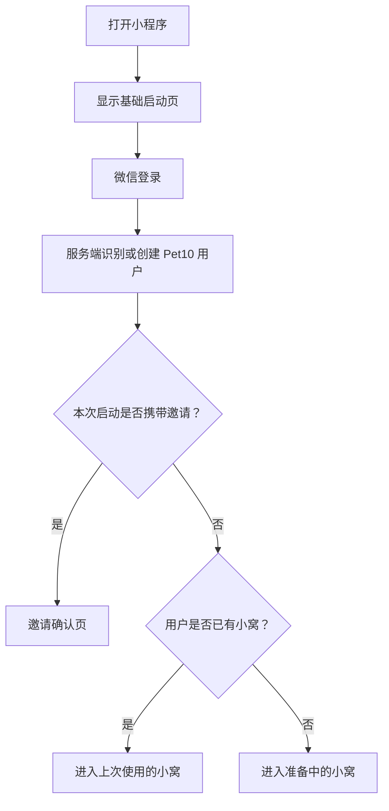

# 微信登录与多关系小窝

## 目标

将小程序从体验版的“邮箱验证码 + 手动房间 ID”升级为正式用户流程：

- 用户只使用微信登录；
- 一个微信用户可以和多个好友分别建立共同小窝；
- 每一对好友只能拥有一个共同小窝和一只共享宠物；
- 用户没有邀请时也能自然进入产品；
- 首屏资源按用户状态和当前小窝按需准备，不下载全部功能资源。

这项设计服务于正式推广场景，同时保留当前两个固定测试用户的迁移路径。

## 核心关系规则

```text
微信用户
  └─ 关系小窝
       ├─ 用户 A
       ├─ 用户 B
       └─ 共享宠物
```

同一用户可以拥有多个关系小窝：

```text
A + B → 小多利 1
A + C → 小多利 2
B + C → 小多利 3
```

必须满足以下约束：

- 每个小窝只包含两位用户；
- 每个小窝只有一只共享宠物；
- 同一对用户最多拥有一个小窝；
- 用户可以和不同好友分别养不同宠物；
- 不允许把已有小窝合并；
- 第一版不支持多人共享同一只宠物；
- 第一版不支持一个邀请覆盖或替换已有小窝。

服务端应以排序后的用户对建立唯一约束，例如将较小的用户 ID 作为 `userAId`，较大的用户 ID 作为 `userBId`，保证 A 邀请 B 与 B 邀请 A 命中同一段关系。

## 用户流程

### 首次打开



### 微信登录

微信登录只负责确认用户身份，不再要求邮箱、验证码、邀请码或房间 ID。服务端通过微信登录凭证完成身份识别，并返回 Pet10 会话令牌；客户端不能伪造用户身份或直接生成服务端令牌。

首次登录可以使用微信昵称和头像作为默认资料，同时允许用户设置小窝内的称呼。资料补充应是轻量步骤，不能阻塞用户进入产品。

### 无邀请进入

没有邀请且没有小窝的用户进入“准备中的小窝”，而不是空白页或错误页。

页面文案示例：

> 小多利正在准备自己的新家  
> 邀请一位重要的人，你们就可以一起照顾它

主要入口：

- `邀请好友一起养`；
- `先和小多利玩一会儿`；
- 个人功能和玩法介绍；
- 待处理邀请。

准备中的小窝可以提供轻量试玩，但试玩不改变正式共享宠物的等级和属性，也不创建需要后续合并的正式宠物数据。试玩结果可以转化为建立共同小窝后的初见礼物或纪念记录。

### 发起邀请

用户从准备中的小窝或小窝列表发起邀请，使用微信小程序分享能力生成邀请卡片。分享内容表达“建立一只只属于你们的小多利”，不向用户暴露房间 ID。

邀请记录至少需要保存：

- 邀请人；
- 接收人或待接收状态；
- 邀请状态；
- 创建时间和失效时间；
- 接受时间；
- 绑定的小窝 ID。

邀请参数应是服务端生成的一次性或可撤销凭证，而不是可猜测的房间 ID。

### 接受邀请

被邀请者打开分享卡片后，先看到邀请确认页：

> 小雨邀请你一起照顾小多利

页面展示邀请人昵称、头像和小多利形象，并提供：

- `和小雨一起养`；
- `暂时不了`。

未登录用户应完成微信登录后回到同一邀请确认页，不能丢失邀请上下文。

接受成功后：

1. 服务端校验邀请仍有效；
2. 校验邀请双方不是同一用户；
3. 校验这对用户尚未存在其他小窝；
4. 创建关系小窝和共享宠物；
5. 返回新的小窝上下文；
6. 进入共同小窝。

成功反馈可以使用短暂建立动画和文案：

> 共同小窝建立成功  
> 从今天开始，小多利由你们一起照顾

### 多个小窝

用户拥有多个小窝时，默认进入上次使用的小窝。小窝首页需要提供当前关系和切换入口，例如：

> 和小雨的小窝

小窝列表只展示轻量摘要：

- 对方昵称和头像；
- 宠物缩略图；
- 宠物等级；
- 最近互动时间；
- 未读消息数。

点击小窝后再加载该小窝的完整数据和首屏资源。用户可以从小窝列表发起“和另一位好友建立小窝”，不会影响已有关系。

### 邀请异常

必须为以下情况提供明确的用户提示：

- 邀请已失效：请对方重新发送邀请；
- 邀请已被接受：进入自己的小窝列表或准备中的小窝；
- 已经与该好友拥有小窝：打开已有小窝，不重复创建宠物；
- 对方是自己：提示不能邀请自己；
- 当前小窝加载失败：保留登录状态，提供重试，不重新登录；
- 网络超时：显示可重试状态，不清理本地会话。

## 启动上下文

微信登录完成后，服务端应一次返回用于决定首屏的启动上下文，概念结构如下：

```ts
type LaunchContext = {
  user: UserSummary
  rooms: RoomSummary[]
  pendingInvitations: InvitationSummary[]
  activeRoomId?: string
  entry: 'shared-room' | 'invite' | 'room-list' | 'waiting-room'
  assetVersion: string
}
```

启动判断优先级：

1. 微信会话是否有效；
2. 本次启动是否携带邀请；
3. 邀请是否有效、是否可接受；
4. 用户是否有已有小窝；
5. 用户是否有待处理邀请；
6. 否则进入准备中的小窝。

携带邀请时应优先展示邀请确认页。即使用户已经有其他小窝，也要解释当前邀请是否可接受，不能无提示地跳回已有小窝。

## 资源加载策略

### 基础包

基础包只放所有用户都需要的轻量资源：

- 启动页和登录页基础图标；
- 默认头像；
- 加载、空状态和错误占位；
- 基础样式；
- 小尺寸的小多利占位图。

不能在微信登录前下载全部宠物动作、塔罗牌或其他大型功能资源。

### 登录后按入口准备

微信登录完成并拿到启动上下文后，根据 `entry` 准备目标页面资源：

| 入口 | 首屏资源 |
| --- | --- |
| `shared-room` | 当前小窝数据、小多利主图、房间背景、导航资源 |
| `invite` | 邀请人头像昵称、小多利主图、邀请页背景和按钮 |
| `waiting-room` | 准备中小窝背景、小多利主图、邀请入口和导航资源 |
| `room-list` | 小窝摘要、头像、缩略图和列表图标 |

小窝数据和首屏关键资源并行准备。进入页面不应等待所有后续资源完成；最少需要保证页面骨架、小多利主图和当前场景稳定显示。

### 当前小窝优先

用户拥有多个小窝时，只加载当前小窝的完整资源。其他小窝只加载轻量摘要，切换后再请求目标小窝数据。

如果多个小窝共用小多利主图和房间背景，应复用本地缓存；未来支持主题或装扮时，按 `roomId + assetVersion` 缓存特定资源。

### 按功能加载

以下资源在进入对应功能时再加载：

- 全套塔罗牌；
- 五子棋资源；
- 图片生成资源；
- 足迹地图资源；
- 活动主题和未解锁装饰。

资源失败不能被当作登录失败处理，必须保留页面布局、会话和邀请上下文。

## 代码入口

当前体验版入口：

- `miniapp/src/services/authApi.ts`
- `miniapp/src/services/apiClient.ts`
- `miniapp/src/pages/index/index.tsx`
- `miniapp/src/pages/room/room.tsx`
- `miniapp/src/pages/settings/settings.tsx`
- `docs/features/miniapp.md`

后续正式化预计新增或调整：

- `server/src/domain/launchContext.ts`
- `server/src/domain/launchContext.test.ts`
- `server/src/services/wechatAuthService.ts`
- `server/src/services/wechatAuthService.test.ts`
- `server/src/http/authMiddleware.ts`
- 小程序微信登录服务；
- 邀请凭证与邀请确认页；
- 用户小窝列表和当前小窝切换；
- 启动上下文服务；
- 按入口加载的资源服务；
- 服务端用户对唯一约束和关系小窝服务。

## 风险

- 微信登录凭证只能在服务端换取用户身份，不能把 AppSecret 或可伪造令牌放进小程序；
- 关系小窝必须使用用户对唯一约束，防止重复宠物；
- 邀请登录回跳必须保留邀请参数；
- 多小窝切换不能误提交到当前错误的小窝；
- 试玩数据不能与正式共享宠物数据混用；
- 资源加载失败不能清理有效会话；
- 当前体验版的邮箱登录和手动房间 ID 不能与正式微信登录流程混用；
- 用户关系、宠物归属和邀请状态需要在服务端事务中保持一致。

## 验收清单

- [ ] 用户只使用微信登录即可创建或恢复 Pet10 身份。
- [ ] 无邀请且无小窝的用户进入准备中的小窝。
- [ ] 有效邀请可以在登录前后保持上下文并完成接受。
- [ ] A 与 B 只能创建一个小窝和一只宠物。
- [ ] A 可以与 B、C 分别拥有不同小窝和不同宠物。
- [ ] 用户拥有多个小窝时默认恢复上次使用的小窝。
- [ ] 小窝列表只加载轻量摘要，切换时加载当前小窝完整数据。
- [ ] 接受邀请不会影响用户已有的其他小窝。
- [ ] 邀请失效、重复关系、自己邀请自己和网络失败都有明确提示。
- [ ] 登录前不下载非首屏大型功能资源。
- [ ] 首屏资源按入口加载，塔罗和其他大型功能按需加载。
- [ ] 资源失败不会被误判为登录失败或清理会话。
- [ ] 真实 HTTPS API、两台真机和微信开发者工具完成验收。
