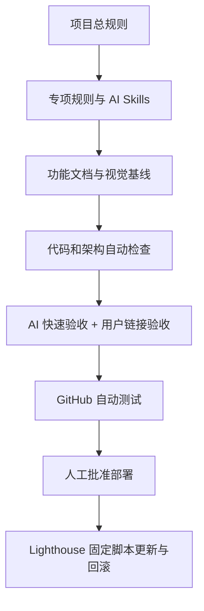

# Pet10 AI 可维护性与安全发布设计

## 1. 目标

Pet10 的主要代码由 AI 协助生成和修改。项目当前可以正常运行，但随着功能迭代，容易出现以下问题：

- AI 在不了解完整上下文时重复叠加修改。
- 视觉效果，尤其是塔罗动画，缺少可执行的验收标准。
- 不同 AI 对目录、业务规则、测试和部署流程理解不一致。
- 用户不熟悉代码，难以判断修改是否安全、是否只影响目标功能。
- 本地修改和服务器更新依赖临时命令，缺少稳定、可回滚的固定流程。

本设计建立一套仓库内的长期维护护栏，使 AI 能够更准确地修改代码，也让非技术维护者可以通过中文文档、验收链接和固定发布流程掌握项目状态。

## 2. 成功标准

完成首轮实施后，应满足：

1. 任何 AI 打开仓库后，都能从根目录规则了解项目结构、修改流程和禁止事项。
2. 每个主要功能都有面向非技术维护者的中文说明。
3. 界面或动画修改完成后，AI 必须提供可点击的本地验收链接。
4. 塔罗动画可以直接进入指定阶段验收，不必每次重复完整流程。
5. 开发中使用快速专项验证，交付、合并和部署前使用更完整的分级验证。
6. GitHub 自动运行测试，但生产部署必须经过人工批准。
7. 腾讯云轻量应用服务器只执行仓库内固定部署脚本，不接受临时拼接的生产命令。
8. 前端修改默认只更新 `web`，后端修改默认只更新 `api`，避免无关服务重启。
9. 部署前记录旧版本，部署后执行健康检查，失败时可以回滚。
10. 不改变现有产品功能、数据库结构和 Docker Compose 总体架构。
11. 图片资源在保证清晰度的前提下控制加载体积，原始概念图不得进入运行时预加载路径。

## 3. 总体方案

采用“规则、技能、文档、自动检查、人工验收、固定部署”六层结构：



首轮不全面重写业务代码。先建立护栏，再选取低风险模块示范新分层方式，后续功能按同一标准逐步迁移。

## 4. 仓库规则体系

### 4.1 总入口

新增：

```text
AGENTS.md
AI_RULES.md
```

`AGENTS.md` 是代码代理优先读取的简洁强制规则，覆盖整个仓库。它必须要求：

- 修改前确认仓库目录、当前分支、基线提交和未提交改动。
- 新任务必须基于最新 `main`。
- 同一功能同时只保留一个活动 worktree。
- 修改前阅读对应功能文档和专项规则。
- 一次只处理一个明确目标，禁止顺便全面重写。
- 业务逻辑不得继续堆入 React 页面组件。
- UI、动画、API、部署修改必须执行对应验证。
- 修改行为后必须同步文档。
- 未提供验证证据时不得声称完成。
- 未经用户确认，视觉修改不得合并或部署。

`AI_RULES.md` 使用中文面向用户和不自动读取 `AGENTS.md` 的 AI，解释：

- 项目用途和目录结构。
- AI 开始任务前应该做什么。
- 如何提出计划和确认边界。
- 如何提供验收链接与改动报告。
- 如何处理分支、worktree、部署和回滚。

### 4.2 专项规则

新增：

```text
.agents/rules/
├── architecture.md
├── change-protocol.md
├── testing-and-review.md
├── documentation.md
├── deployment.md
└── tarot-animation.md
```

#### `architecture.md`

明确前端边界：

- `components/`：通用或页面 UI，不保存领域算法。
- `games/`：独立游戏功能，内部可以拥有组件、状态机、样式和领域逻辑。
- `domain/`：纯类型、规则、计算，不访问浏览器和网络。
- `services/`：HTTP、WebSocket、存储、浏览器能力和外部适配。
- `state/`：跨页面状态和 mock 数据。

明确后端边界：

- `http/`：请求解析、鉴权和响应映射。
- `services/`：用例协调。
- `domain/`：业务规则和模型。
- `repositories/`：持久化接口与实现。
- `realtime/`：实时事件适配。

禁止组件直接拼接 HTTP、直接实现复杂业务算法、无边界访问 `localStorage`，以及在前后端复制会发生漂移的规则。

#### `change-protocol.md`

所有 AI 修改遵循：

1. 确认工作目录、分支、基线与 Git 状态。
2. 确认目标功能和明确的不修改范围。
3. 阅读功能文档、专项规则和相关测试。
4. 说明准备修改的文件、原因和验证方式。
5. 行为修改先建立失败测试或可复现证据。
6. 只修改目标相关文件。
7. 执行快速专项验证。
8. 启动本地验收服务并提供链接。
9. 等待用户验收视觉和交互。
10. 合并或部署前执行完整验证。
11. 同步功能文档并输出标准改动报告。

#### `testing-and-review.md`

定义三级验证：

- Level 1 开发中：相关测试、局部类型检查、目标页面和关键状态。
- Level 2 交付验收：完整 TypeScript、前端测试、相关后端测试、生产构建、控制台检查、本地链接。
- Level 3 合并或部署：前后端全部测试、完整构建、架构检查、文档检查、关键流程冒烟和部署健康检查。

#### `documentation.md`

规定何时必须同步文档：

- 功能流程变化。
- 用户可见行为变化。
- 状态机或业务规则变化。
- API、环境变量或部署方式变化。
- 动画时间线、交互锁或视觉检查点变化。

#### `deployment.md`

规定：

- 服务器只部署 `main` 的已提交版本。
- 禁止在服务器上手工编辑业务代码。
- 默认执行最小服务更新。
- 数据库迁移、环境变量和基础设施变化必须单独确认。
- 部署前记录旧提交，部署后执行健康检查。
- 不输出生产密钥，不把 `.env.production` 上传到 GitHub。

#### `tarot-animation.md`

规定塔罗流程的唯一状态来源、动画锁、动画 token、reduced-motion、CSS 归属、时间线和截图检查点。禁止同一阶段由多个定时器、重复 CSS 覆盖和历史 worktree 共同决定行为。

## 5. 仓库内 AI Skills

新增：

```text
.agents/skills/
├── feature-development/SKILL.md
├── visual-animation-change/SKILL.md
├── react-refactor/SKILL.md
├── domain-rule-change/SKILL.md
├── documentation-sync/SKILL.md
└── release-verification/SKILL.md
```

这些 Skills 不承载业务代码，而是告诉 AI 如何执行特定类型任务。

### 5.1 新功能开发

要求先确定入口、数据流、错误状态、测试和文档，再实现。组件负责显示，领域规则和服务适配放入各自层。

### 5.2 视觉与动画修改

一次只允许修改一个阶段或一个视觉目标。必须记录：

- 参考素材。
- 基线提交。
- 时间线变化。
- 修改文件。
- 固定视口。
- 检查点截图。
- reduced-motion 结果。
- 未修改阶段。

### 5.3 React 重构

限制为不改变外部行为的边界整理。每轮只拆一个职责，拆分前后运行同一套测试，不顺便修改文案和视觉。

### 5.4 领域规则修改

要求识别规则归属、前后端使用点、数据兼容性和测试矩阵，防止两端规则漂移。

### 5.5 文档同步

检查代码变化是否影响功能说明、流程图、验收清单、环境变量和部署说明。

### 5.6 发布验证

统一执行类型检查、测试、构建、架构检查、文档检查、浏览器验收和线上健康检查。

## 6. 面向非技术维护者的功能文档

新增：

```text
docs/features/
├── README.md
├── app-navigation.md
├── chat.md
├── pet-system.md
├── social-and-session.md
├── daily-fortune.md
├── tarot.md
├── image-generation.md
├── gobang.md
└── deployment.md
```

每份文档使用统一模板：

1. 功能是做什么的。
2. 用户如何操作。
3. 正常结果是什么。
4. 简单流程图。
5. 关键代码入口。
6. 数据保存在哪里。
7. 常见问题和排查顺序。
8. 修改风险。
9. 人工验收清单。
10. 最近一次重要变更。

正文以中文和图示为主，技术细节控制在必要程度。文件链接用于让 AI 和开发者定位代码，不要求用户阅读实现。

同时修复当前 `README.md` 中文乱码，并将其缩减为项目入口、启动方式、常用命令和文档索引。

## 7. 本地测试与用户验收

### 7.1 固定验收命令

新增 npm 命令：

```text
npm run review
npm run review:stop
npm run verify:quick
npm run verify:full
```

`npm run review` 应：

- 使用固定默认端口启动可验收前端。
- 端口冲突时给出清晰提示或选择备用端口。
- 输出准确 URL。
- 标明当前使用 Mock API 还是真实 API。
- 将进程信息写入临时文件，便于 `review:stop` 关闭。
- 不要求用户理解终端命令。

默认链接：

```text
http://127.0.0.1:4173
```

若使用真实本地 API，同时输出：

```text
http://127.0.0.1:8787/health
```

### 7.2 AI 验收效率

AI 开发中不重复检查全站。验证范围由修改类型决定：

| 修改类型 | 快速验证 |
| --- | --- |
| 纯函数或领域规则 | 对应单元测试 |
| React 组件 | 组件测试 + 目标页面 |
| CSS 或动画 | 目标阶段 + 固定视口截图 |
| API 客户端 | 映射/错误测试 + Mock 请求 |
| 后端服务 | 对应服务测试 + 健康检查 |
| 部署配置 | Compose 配置 + 脚本 dry-run/静态检查 |

AI 在交付时必须输出：

```text
本次修改：
验收地址：
验收路径：
重点检查：
自动验证：
未验证内容：
如何关闭验收服务：
```

### 7.3 用户验收门禁

涉及 UI、交互或动画时：

- AI 可以完成自动验证，但状态必须是“等待用户验收”。
- 用户确认前不得合并到 `main` 或部署生产。
- 用户不满意时优先回到基线分析差异，不在错误效果上无限叠加补丁。

## 8. 塔罗动画唯一基线

### 8.1 开发验收入口

新增仅开发环境启用的塔罗验收入口：

```text
/dev/tarot
/dev/tarot?stage=question
/dev/tarot?stage=spread
/dev/tarot?stage=shuffle
/dev/tarot?stage=cut
/dev/tarot?stage=fan
/dev/tarot?stage=reveal
/dev/tarot?stage=reading
```

要求：

- 复用正式阶段组件，不复制动画实现。
- 生产构建中不可访问。
- 不写入正式历史或用户数据。
- 支持固定卡牌和确定性数据，保证截图可比较。
- 支持移动端和桌面端固定视口。

### 8.2 动画文档

新增：

```text
docs/visual-baselines/tarot/
├── README.md
├── timeline.md
├── checkpoints.md
└── acceptance-criteria.md
```

为每个阶段记录：

- 进入和退出条件。
- 可交互时机。
- 动画时间线。
- 关键位置和层级。
- reduced-motion 结果。
- 桌面端和移动端差异。
- 截图检查点。

### 8.3 防止反复修补

塔罗动画修改必须遵循：

1. 从最新 `main` 创建唯一临时分支/worktree。
2. 记录基线提交。
3. 一次只改一个阶段。
4. 先更新目标时间线或验收标准。
5. 使用开发验收入口直接定位阶段。
6. 通过专项测试和固定截图后交给用户。
7. 用户确认后才合并。
8. 合并验证通过后关闭服务并清理旧 worktree。
9. 下一次任务不得继续使用已完成的旧 worktree。

## 9. 自动架构与文档检查

新增检查脚本，首轮以高价值、低误报为目标：

- 检查全局样式中是否重新出现塔罗专属选择器。
- 检查功能文档引用的本地路径是否存在。
- 检查主要功能是否都有文档。
- 检查新增环境变量是否同步示例文件和部署文档。
- 检查超出约定阈值的页面组件并报告，不立即强制失败。
- 检查 UI 层是否新增直接 `fetch`、数据库或服务端引用。

新增命令：

```text
npm run check:architecture
npm run check:docs
npm run verify:quick
npm run verify:full
```

首轮使用 Node/TypeScript 或 ESM 脚本，不新增重量级 lint 框架。

## 10. 前端能力层示范

首轮只做低风险示范，不全面重写。

建议整理：

- 统一异步操作结果和用户可读错误映射。
- 为 React 提供通用的异步任务 hook，统一 `idle/loading/success/error`。
- 将 `AppShell` 中一小块独立启动或会话协调逻辑迁入专用 hook。
- 为服务调用建立一致的错误边界，但不改变现有 API 接口。

选择标准：

- 有现有测试或容易补测试。
- 不涉及数据库迁移。
- 不改变页面文案和视觉。
- 可以独立回滚。

前后端共享宠物规则只迁移低风险、纯计算部分。若会引入构建配置或运行时依赖复杂化，则只先建立一致性测试和迁移文档。

## 11. 图片资源与加载性能

当前资源盘点显示：

- `public/tarot/cards` 的 22 张展示牌面为 `768x1152`，单张约 `170–240 KB`，总量约 `4.4 MB`。
- `public/tarot/ui` 的背景和牌背适合运行时使用。
- `public/tarot/concepts` 的原始概念图单张约 `6–10 MB`，总量约 `202.9 MB`，不应被正式页面或塔罗启动预加载。

### 11.1 资源分类

所有图片必须归入以下类别之一：

| 类别 | 示例 | 运行时策略 |
| --- | --- | --- |
| `runtime-critical` | 启动画面、应用图标、首屏宠物图 | 保留高质量小尺寸版本，必要时预加载 |
| `runtime-feature` | 塔罗牌面、牌背、塔罗背景 | 按功能和阶段加载，不加载无关资源 |
| `user-content` | 用户头像、聊天图片、生成图片 | 使用服务端/CDN URL，界面懒加载 |
| `source-only` | 概念图、原始生成图、设计稿 | 只作为归档素材，不进入 `public` 运行资源或预加载清单 |

### 11.2 质量和体积预算

首轮预算以当前视觉尺寸为基准，不以“越小越好”为目标：

- 塔罗牌面展示尺寸保持 `768x1152`，优先使用高质量 WebP/AVIF；兼容性 fallback 保留 JPEG。
- 单张运行时塔罗牌目标不超过 `250 KB`；超过 `350 KB` 时 CI 警告，超过 `500 KB` 时检查失败，除非在资源清单中写明例外原因。
- 塔罗背景目标不超过 `300 KB`；超过 `500 KB` 时检查失败。
- 头像和宠物图按实际显示尺寸提供 small/medium/large 变体，禁止用 `1086x1448` 原图作为列表头像。
- 启动画面保留明确的 `width`/`height`，避免布局跳动；首屏关键图目标不超过 `150 KB`。
- 不允许通过明显降低 JPEG 质量解决体积问题；优先裁剪无用像素、使用正确尺寸、现代格式和按需加载。

### 11.3 加载策略

- 首屏只加载首屏需要的资源。
- 塔罗入口先加载背景、牌背和即将显示的资源，不再无条件预加载所有牌面。
- 牌面资源分批预加载，并设置并发上限，避免一次建立过多连接。
- 抽牌结果确定后，优先预加载实际将展示的牌面，保证翻牌动画期间不等待网络。
- 非首屏图片使用 `loading="lazy"`，并提供明确尺寸或 `aspect-ratio`，避免布局抖动。
- `preload` 只用于真正首屏关键资源；功能资源使用 `prefetch` 或阶段级预加载。
- 图片 URL 和资源清单集中维护，不在组件中散落硬编码路径。
- Service Worker 缓存只缓存稳定的运行时资源，不缓存未版本化的用户内容。

### 11.4 原始素材目录

原始概念图应迁移到仓库外的设计素材目录，或至少放到明确的非运行时目录：

```text
design-assets/tarot/concepts/
```

如果暂时必须保留在仓库，构建和资源检查必须明确排除它们，且运行时代码、预加载清单和部署镜像不得引用该目录。长期建议使用 Git LFS 或对象存储保存原始大图，避免普通 Git 历史持续膨胀。

### 11.5 自动检查

新增：

```text
npm run check:assets
```

检查内容：

- 运行资源是否超过单文件预算。
- `source-only` 目录是否被运行时代码引用。
- 图片是否缺少尺寸信息或资源清单记录。
- 同一用途是否存在重复大图。
- 运行时图片总量是否超过预算。
- 新增图片是否使用允许的格式和命名规则。

检查结果分为 error 和 warning。原始概念图体积可以是 warning，但一旦被运行时引用必须 error。

### 11.6 图片验收

每次替换图片必须同时验收：

1. 手机视口下清晰度。
2. 桌面视口下清晰度。
3. 首屏加载时间和网络请求数量。
4. 塔罗动画中牌面切换是否出现闪烁。
5. 慢速网络下是否有明确占位或加载状态。
6. 图片失败时是否有 fallback。

AI 的改动报告必须说明：

```text
新增/替换图片：
原始尺寸和体积：
运行时尺寸和体积：
格式：
是否进入预加载：
是否通过资源预算：
验收链接：
```

## 12. GitHub 自动测试

新增：

```text
.github/workflows/ci.yml
```

触发条件：

- Pull Request。
- 推送到 `main`。
- 手动运行。

执行：

1. `npm ci`
2. `npx tsc -b`
3. `npm test -- --run`
4. `npm run server:test`
5. `npm run build:all`
6. `npm run check:architecture`
7. `npm run check:docs`
8. `npm run check:assets`

CI 只验证代码，不直接部署生产。

## 13. Lighthouse 手动批准部署

### 13.1 与现有架构兼容性

保留现有：

- `docker-compose.prod.yml`
- Caddy
- Nginx
- Node API
- PostgreSQL
- Redis

不引入 Kubernetes，不改变数据库结构。新增的是部署控制层。

### 13.2 部署脚本

新增：

```text
deploy/
├── update-web.sh
├── update-api.sh
├── update-all.sh
├── verify.sh
├── rollback.sh
└── lib/deploy-common.sh
```

脚本共同要求：

- 只能在配置的服务器项目目录运行。
- 工作区必须干净。
- 目标提交必须存在于远端 `main`。
- 使用 `git fetch` 和显式提交检出，不使用不受控的本地修改。
- 部署前记录当前稳定提交。
- 使用 Docker Compose 重建目标服务。
- 等待健康检查。
- 成功后保存稳定版本。
- 失败时输出明确错误和回滚命令；自动回滚仅在可以证明安全时执行。

更新类型：

| 类型 | 服务 | 典型场景 |
| --- | --- | --- |
| web | 只重建 `web` | React、CSS、塔罗动画 |
| api | 只重建 `api` | 后端路由、服务、AI 调用 |
| all | 重建受影响服务 | Compose、环境变量、前后端契约 |

数据库迁移不包含在普通自动部署中，必须单独确认。

### 13.3 GitHub Actions 部署

新增：

```text
.github/workflows/deploy-production.yml
```

采用 `workflow_dispatch` 手动触发，并使用 GitHub Environment 的生产保护规则。工作流参数至少包括：

- 部署提交，默认当前 `main`。
- 更新类型：`web`、`api`、`all`。

部署工作流先运行或复用 CI 结果，然后等待生产环境批准，再通过 SSH 调用固定脚本。

GitHub Secrets：

```text
DEPLOY_HOST
DEPLOY_PORT
DEPLOY_USER
DEPLOY_SSH_PRIVATE_KEY
DEPLOY_PATH
DEPLOY_URL
```

生产 `.env.production` 只保留在服务器。

### 13.4 服务器权限

- 使用专用部署账户，不使用 root 密码登录。
- SSH key 仅用于部署。
- 部署用户仅获得项目目录和 Docker 所需权限。
- Lighthouse 防火墙只开放必要端口。
- 腾讯云自动化助手可作为 SSH 故障时的备用运维方式，不作为日常发布主路径。

### 13.5 部署验收

成功后工作流输出：

```text
部署类型：
旧版本：
新版本：
线上地址：
健康检查：
重启服务：
未重启服务：
回滚方式：
```

前端健康检查使用 `/healthz`。API 检查使用实际存在的 API 健康路径，并在实施时先核实现有路由，避免文档和代码不一致。

## 14. 分支与 worktree 生命周期

规则：

- `main` 是唯一稳定基线。
- 一个任务对应一个命名明确的临时分支。
- 创建 worktree 时记录基线 SHA。
- 开始任务前确认没有旧 worktree 承载同一任务。
- 用户验收前不合并视觉改动。
- 合并后在 `main` 重新运行 Level 3 验证。
- 验证通过后关闭本地服务。
- 由项目流程创建且已完成的 worktree 应清理。
- 外部工具托管的 worktree 不擅自删除，但必须报告其位置和状态。

## 15. 非技术用户的标准操作

### 修改功能

用户可以使用固定提示：

```text
先不要修改代码。请基于最新 main 检查对应功能文档，
说明只准备修改哪些文件、不会修改什么、如何自动验证，
以及完成后会提供哪个本地验收链接。等我确认后再执行。
```

### 修改塔罗动画

```text
只修改塔罗的 <阶段>。先读取塔罗动画规则和视觉基线，
确认当前 main 和基线提交，列出时间线差异。
完成后提供该阶段的直接验收链接、移动端检查结果和未修改阶段。
我确认前不要合并或部署。
```

### 发布服务器

```text
确认 main 已提交并通过完整验证。
触发 GitHub 的生产部署工作流，更新类型为 <web/api/all>。
等待我批准后部署，完成后返回线上链接、版本号和健康检查结果。
```

## 16. 首轮实施范围

首轮包含：

1. 项目总规则和专项规则。
2. 六个仓库内 AI Skills。
3. README 乱码修复和文档索引。
4. 主要功能的非技术中文文档。
5. 本地 review 服务和分级验证命令。
6. 塔罗开发验收入口、时间线和验收标准。
7. 架构边界和文档检查。
8. 一个低风险前端能力层示范。
9. GitHub CI。
10. Lighthouse 固定部署、验证和回滚脚本。
11. 手动批准生产部署工作流。
12. 部署配置说明和一次性服务器初始化说明。
13. 图片资源清单、体积预算、按需加载和 CI 资源检查。

首轮不包含：

- 全量重写 `AppShell`。
- 全量拆分所有领域类型。
- 数据库迁移自动化。
- 自动部署生产而无需人工批准。
- 新增测试服务器。
- 视觉回归 SaaS 或付费平台。
- Kubernetes 或云原生平台迁移。

## 17. 风险与应对

### 文档很快过期

通过 `check:docs`、AI Skills 和修改报告强制同步。文档只记录稳定行为和入口，避免复制大量源码。

### 规则太多导致 AI 变慢

`AGENTS.md` 保持简短，只链接与任务相关的专项规则。快速验证按改动范围执行，完整验证只在交付、合并和部署时运行。

### 开发验收入口与正式行为不一致

开发入口必须复用正式组件、状态机和样式，只注入确定性初始状态。

### 部署脚本误操作生产

要求干净工作区、显式提交、固定项目路径、人工审批、健康检查和稳定版本记录。数据库迁移不进入普通部署流程。

### 回滚后数据库不兼容

首轮普通部署不自动执行数据库迁移。未来增加迁移时必须设计向后兼容和单独回滚策略。

### GitHub 密钥泄漏

Secrets 只存 GitHub 和服务器，不写入日志、文档和仓库。部署账户使用最小权限。

### 图片质量过低或加载过慢

通过正确尺寸、现代格式 fallback、单文件预算、运行时总量检查和固定视口验收共同控制。禁止只靠降低压缩质量解决性能问题；原始概念图与运行时展示图必须分离。

## 18. 验收标准

首轮完成时，用户应能够：

1. 打开 `docs/features/README.md` 理解主要功能。
2. 告诉 AI 修改某个功能，并由规则自动限制范围。
3. 点击 AI 提供的本地链接验收界面。
4. 直接打开塔罗某一动画阶段进行验收。
5. 在 GitHub 查看自动测试结果。
6. 手动批准一次 Lighthouse 部署。
7. 从部署结果看到线上地址、版本号和健康状态。
8. 在部署失败时使用明确的回滚流程。
9. 图片替换后能看到体积预算、加载策略和清晰度验收结果。

AI 应能够：

1. 正确识别项目架构边界。
2. 根据改动类型选择合适的验证级别。
3. 不从旧 worktree 继续叠加修改。
4. 不在用户确认前合并视觉改动。
5. 不直接修改生产服务器代码。
6. 不把原始概念图加入运行时预加载或正式展示路径。
