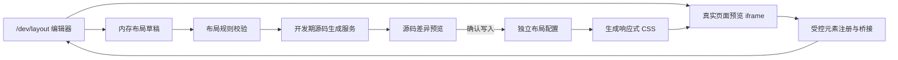

# 全应用响应式可视化布局编辑器设计

## 背景

Pet10 当前使用 React、Vite 和集中式 CSS 构建手机优先界面。页面布局分布在 `src/components/`、`src/games/` 和 `src/styles.css` 等位置，部分功能还有独立样式文件。维护者希望不用直接手写 CSS，就能在可视化画布中调整页面元素的位置、尺寸、间距、对齐和顺序，并确保结果适配不同分辨率。

该能力不是线上低代码系统。编辑器只在开发环境运行，调整结果生成独立源码文件，经差异审查、测试、Git 提交和正常发布流程后生效。

## 目标

提供覆盖全应用页面的开发环境布局编辑器：

- 通过 `/dev/layout` 独立路由打开。
- 在编辑器画布中加载真实应用页面。
- 只允许编辑开发者明确注册的受控元素。
- 支持窄屏、标准屏和宽屏三个预设设备档位。
- 支持拖拽、缩放、方向键微调和同一受控容器内排序。
- 使用响应式约束描述布局，不把单一设备上的绝对坐标直接当作最终规则。
- 先生成独立布局配置和 CSS 草稿，展示源码差异，确认后才写入工作区。
- 不进入编辑器时，现有业务页面、交互和视觉行为保持不变。

## 非目标

- 不提供线上后台实时修改或立即发布布局的能力。
- 不允许选择和修改任意 DOM 节点。
- 不允许元素跨 React 组件边界或跨受控容器移动。
- 不自动重写现有 TSX 结构、`src/styles.css` 或功能专属 CSS。
- 不让 UI 组件直接访问文件系统或实现源码生成算法。
- 不编辑文本内部排版、聊天消息内容、弹窗内部结构、Canvas 内容或复杂动画节点。
- 第一版不支持用户自定义任意媒体查询断点。
- 第一版不删除或迁移现有人工维护样式。

## 用户流程

1. 开发者运行本地开发环境并访问 `/dev/layout`。
2. 从页面树中选择小窝、小记、消息、聊天详情、我的或游戏页面。
3. 选择窄屏、标准屏或宽屏设备档位。
4. 在真实页面预览中点击带有稳定布局 ID 的受控元素。
5. 使用拖拽、缩放、方向键、属性面板或容器内排序调整布局。
6. 编辑器把变更保存到内存草稿，并将编辑会话备份到浏览器本地存储；此时不修改项目文件。
7. 点击“生成源码草稿”，编辑器验证布局规则并请求开发期源码生成服务。
8. 编辑器显示将新增或修改的独立布局配置与生成 CSS 的统一差异。
9. 开发者确认后，开发期服务才把结果写入工作区。
10. 运行聚焦测试和三个代表宽度的预览检查，再进入正常 Git 提交流程。

## 预设设备档位

第一版固定三个设备档位：

| 档位 | 适用宽度 | 代表验收宽度 | 用途 |
| --- | --- | --- | --- |
| `narrow` | `320px–374px` | `320px` | 小尺寸手机 |
| `standard` | `375px–767px` | `390px` | 默认手机布局 |
| `wide` | `768px` 及以上 | `768px` | 平板和宽屏布局 |

继承规则：

- `standard` 是默认规则来源。
- `narrow` 和 `wide` 只记录相对 `standard` 的覆盖项。
- 某个属性未在当前档位设置时，继承 `standard` 对应属性。
- 生成器输出固定媒体查询，不允许第一版在编辑器内增加任意断点。
- 每次生成后必须检查 `320px`、`390px` 和 `768px` 三个宽度。

## 总体架构



### 编辑器层

`src/dev/layout/` 负责开发工具界面、页面树、设备档位、画布、选区、属性面板、历史记录和差异预览。该目录不拥有业务页面的状态和规则。

### 布局运行时

`src/layout/` 负责：

- 稳定布局 ID 和类型。
- 受控元素、受控容器和页面的注册信息。
- 三档响应式布局配置解析。
- 在正常页面中应用生成后的 class、CSS 自定义属性或数据属性。
- 编辑模式下与父级编辑器通信。

布局运行时不得访问 HTTP、文件系统或服务器模块。

### 开发期源码生成服务

开发期服务负责：

- 接收经过校验的布局草稿。
- 规范化属性顺序和数值格式。
- 生成布局配置与 CSS 文本。
- 返回拟写入文件的差异。
- 只在收到显式确认后写入允许列表中的文件。

正式生产构建不注册写文件端点。浏览器中的 React 组件不能直接写文件。

## 受控元素注册

布局编辑器不依赖易变化的 CSS 选择器寻找元素。可编辑元素必须有稳定、全局唯一的布局 ID，并明确属于一个受控容器。

概念接口：

```tsx
<LayoutRegion id="nest.main" kind="container">
  <LayoutItem id="nest.pet-status" parentId="nest.main">
    <PetStatusCard />
  </LayoutItem>
</LayoutRegion>
```

注册信息至少包含：

- `id`：稳定布局 ID，例如 `nest.pet-status`。
- `pageId`：所属页面。
- `parentId`：所属受控容器。
- `label`：编辑器中的中文名称。
- `capabilities`：允许编辑的属性集合。
- `locked`：是否完全锁定。
- `orderable`：是否允许在当前容器内排序。

稳定性要求：

- ID 不使用数组索引、随机值或翻译后的可见文本。
- 同一页面和容器内不得重复。
- 删除或重命名 ID 时必须处理已有配置并通过文档化迁移。
- 业务组件不读取编辑器草稿；它只接收布局运行时提供的标准属性。

## 可编辑属性

第一版属性按能力白名单开放，元素可只开放其中一部分。

### 通用属性

- 外边距和内边距。
- 宽度、高度、最小和最大尺寸。
- 水平与垂直对齐。
- Flex 的 `order`、`align-self` 和允许范围内的伸缩规则。
- Grid 的列、行和跨度。
- `z-index`，但限制在预设层级范围。
- 当前设备档位下的显示或隐藏。

### 拖拽与定位

- 默认优先转换为容器间距、对齐、Grid/Flex 排列等流式规则。
- 只有注册能力明确允许 `positioned` 时，才可生成受约束的定位规则。
- 定位元素必须选择锚点：左上、顶部居中、右上、左下、底部居中或右下。
- 生成的偏移量相对锚点和受控容器，不相对整个浏览器窗口。
- 编辑器应提示固定像素可能造成的溢出，并优先建议百分比、`clamp()` 或最大宽度。

### 容器内排序

- 只允许同一 `parentId` 下且 `orderable` 的相邻受控元素排序。
- 排序不修改 TSX 节点顺序，生成 Flex/Grid `order` 规则。
- 拖动到其他容器时显示禁止状态，不产生草稿。
- 列表内容、聊天消息、动态数据数组和动画卡牌序列不属于布局排序范围。

## 编辑器界面

### 左侧页面与元素树

- 按页面列出所有注册的受控容器和元素。
- 锁定元素可显示但不可选择。
- 标记当前页面、当前选区、未保存变更和配置异常。
- 支持按布局 ID 或中文名称搜索。

### 中央画布

- 使用 `iframe` 隔离真实页面样式和编辑器样式。
- 切换档位时设置固定画布视口宽度。
- 选中元素时显示边框、尺寸、布局 ID、锚点和拖拽手柄。
- 拖拽期间只更新草稿预览。
- 页面内部原交互默认被编辑遮罩拦截；可临时切换“交互预览模式”检查页面行为。

### 右侧属性面板

- 显示当前容器、布局策略、继承来源和当前档位覆盖。
- 提供数值输入、步进按钮、对齐选择、Grid/Flex 选项和重置。
- 明确区分“继承值”“当前档位覆盖值”和“现有人工样式计算值”。
- 不把浏览器计算样式自动写回配置。

### 顶部工具栏

- 页面选择。
- 窄屏、标准屏和宽屏切换。
- 撤销、重做。
- 重置当前元素、当前档位或当前页面。
- 生成源码草稿。
- 进入交互预览模式。

## 草稿、撤销和恢复

- 拖拽和属性编辑首先写入内存草稿。
- 每个完成的用户操作形成一个历史记录，支持撤销和重做。
- 编辑会话可备份到 `localStorage`，键名包含布局版本和当前 Git 基线，避免旧草稿静默覆盖新代码。
- 当配置版本、基线提交或注册表发生变化时，编辑器提示草稿不兼容，不自动应用。
- “重置”只清除目标范围的草稿覆盖，不修改现有源码。
- 源码写入成功后，编辑器重新读取工作区配置并清空已应用草稿。

## 源码产物

建议文件结构：

```text
src/layout/
  layoutTypes.ts
  layoutRegistry.ts
  layoutRuntime.tsx
  layoutValidation.ts
  generated/
    layout.config.ts
    layout.generated.css
src/dev/layout/
  LayoutDevEntry.tsx
  LayoutEditor.tsx
  LayoutCanvas.tsx
  LayoutElementTree.tsx
  LayoutInspector.tsx
  LayoutDiff.tsx
  layoutEditor.css
```

`layout.config.ts` 保存结构化、可测试的响应式规则；`layout.generated.css` 是确定性生成物。两者都位于专用目录，编辑器不修改 `src/styles.css` 或其他已有样式文件。

概念配置：

```ts
export const generatedLayout = {
  'nest.pet-status': {
    parentId: 'nest.main',
    order: 10,
    standard: {
      marginInline: 16,
      maxWidth: '100%'
    },
    narrow: {
      marginInline: 12
    },
    wide: {
      gridColumn: '1 / 2'
    }
  }
} as const
```

生成规则：

- 输出顺序按页面、容器和布局 ID 固定排序。
- 数值单位和属性写法统一规范化。
- 不生成空覆盖或与 `standard` 完全相同的覆盖。
- CSS 选择器只使用布局运行时提供的稳定数据属性。
- 同一草稿重复生成必须得到相同文本。

## 差异与写入安全

“生成源码草稿”分为预览和确认两个请求：

1. 预览请求生成候选文件内容和统一差异，不写文件。
2. 编辑器展示目标文件、增加行、删除行和校验结果。
3. 确认请求携带预览内容的摘要值。
4. 服务端确认工作区目标文件仍与预览时一致。
5. 只有摘要和基线一致时才原子写入允许列表中的文件。

允许写入范围限定为布局生成目录。服务端拒绝：

- `..`、绝对路径或符号链接逃逸。
- 写入 `src/styles.css`、组件源码、环境变量或部署文件。
- 基线已变化的过期确认请求。
- 未通过布局校验的配置。
- 非开发环境请求。

## 校验与错误状态

布局生成前至少校验：

- 页面、容器和元素 ID 已注册且唯一。
- 元素没有跨容器排序。
- 属性属于该元素能力白名单。
- 数值、单位和范围合法。
- 宽高、偏移和 Grid 范围不会生成明显无效 CSS。
- `z-index` 位于预设层级范围。
- 当前配置不存在循环继承。
- 三个设备档位都能解析出完整最终规则。

错误处理：

- 单个属性错误时定位到具体页面、元素、档位和字段。
- 校验失败时保留草稿，但禁用源码确认写入。
- iframe 页面加载失败时提供重试和错误详情，不生成空布局。
- 源码基线变化时要求重新生成差异。
- 写入失败时不清除草稿，并报告未写入的文件。

## 页面覆盖策略

最终目标是所有用户可见页面都可在编辑器中打开，但不要求所有内部 DOM 都可编辑。

第一阶段先建立完整基础闭环并注册代表性页面：

- 主应用壳与底部导航。
- 小窝页面中的主要卡片容器。
- 小记页面中的主要内容区域。
- 消息列表和聊天详情的页面级区域。
- 我的页面中的资料卡和列表容器。
- 一个游戏页面作为功能目录接入示例。

后续按页面逐步增加受控元素注册，直到页面清单全部可进入、主要布局区域全部可编辑。每次注册新页面都必须更新页面清单、聚焦测试和功能文档。塔罗内部动画节点仍遵循 `.agents/rules/tarot-animation.md`，默认不纳入通用布局编辑。

## 测试策略

### 单元测试

- 三档规则继承和覆盖解析。
- 配置规范化和确定性排序。
- 能力白名单和数值范围校验。
- 同容器排序成功与跨容器排序拒绝。
- 草稿版本和 Git 基线兼容判断。

### 组件测试

- `/dev/layout` 仅在开发环境注册。
- 页面树显示注册页面和元素。
- 档位切换更新 iframe 视口。
- 选中元素后属性面板显示正确继承状态。
- 拖拽只改变草稿，不立即写文件。
- 撤销、重做和重置行为。
- 校验失败时不能确认写入。
- 差异预览和过期基线提示。

### 集成验证

- 在 `320px`、`390px` 和 `768px` 下检查代表性页面。
- 确认进入普通应用路由时编辑器代码和交互不生效。
- 确认生成文件重复生成无无意义差异。
- 运行聚焦测试、类型检查、文档检查和本地 UI 验收。
- 合并或部署前运行 `npm run verify:full`。

## 文档影响

实现时需要：

- 新增 `docs/features/layout-editor.md`，向非技术维护者说明用途、操作流程、失败状态、风险和验收。
- 更新 `docs/features/app-navigation.md`，记录 `/dev/layout` 仅开发环境可用。
- 页面新增受控元素时，更新对应功能文档的关键入口和验收项。
- 若生成服务增加开发环境配置或命令，更新相关开发与部署文档。

## 风险与缓解

### 固定坐标破坏响应式布局

编辑器优先生成流式布局规则；定位能力必须显式开放并绑定锚点。三个代表宽度是每次验收的最低要求。

### 自动生成覆盖人工样式

生成结果只写入独立目录，并通过稳定数据属性应用。差异预览和明确的 CSS 优先级策略防止静默覆盖。

### 页面交互与编辑操作冲突

编辑模式默认拦截页面点击和拖拽；需要测试业务交互时切换到独立的交互预览模式。

### 组件状态被 iframe 重载丢失

编辑器按页面准备可重复的开发预览状态。需要真实会话状态的页面应通过已有 Mock 或开发入口加载，不让布局工具伪造生产数据。

### 注册成本过高

只注册页面主要布局区域，不追求任意 DOM 可编辑。注册组件保持轻量，并通过注册表测试防止 ID 冲突。

### 生成服务成为任意文件写入入口

仅开发环境启用、限定文件白名单、校验路径、校验摘要和基线，并使用原子写入。

## 回滚

- 未确认写入前：清除当前草稿或重载已提交配置。
- 已写入但未提交：恢复 `src/layout/generated/` 的工作区变更。
- 已提交：回滚布局配置提交并重新生成 CSS。
- 若需要完全移除编辑器：删除 `/dev/layout` 开发入口、开发期生成服务和布局注册包装；现有业务组件与人工 CSS 不应依赖编辑器才能运行。

## 验收标准

- `/dev/layout` 在开发环境可打开，生产构建不暴露编辑器或写文件端点。
- 所有用户可见页面都有可选择的预览入口或明确记录为待注册页面。
- 受控元素使用稳定布局 ID，未注册 DOM 不可编辑。
- 窄屏、标准屏和宽屏规则可独立覆盖并按设计继承。
- 画布支持拖拽、缩放、方向键微调、撤销、重做和重置。
- 同一受控容器内可排序，跨容器移动被拒绝。
- 拖拽期间只修改草稿，不直接修改源码。
- 生成结果位于独立配置和 CSS 文件中，不改写现有组件与样式文件。
- 写入前显示源码差异，只有显式确认后才写入工作区。
- 校验错误、iframe 加载错误、基线变化和写入失败都有可理解的错误反馈。
- `320px`、`390px` 和 `768px` 三个代表宽度通过自动检查和人工验收。
- 普通应用页面在未进入编辑模式时保持现有行为和视觉。

## 分阶段实施建议

1. 建立布局类型、注册表、运行时和三档规则解析测试。
2. 建立 `/dev/layout`、页面树、iframe 画布和元素选择桥接。
3. 实现属性草稿、拖拽、缩放、排序、撤销和重做。
4. 实现开发期源码预览、差异、确认写入和安全校验。
5. 注册代表性主页面并完成三档验收。
6. 按功能文档逐页扩展受控元素，直至覆盖全应用主要布局区域。
