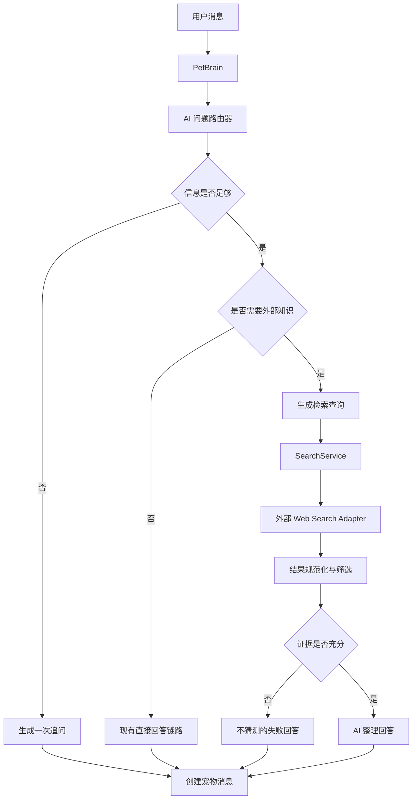

# 小多利智能检索与专业问答设计

## 1. 背景与目标

当前小多利主要依赖 AI 模型、人设提示词、近期聊天记录和长期记忆回答问题。该链路适合陪伴式闲聊，但无法可靠处理以下问题：

- 商品当前价格。
- 游戏当前赛季、版本和主流阵容。
- 近期变化的专业资料。
- 需要先确认型号、地区、配置或版本的问题。

本次设计采用“智能路由 + 自动检索 + 整理回答”的方案：

1. 普通聊天直接回答，保持小多利的陪伴感。
2. 实时、专业、陌生或版本敏感的问题自动联网检索。
3. 信息不足时先追问最关键的条件。
4. 检索结果由服务端筛选、整理，再交给模型生成自然回答。
5. 用户不看到链接和引用，但系统保留检索元数据用于排错和质量分析。
6. 搜索失败、资料不足或版本冲突时不猜测。

## 2. 非目标

本次不做：

- 不重写现有聊天 UI。
- 不改变房间、消息、Socket.IO 或数据库的基本协议。
- 不让前端直接访问搜索服务。
- 不展示搜索结果链接、引用卡片或来源列表。
- 不一次性接入商品、天气、地图等所有专用工具。
- 不建立完整的后台运营审核系统。
- 不把用户的所有聊天内容发送给搜索服务。

## 3. 用户体验

### 3.1 普通聊天

对于情绪表达、日常陪伴和明确的稳定知识，小多利直接回答，不触发搜索：

```text
用户：我今天有点累
小多利：那今天先把脑袋靠过来休息一下吧，我陪你慢慢缓一会儿。
```

### 3.2 信息不足时追问

问题需要外部信息但关键条件不足时，小多利不直接给确定答案，只问一个最重要的问题：

```text
用户：一个相机多少钱？
小多利：你想看哪个品牌或型号？如果还没想好，也可以告诉我预算和主要用途，我先按价位帮你筛。
```

价格类可补充的条件包括品牌、型号、机身或套机、全新或二手、地区和币种。游戏类可补充准确游戏名称、赛季、模式和用户当前已有资源。

### 3.3 自动检索与整理

条件足够后，小多利在服务端自动检索，回答应包含：

- 先给结论。
- 提供价格区间、阵容结构或专业概念。
- 说明适用条件、版本和波动因素。
- 给出替代方案或下一步建议。
- 不主动展示 URL、引用编号或来源列表。

示例：

```text
用户：索尼 A7C II 全新单机身现在多少钱？
小多利：目前全新单机身大致在 ¥××××～¥××××。国行、促销和渠道会造成波动，套机价格会更高。如果你告诉我所在地区和是否只考虑国行，我可以继续帮你判断哪个价位值得买。
```

### 3.4 失败与冲突

搜索超时、结果太少、资料明显过期或不同结果冲突时：

- 可以回答已确认的部分。
- 数字使用“约”“通常”“大致”等不确定表达。
- 明确说明暂时无法可靠确认的部分。
- 请求更具体的型号、版本或关键词。
- 禁止使用看似确定的编造数据填空。

## 4. 系统架构



### 4.1 AI 问题路由器

路由器输出内部结构，不直接作为用户消息：

```ts
interface AiRouteDecision {
  mode: 'direct' | 'clarify' | 'search'
  category: 'casual' | 'price' | 'game' | 'professional' | 'current'
  question: string
  clarification?: string
  searchQueries?: string[]
  freshnessRequired: boolean
}
```

路由规则：

- `direct`：日常聊天或稳定知识，直接进入现有回答流程。
- `clarify`：属于实时或专业问题，但缺少决定答案的条件。
- `search`：条件足够，或模型对稳定知识的信心不足。

路由器不得因用户使用“最新”“现在”“S2”“多少钱”等词就盲目生成答案，必须判断是否需要检索和是否具备足够检索条件。

### 4.2 SearchService

搜索能力放在服务端 `services` 层，聊天编排只依赖抽象接口：

```ts
interface SearchService {
  search(input: SearchInput): Promise<SearchResultSet>
}

interface SearchInput {
  queries: string[]
  freshnessRequired: boolean
  category: 'price' | 'game' | 'professional' | 'current'
  locale: string
}
```

搜索供应商通过适配器接入，不能让 `petBrain` 或 `aiService` 直接依赖某一家供应商的响应格式。供应商配置、超时、最大查询数和最大结果数从服务端环境变量读取。

### 4.3 结果整理

搜索结果进入模型前先做服务端规范化：

- 保留标题、摘要、URL、发布时间和域名等必要元数据。
- 去重相同或高度相似的结果。
- 限制总字符数，避免把无关网页全文发送给模型。
- 优先新结果，但不能只按发布时间判断可信度。
- 对价格和游戏版本保留日期、币种、版本号等上下文。
- 过滤明显的广告、空摘要和无法关联用户问题的结果。

URL 仅用于内部证据追踪，不直接进入最终回答提示词中的用户可见部分。

### 4.4 AI 最终整理

模型接收：

- 用户问题和必要的聊天上下文。
- 路由类别和新鲜度要求。
- 规范化的搜索资料。
- 小多利人设和回答格式要求。

模型必须：

- 只使用资料支持的事实。
- 把推断标为建议或可能性。
- 对冲突信息总结差异，不擅自选择确定数字。
- 不输出 Markdown 链接、来源列表或内部检索字段。
- 在资料不足时返回可识别的失败状态，而不是补写答案。

## 5. 数据安全与成本控制

- 搜索服务只接收必要的查询词，不发送完整长期记忆。
- 查询词需要去除明显的私人姓名、邮箱、地址和敏感内容。
- 结果数量、总字数、超时和单次查询数均有限制。
- 可对相同问题做短时缓存，降低重复搜索成本。
- 记录搜索类别、耗时、结果数量和失败原因，不记录不必要的完整用户隐私。
- AI 不可用时保留现有降级文案；搜索不可用时不绕过安全规则强行猜测。

## 6. 分阶段范围

### 第一阶段

- 增加 `direct / clarify / search` 路由。
- 增加 SearchService 抽象和一个外部 Web Search 适配器。
- 支持价格、游戏版本和一般专业问题。
- 增加检索结果规范化、超时、空结果和冲突处理。
- 增加服务端配置和测试。
- 更新聊天功能文档。

### 第二阶段

- 为价格和游戏问题增加专用回答模板。
- 在连续追问中复用已经确认的型号、版本和地区。
- 增加短时搜索缓存。
- 根据问题复杂度选择模型。
- 增加内部质量指标。

### 第三阶段

- 增加商品价格、天气、地图、计算器等专用工具。
- 增加可信域名和游戏版本资料配置。
- 增加搜索质量回放和运营纠错能力。

## 7. 验收标准

- [ ] “一个相机多少钱？”先追问品牌、型号或预算，不直接报确定价格。
- [ ] 明确相机型号后自动检索并给出价格区间与购买判断。
- [ ] “蛋仔派对碰碰棋 S2 主流阵容”自动识别为版本敏感的游戏问题并整理阵容、核心、装备和替代方案。
- [ ] 普通情绪聊天不触发外部搜索。
- [ ] 搜索超时或无结果时明确说明无法可靠确认，不编造。
- [ ] 搜索结果冲突时说明版本或渠道差异。
- [ ] 最终用户消息不展示 URL、来源列表或内部字段。
- [ ] 搜索供应商更换时不需要修改 `petBrain` 的业务流程。
- [ ] 现有 mock 模式和非 AI 降级行为保持可用。

## 8. 明确不验证的内容

- 外部搜索供应商在生产环境中的长期可用率。
- 所有商品和所有游戏版本的事实正确率。
- 用户是否接受具体回答风格。
- 未提供真实搜索密钥时的线上检索效果。

